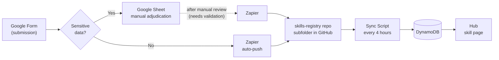
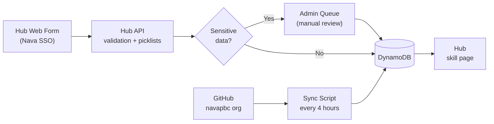

# Form Integration — Data Flow Options

**For review by:** Cory + Diana
**Date:** 2026-06-03

---

## Diagram 1 — Current State

The Zapier automation is built. The path splits based on whether the submitted skill flags sensitive data.

**How it works today:**
- No sensitive data: Zapier auto-pushes the submission to a subfolder in skills-registry; sync script picks it up within 4 hours
- Sensitive data: submission lands in the Google Sheet for manual review; unclear whether there is a built step that then pushes to the repo after approval — **needs validation**

---

## Diagram 2 — Potential State: Hub Web Form

The web form handles non-GitHub submissions. The sync script continues running every 4 hours to discover net-new skills and agents across the navapbc GitHub org.

---

## What Each Form Field Maps To

| Form question | Maps to Hub | Notes |
|---|---|---|
| Email | `author` | auto-captured |
| First and Last Name | `author_name` | submitter info |
| Team | — | not in Hub schema today |
| Skill name | `slug` + `name` | shown on skill card |
| Skill description | `description` | shown on skill card |
| What problem does this skill solve? | — | not in Hub schema today |
| Where does it run? *(claude-chat, etc.)* | `compatibility []` | used for Hub filtering |
| Add tags | `tags []` | used for Hub filtering |
| Impact type | — | not in Hub schema today |
| Estimated impact per use | — | not in Hub schema today |
| Usage frequency | — | not in Hub schema today |
| Expected audience size | — | not in Hub schema today |
| Sensitive data? | review flag | gates manual review before publish |
| Data sources (optional) | — | not in Hub schema today |
| Attach SKILL.md / .zip | skill content | frontmatter parsed for name, description, compatibility |

**Only two form fields currently drive Hub display:** `compatibility` (where it runs) and `tags`.
Everything else is either parsed from the SKILL.md file or stored as submission context not surfaced on skill pages.

---

## Answered Questions

| Question | Answer |
|---|---|
| Does IT have Zapier licenses? | Yes |
| Is the Google Sheet used for anything beyond Hub population? | No — used only to hold sensitive-data submissions for manual adjudication |
| Is there a review queue step in Zapier? | Possibly — needs validation |

---

## Open Questions

| Question | Why it matters |
|---|---|
| Does Zapier have a built step to push sensitive-data submissions to the repo after manual approval? | If not, those skills have no path to the Hub today |
| Who owns this system long-term — IT, Eng, or another department? | Critical: IT is non-technical. Debugging a Zapier failure or a broken sync script is not something they can do without dev support |
| What does failure look like to a non-technical owner? | Both the sync script and Zapier can fail silently. Without alerting, the owner won't know until someone notices a skill is missing |
| Which form fields beyond name, description, compatibility, and tags should appear on Hub skill pages? | Impact data, team, audience size — these are collected but not displayed. Is that intentional or a gap? |
| Should the Hub eventually replace the Google Form, or are they meant to coexist? | Affects how much investment goes into the form integration vs. a native Hub submission path |

---

## Summary

| | Google Form + Zapier (current) | Hub Web Form (potential) |
|---|---|---|
| External services required | Google Form, Sheet, Zapier | None |
| Non-technical IT can manage | Partially — Zapier UI is manageable, but failures are opaque | Yes — admin panel, visible errors |
| Sensitive data review | Manual in Google Sheet | Built-in admin queue |
| Failure mode | Silent (Zapier drop, sync error) | Visible error to submitter |
| Alerting if something breaks | Not built | Not built (same gap) |
| Remaining build effort | Low — validate and complete Zapier queue step | Low — form UI + picklists |
| Long-term maintenance | 3 systems, failure opacity is a risk for non-technical owner | 1 system, easier to support |
