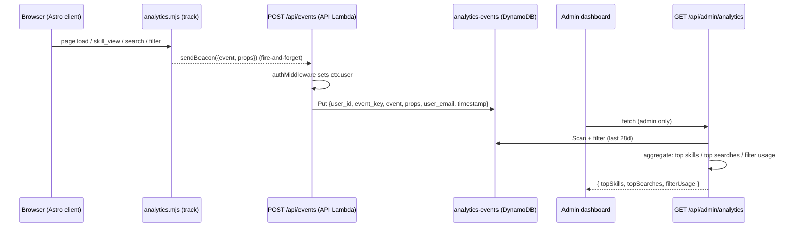

# feat: Hub analytics instrumentation (events + content metrics)

## Summary

Add a client-side event-capture path (four behavioral events) that POSTs to a new `POST /api/events` ingest route, stores events in a dedicated `analytics-events` DynamoDB table with the user's email stamped server-side, and surfaces the newly-available **content analytics** (top viewed skills, top searches, filter usage) as panels in the existing admin dashboard. Existing user-activity metrics stay untouched.

---

## Problem Frame

The Hub has no behavioral instrumentation, so content-usage questions ("which skills get the most views", "what are people searching for") are unanswerable. User-activity counts are already covered by the `users` table's `last_seen_at`; the missing capability is content-level analytics. See origin for the full framing and the Approach A / B / C decision (Sources & References).

---

## Requirements

- R1. Capture four events client-side and persist them: `page_view`, `skill_view`, `search_query`, `filter_applied`. (origin: Events in scope)
- R2. Every event carries `user_email` stamped server-side from the JWT (never client-supplied) plus a server `timestamp`. (origin: server-side identity)
- R3. Events land in a dedicated `analytics-events` DynamoDB table, isolated from the security audit log. (origin: Decision — Approach A)
- R4. Admin dashboard shows top viewed skills, top searches, and filter usage over a rolling 28-day window. (origin: Admin surface)
- R5. Existing user-activity metrics (active/new/returning/dormant) remain sourced from `last_seen_at`, unchanged. (origin: Non-goals)
- R6. Raw per-user event rows expire ~200 days after write via DynamoDB TTL. (revised during implementation from "indefinite"; see origin: Data / retention decision)
- R7. No SSO/auth work; `session_start` is out of scope. (origin: Non-goals + Dropped from list)

**Origin actors:** admins (read the dashboard); all authenticated `@navapbc.com` users (generate events).
**Origin flows:** capture → ingest → store → aggregate → display.

---

## Scope Boundaries

- No `session_start` event and no session-count metric (derivable later from the `page_view` stream).
- No recomputation of user-activity metrics from events (that is upgrade path C).
- No SSO/auth changes.
- No analytics exposure outside the admin dashboard (no external BI export, no per-user-facing analytics).
- No pre-aggregation / rollup tables in this iteration (scan-and-aggregate at read time; see Risks).

### Deferred to Follow-Up Work

- Upgrade path C (events as source of truth for user metrics): future iteration, read-side change to `userSegments()`.
- GSI or pre-aggregation for the events table: add if/when scan latency degrades (see Risks).

---

## Context & Research

### Relevant Code and Patterns

- **Server event write:** `functions/api/lib/audit.mjs` (`writeAudit`) — mirror its shape (`user_id` + `event_key` = ISO ts + UUID) for the new analytics writer, but to a separate table.
- **Route registration:** `functions/api/index.mjs` — routes are registered as `xxxRoutes(app)`; `authMiddleware` runs on `*` so `c.get('user')` is populated for every route.
- **Route + scan/aggregate pattern:** `functions/api/routes/admin.mjs` (`/api/admin/queue`, `/api/admin/audit`) — paginated `ScanCommand` with `FilterExpression`, sort in Lambda, permission-gated via `can(user, ...)`.
- **DynamoDB helper:** `functions/api/lib/dynamo.mjs` — `tables.*` env-var accessors and re-exported commands; add `tables.analyticsEvents()`.
- **Permissions:** `functions/api/lib/permissions.mjs` — `can(user, action)`; `read:audit` is admin-only. Reuse it to gate the analytics read route.
- **Client fetch:** `src/lib/api.mjs` (`fetchApi`) — same-origin, `credentials: 'include'`. Analytics POST will not reuse this (needs `sendBeacon`/fire-and-forget), but follows the same same-origin `/api/*` convention.
- **Skill detail load:** `src/pages/skills/index.astro` (~line 203, `fetchApi('/skills/' + slug)` branch) — the `skill_view` hook.
- **Search inputs:** `src/pages/index.astro` (`#global-search`) and `src/pages/skills/index.astro` (`#skills-search`) — live input filtering; `search_query` fires on debounced input.
- **Filter buttons:** `src/pages/skills/index.astro` (~line 190, `.skills-filter-btn`, `data-filter` = all/org-wide/community) — the `filter_applied` hook.
- **Admin dashboard render:** `src/scripts/admin/dashboard.mjs` — `load()` fetches in parallel and renders stat cards + `adminSection` (gated `ctx.role === 'admin'`). New panels slot in here.
- **Metric formatting/window:** `src/lib/admin/format.mjs` — `ACTIVE_WINDOW_MS` (28d) and `userSegments()`; reuse the 28-day window constant for content metrics.
- **Infra:** `terraform/dynamodb.tf` (audit_log table block to copy), `terraform/lambda.tf` (API Lambda `environment.variables` — `AUDIT_TABLE` etc.), `terraform/iam.tf` (API Lambda execution role DynamoDB policy listing the four table ARNs).
- **Test patterns:** `tests/api/middleware.test.mjs` (vitest, `vi.mock` of `dynamo.mjs`/SSM/cookies) for server logic; `tests/frontend/admin-format.test.mjs` for pure client helpers.

### Institutional Learnings

- None found in `docs/solutions/` for analytics/event capture — greenfield for this repo.

### External References

- None required — the change follows well-established local patterns (Hono route + DynamoDB scan/aggregate + Astro client script). No external research performed.

---

## Key Technical Decisions

- **Separate `analytics-events` table, not the audit log:** behavioral volume would swamp the security trail and the admin "Recent Activity" feed; retention and query shapes differ. (origin: Approach A)
- **Server-stamped identity:** ingest reads `c.get('user').user_id` for `user_email` and generates the `timestamp`; the client body carries only event name + properties. Prevents identity spoofing and keeps SSO untouched.
- **Fire-and-forget client capture via `navigator.sendBeacon`** (fallback `fetch` with `keepalive: true`): analytics must never block navigation or surface errors to users. A failed event is dropped silently.
- **Scan-and-aggregate at read time** (no GSI, no rollups): mirrors `/api/admin/audit` and `/api/admin/queue`; correct for the current low volume. GSI/rollup deferred (see Risks).
- **`search_query` fires on debounced input (~500ms idle), not per keystroke:** search is a live filter with no submit event; debounce defines one logical "search" and captures the final `query` + `result_count`.
- **Reuse `read:audit` (admin-only) to gate the analytics read route:** avoids touching `permissions.mjs`; the existing dashboard `adminSection` is already admin-only. Maintainer access is a future toggle if wanted.
- **Event `key` schema mirrors audit** (`user_id` hash, `event_key` = `${iso}#${uuid}` range): consistent with the existing writer and gives per-user history for free.

---

## Open Questions

### Resolved During Planning

- Where does `skill_view` fire vs a browse-card impression? — Only in the detail-load branch of `src/pages/skills/index.astro` (and the agents detail equivalent), never in list rendering. (origin definition)
- Client or server capture? — Client (site is fully static); server only ingests + stamps identity.
- How to gate the read route? — Reuse `read:audit` (admin-only).

### Deferred to Implementation

- Exact aggregation helper/function names and the precise property-normalization for `search_query` (e.g. trimming/casing of `query`) — settle against real code.
- Whether the agents detail page needs a distinct `skill_view` call site or shares one helper — confirm when wiring `src/pages/agents/`.
- Precise debounce interval — start at 500ms, tune if events look noisy.

---

## High-Level Technical Design

> *This illustrates the intended approach and is directional guidance for review, not implementation specification. The implementing agent should treat it as context, not code to reproduce.*

---

## Implementation Units

- U1. **Provision the `analytics-events` table (Terraform + IAM + env)**

**Goal:** Create the dedicated DynamoDB table and wire it into the API Lambda.

**Requirements:** R3, R6

**Dependencies:** None

**Files:**
- Modify: `terraform/dynamodb.tf` (add `aws_dynamodb_table "analytics_events"`)
- Modify: `terraform/lambda.tf` (add `ANALYTICS_TABLE` to API Lambda `environment.variables`)
- Modify: `terraform/iam.tf` (add the new table ARN to the API Lambda execution role's DynamoDB policy)

**Approach:**
- Copy the `audit_log` table block: `PAY_PER_REQUEST`, hash `user_id`, range `event_key`, PITR enabled, name `${var.project_name}-analytics-events-${var.environment}`, `deletion_protection_enabled = var.environment == "prod"`.
- TTL attribute `ttl` (Unix-epoch seconds), ~200-day expiry (R6). Revised from the original keep-forever decision.
- No GSI in this iteration.
- Requires manual `terraform apply` per env (staging state, then prod) — CI does not apply infra.

**Patterns to follow:**
- `aws_dynamodb_table "audit_log"` in `terraform/dynamodb.tf`.
- Existing `AUDIT_TABLE` env wiring in `terraform/lambda.tf`.

**Test scenarios:**
- Test expectation: none — infrastructure config; validated by `terraform plan`/`apply`, not unit tests.

**Verification:**
- `terraform plan` shows one new table + IAM policy statement + env var, no changes to existing tables.

---

- U2. **Server ingest: `writeEvent` lib + `POST /api/events` route**

**Goal:** Accept client events, stamp identity/timestamp server-side, persist to the table.

**Requirements:** R1, R2, R3

**Dependencies:** U1

**Files:**
- Create: `functions/api/lib/analytics.mjs` (`writeEvent(user, event, props)`)
- Create: `functions/api/routes/events.mjs` (`eventsRoutes(app)` → `POST /api/events`)
- Modify: `functions/api/index.mjs` (register `eventsRoutes`)
- Modify: `functions/api/lib/dynamo.mjs` (add `tables.analyticsEvents()`)
- Test: `tests/api/events.test.mjs`

**Approach:**
- `writeEvent` mirrors `writeAudit`: `event_key = ${now}#${randomUUID()}`, item `{ user_id: user.user_id, event_key, event, props, user_email: user.user_id, timestamp: now }`.
- Route: validate `event` against an allowlist (`page_view`, `skill_view`, `search_query`, `filter_applied`); reject unknown names with 400. Coerce/whitelist `props` per event (drop unexpected keys). Ignore any client-supplied identity/timestamp.
- `authMiddleware` already guarantees `c.get('user')`; unauthenticated requests get 401 from middleware.
- Return `204`/`202` with no body (fire-and-forget); never echo stored data.

**Patterns to follow:**
- `functions/api/lib/audit.mjs`; route/validation style in `functions/api/routes/admin.mjs` (JSON parse guard, 400 on bad body).

**Test scenarios:**
- Happy path: valid `skill_view` with `{skill_id, skill_slug, referrer}` → item written with `user_email` and `timestamp` set from server, client identity ignored. Covers R2.
- Happy path: each of the four event names is accepted.
- Edge case: unknown `event` name → 400, nothing written.
- Edge case: missing/extra `props` keys → stored event contains only whitelisted keys; no crash.
- Error path: malformed JSON body → 400 (no throw).
- Security: body containing `user_email`/`timestamp`/`user_id` → server values win, client values discarded. Covers R2.

**Verification:**
- Posting each event type results in a correctly-shaped row in `analytics-events`; audit-log table is never written.

---

- U3. **Client capture module + wire the four events**

**Goal:** Emit events from the static frontend without blocking UX.

**Requirements:** R1, R7

**Dependencies:** U2

**Files:**
- Create: `src/lib/analytics.mjs` (`track(event, props)` + `page_view` auto-fire)
- Modify: `src/layouts/` Base layout (import/invoke `track('page_view', …)` on load) — confirm exact layout file when wiring
- Modify: `src/pages/skills/index.astro` (fire `skill_view` in the detail branch; `filter_applied` on filter buttons; debounced `search_query` on `#skills-search`)
- Modify: `src/pages/index.astro` (debounced `search_query` on `#global-search`)
- Test: `tests/frontend/analytics.test.mjs`

**Approach:**
- `track()` sends via `navigator.sendBeacon('/api/events', Blob(JSON))`; fallback `fetch('/api/events', {method, keepalive, credentials:'include'})`. Wrap in try/catch; never throw, never await in a way that blocks.
- `page_view`: fire once per load with `{ path: location.pathname, referrer: document.referrer }`.
- `skill_view`: in the `if (slug)` detail branch, fire `{ skill_id, skill_slug: slug, referrer }` where `referrer` ∈ browse/search/direct inferred from `document.referrer`/query param.
- `search_query`: debounce ~500ms after input idle, fire `{ query, result_count }` using the already-computed match count; skip empty queries.
- `filter_applied`: on filter button click, fire `{ filter_name: 'source', filter_value: btn.dataset.filter }`.

**Execution note:** Keep instrumentation additive — do not alter existing search/filter/detail behavior; only add `track()` calls alongside current handlers.

**Patterns to follow:**
- Existing client script structure and event wiring in `src/pages/skills/index.astro` / `src/pages/index.astro`; module import style of `src/lib/api.mjs`.

**Test scenarios:**
- Happy path: `track('page_view', props)` calls `sendBeacon` with the correct URL and JSON payload.
- Edge case: `sendBeacon` unavailable → falls back to `fetch` with `keepalive: true`.
- Error path: transport throws → `track` swallows the error (no unhandled rejection, returns cleanly).
- Behavior: debounced `search_query` fires once after multiple rapid inputs, with the final `query` + `result_count`; empty query fires nothing.
- Behavior: filter button click emits `filter_applied` with the button's `data-filter` value.

**Verification:**
- Navigating pages, opening a skill, searching, and toggling filters each produce exactly one corresponding row; no console errors; navigation unaffected.

---

- U4. **Aggregation route: `GET /api/admin/analytics`**

**Goal:** Return windowed content metrics for the dashboard.

**Requirements:** R4, R5

**Dependencies:** U1, U2

**Files:**
- Modify: `functions/api/routes/admin.mjs` (add `GET /api/admin/analytics`)
- Test: `tests/api/admin-analytics.test.mjs`

**Approach:**
- Gate with `can(user, 'read:audit')` → 403 otherwise.
- Paginated `ScanCommand` over `analytics-events` with `FilterExpression` on `timestamp >= :cutoff` (28-day cutoff, reuse a shared window value).
- Aggregate in Lambda: `topSkills` (count of `skill_view` by `skill_slug`, sorted desc, top N), `topSearches` (count of `search_query` by normalized `query` + representative `result_count`, top N), `filterUsage` (count of `filter_applied` by `filter_value`).
- Does not read or modify the users table (R5 — user metrics stay on `last_seen_at`).
- Return `{ topSkills, topSearches, filterUsage, window_days: 28 }`.

**Patterns to follow:**
- Scan-pagination + Lambda sort in `/api/admin/queue` and `/api/admin/audit` (`functions/api/routes/admin.mjs`).

**Test scenarios:**
- Happy path: mixed events in-window → correct top-skills/top-searches/filter-usage counts, sorted descending.
- Edge case: events older than the cutoff are excluded.
- Edge case: empty table → empty arrays, 200 (not error).
- Error path: non-admin (`user` role) → 403.
- Edge case: ties broken deterministically (stable sort / secondary key).

**Verification:**
- With seeded events, the endpoint returns counts matching the seed within the 28-day window and excludes older rows.

---

- U5. **Admin dashboard content-analytics panels**

**Goal:** Render the new metrics in the admin dashboard.

**Requirements:** R4

**Dependencies:** U4

**Files:**
- Modify: `src/scripts/admin/dashboard.mjs` (fetch `/admin/analytics`, render panels)
- Test: `tests/frontend/admin-dashboard-analytics.test.mjs` (or extend `tests/frontend/admin-format.test.mjs` if a pure render helper is extracted)

**Approach:**
- Add `/admin/analytics` to the parallel `fetchApi` block in `load()` (admin-only, `.catch(() => ({}))` like the others).
- Render three panels (top skills, top searches, filter usage) in `adminSection`, matching the existing card styling and `escapeHtml` usage; empty-state text when arrays are empty.
- Leave the existing Users / Recent Activity panels unchanged (R5).

**Patterns to follow:**
- Existing `statCard` / `adminSection` markup and `escapeHtml` in `src/scripts/admin/dashboard.mjs`; label/tooltip helpers in `src/lib/admin/format.mjs`.

**Test scenarios:**
- Happy path: given an analytics payload, panels render rows with escaped skill slugs / queries / filter values and correct counts.
- Edge case: empty payload → empty-state text, no thrown error.
- Security: user-supplied strings (search queries) are HTML-escaped in output. Covers R2 (no stored-XSS via captured queries).
- Behavior: non-admin context does not fetch or render analytics (existing `ctx.role === 'admin'` gate).

**Verification:**
- Admin sees populated content-analytics panels; maintainer/user do not; existing metrics unchanged.

---

## System-Wide Impact

- **Interaction graph:** new `POST /api/events` runs through the shared `authMiddleware`; a new admin fetch is added to the dashboard's parallel load. No existing route is modified except additive changes in `admin.mjs`.
- **Error propagation:** client capture is fire-and-forget (never surfaces to users); ingest returns 4xx only for malformed/unknown input; aggregation returns 403/200.
- **State lifecycle risks:** events are append-only; no updates/deletes; duplicate events (e.g. double-fire) inflate counts — mitigate by single-firing per logical action (debounce, one call per load).
- **API surface parity:** `page_view` covers all pages generically; `skill_view` needs the agents detail page wired too if agent views should count (confirm in U3).
- **Unchanged invariants:** the `users` table, `last_seen_at`, `userSegments()`, and the audit-log table/`writeAudit` are explicitly not changed. Content analytics is strictly additive.

---

## Risks & Dependencies

| Risk | Mitigation |
|------|------------|
| Read-time scan → aggregation latency grows as events accumulate | ~200-day TTL caps table size (and therefore scan cost). Still O(table): add a time-bucketed GSI or nightly rollup if 200-day volume ever strains the 30s Lambda timeout. |
| Client double-firing inflates counts (SPA-like re-renders, rapid input) | Debounce `search_query`; fire `page_view`/`skill_view` once per load; single filter-click handler. |
| Stored search queries rendered in admin could carry HTML | `escapeHtml` all user-derived strings in U5 (tested). |
| `terraform apply` is manual per env — table could lag code deploy | Sequence U1 apply (staging then prod) before deploying U2 code; ingest to a missing table would error server-side only (client fire-and-forget unaffected). |
| PII (`user_email`) on every row | Internal `@navapbc.com` tool; admin-only read gate; ~200-day TTL caps retention; revisit if Hub serves external users. |

---

## Sources & References

- **Origin document:** [docs/brainstorms/2026-07-09-hub-analytics-instrumentation-requirements.md](docs/brainstorms/2026-07-09-hub-analytics-instrumentation-requirements.md)
- Related issue: [navapbc/skills-registry#18](https://github.com/navapbc/skills-registry/issues/18)
- Related code: `functions/api/lib/audit.mjs`, `functions/api/routes/admin.mjs`, `src/scripts/admin/dashboard.mjs`, `terraform/dynamodb.tf`
