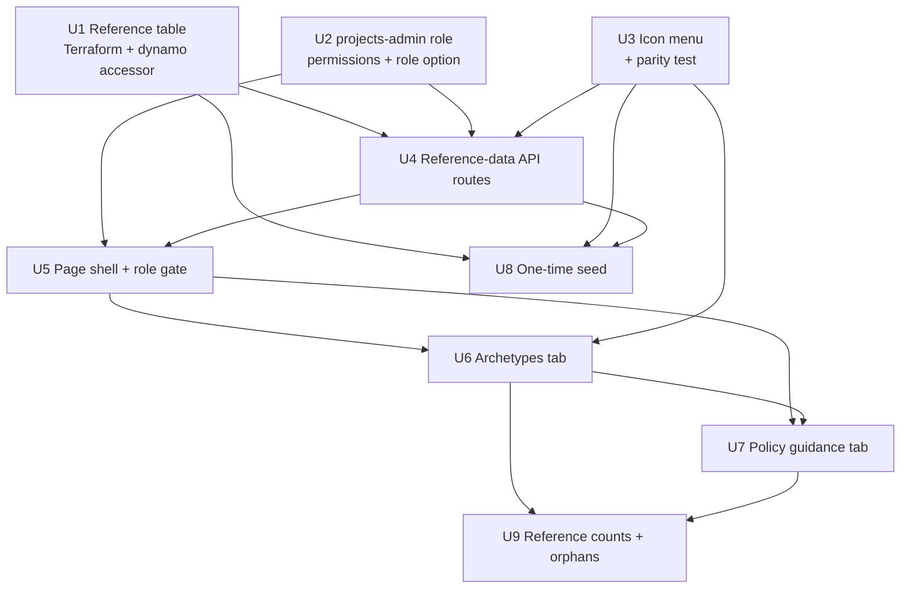

# feat: Projects admin page for archetypes and policy guidance

## Summary

A new unlinked `/projects-admin` page reuses the existing generic tab controller and admin client-script conventions, backed by one Hono route module modeled on the plugins routes and a single DynamoDB reference table keyed by entity type. The existing `/admin` page is touched in exactly one place — the role option — and the archetype icon allowlist is duplicated across the Lambda packaging boundary with a parity test, following the categories precedent.

---

## Problem Frame

Archetype and policy-guidance content currently lives in JSON files outside this repo, inlined into a static HTML prototype at bundle time, so every content correction is an engineering task. See the origin document for the full framing.

The plan-time problem is narrower: this repo has a well-established shape for admin CRUD (route module, permission check, audit write, string-template client script) but no precedent for a second admin surface with its own role, and one packaging constraint that shapes the icon work.

---

## Requirements

Requirement IDs trace directly to the origin document.

**Page and access control**
- R1. Page at `/projects-admin`, reachable by direct URL, linked from nowhere, holding two tabs.
- R2. New `projects-admin` role, orthogonal to the existing hierarchy — grants these two tabs and nothing else, and is not acquired by existing content curators.
- R3. Site admins have the same access; all other roles have none.
- R4. Every read and mutation authorized server-side; unauthorized signed-in users get an explicit refusal, not an empty page.
- R5. The role is selectable where site admins already assign roles and accepted by the role-change API. Only change to the existing admin page.
- R6. Role grants and every mutation on either tab are recorded in the audit trail, attributed to the acting user.

**Archetype management**
- R7. Archetypes tab lists all archetypes, supports add and edit.
- R8. Archetype carries identifier, label, description, color, icon, ordered characteristics, ordered AI opportunities.
- R9. Icon chosen from a closed menu of the hub's existing icons, displayed rendered; an off-menu value cannot be saved.

**Policy guidance management**
- R10. Policy tab lists all postures, supports add and edit. Adding requires no code change or deploy.
- R11. Posture carries identifier, label, color, display position, ordered guidance steps; steps support add, edit, reorder, remove with order preserved on read.
- R12. Display position determines posture order wherever the Contract Explorer enumerates them. No severity semantics; nothing branches on it.
- R13. Color is the only presentation attribute; rendering derives treatment from it so a new posture styles correctly on creation.

R12 and R13 are satisfied here at the **storage and authoring layer only**. Both describe behavior in the Contract Explorer, which this plan does not build — the ordering and color a user authors are stored and shown in the admin tab, but no reader renders them until the Contract Explorer read path exists. See Risks & Dependencies.

**Referential integrity**
- R14. No hard delete while program data references a record; deactivate instead — stops being offered, existing references still resolve.
- R15. Each tab shows per-record reference counts, and surfaces values present in program data with no matching record.

**Seeding and source of truth**
- R16. One-time seed from the prototype's two JSON files; from the policy file, only guidance content.
- R17. Seed creates only absent records, never overwrites; safe to re-run.
- R18. Seed translates existing icon names to the hub's icon menu equivalents.
- R19. After seeding, the table is sole source of truth; neither JSON file is read at runtime.

**Origin actors:** A1 (projects admin), A2 (site admin), A3 (Google Sheet pipeline)
**Origin flows:** F1 (add a new posture), F2 (correct a guidance step), F3 (retire a referenced archetype)
**Origin acceptance examples:** AE1–AE3 (covers R2, R3, R4), AE4 (covers R9), AE5 (covers R10, R12, R13), AE6 (covers R11), AE7 (covers R14), AE8 (covers R15), AE9 (covers R17), AE10 (covers R16)

---

## Scope Boundaries

- Any change to the existing admin page beyond two narrow edits: adding the role option to its user-role control, and tightening its client-side role gate from a blocklist to an allowlist so the new role is not admitted (see U2).
- Retrofit tests for existing admin client scripts, none of which are currently covered.
- The Contract Explorer read path, its page, and its data model.
- Programs, initiatives, survey, and regulatory data, including the Google Sheet pipeline.
- Per-client or per-contract policy records.
- Approval workflow or version history on guidance content.
- Migrating or syncing the prototype HTML.
- Loading an icon font or sourcing icons outside the hub's existing set.

### Deferred to Follow-Up Work

- Relocating the shared tab controller to a neutral module: it now serves two pages but stays in the admin scripts folder, because moving it would edit `/admin`'s imports. Worth doing in a separate PR once this lands.
- Expanding the archetype icon menu beyond the initial set: a code change by design, done on demand.

---

## Context & Research

### Relevant Code and Patterns

- `functions/api/routes/plugins.mjs` — the closest template for the new route module: scan/get for reads, permission check then `PutCommand` then `writeAudit` for mutations, 403/400/404 shapes already consistent.
- `functions/api/lib/permissions.mjs` — `ROLE_RANK` linear ladder plus `can()`. Unknown roles fall through to the lowest rank, which is what makes an orthogonal role safe to add.
- `functions/api/lib/dynamo.mjs` — `tables` accessor mapping logical names to env vars; the new table joins it.
- `functions/api/lib/audit.mjs` — `writeAudit` already builds the `resource_key` composite the `byResource` GSI queries.
- `src/scripts/admin/controller.mjs` — `createTabController({ loaders, role })` is already generic; reusable unchanged.
- `src/scripts/admin/enterprise.mjs` — the fullest example of a tab with an inline add/edit form, row actions, and role-conditional controls. The archetypes tab mirrors its shape.
- `src/scripts/admin/index.mjs` — the entry pattern: fetch the current user for its role, redirect if unauthorized, build a loader map, wire tab buttons.
- `src/components/admin/AdminTabs.astro` — enumerates its tabs in a local array; the new page needs a sibling rather than a modification.
- `src/lib/icons.mjs` — hand-maintained inline-SVG map, Tabler outline set, five entries. `renderIcon` returns an empty string for unknown names.
- `src/lib/categories.mjs` + `functions/api/lib/categories.mjs` + `tests/categories-parity.test.mjs` — the established answer to sharing a constant across the Lambda packaging boundary.
- `scripts/migrate-to-dynamodb.mjs` — one-time-script conventions: explicit `--env` flag, AWS SDK resolved via `createRequire` against the API package.
- `terraform/dynamodb.tf` — carries a load-bearing comment about keeping deprecated `hash_key`/`range_key` syntax; the new table must follow it.

### Institutional Learnings

- No `docs/solutions/` directory exists in this repo yet, so there are no captured learnings to apply. Worth capturing one after this lands, given the packaging-boundary constraint recurs.
- Interpolated Tailwind class names emit no CSS. Admin-set colors must be applied as inline styles, not as generated class names.

### External References

None. Every pattern this plan needs already exists locally with multiple direct examples, so no external research was run.

---

## Key Technical Decisions

- **One shared reference table keyed by entity type, not one table per entity**: both datasets are small and static — low churn, no independent growth or throughput profile — so neither warrants its own table's indexes or lifecycle. Each tab reads with a single query rather than a scan. This diverges from the repo's one-table-per-entity convention deliberately; the convention exists for entities with distinct access patterns, which these do not have.
- **A whole record is written on every edit**: because write contention on static data is negligible, reordering guidance steps is a single write with order carried by array position, and no optimistic-concurrency or per-step sort-key machinery is warranted. "Static" here means low churn, not immutable — the point of the feature is that this data *can* change — so the design optimizes for correctness and auditability on write rather than write throughput.
- **The new role is a capability branch in `can()`, leaving `ROLE_RANK` untouched**: there is no rank at which `projects-admin` is correct, since inserting it below content curation would make curators inherit it and above would make its holders inherit skill review. The existing unknown-role fallback to the lowest rank means the orthogonal treatment fails safe (see origin: `docs/brainstorms/2026-08-06-projects-admin-archetypes-policy-requirements.md`).
- **A single permission action covering both entity types, not one per type**: the origin scoped the role as all-or-nothing across both tabs, so per-entity actions would be unused surface. The cost is that access is table-scoped by construction — any third reference dataset added to this table inherits the same grant, and separating it later means a table split and a data move rather than a permission change. The admission rule follows: only entity types intended to be governed by this one capability may join this table.
- **"Orthogonal" means orthogonal to the rank ladder, not additive**: the role field on a user is a single string, so a holder cannot simultaneously be a content curator. Assigning this role to an existing maintainer silently strips their curation capabilities, and the audit trail records only a role change. That is acceptable for the intended actor, who is a content owner rather than a curator, but it is a real constraint rather than a free addition. Multi-role support — making the field an array — is explicitly deferred; it would be the prerequisite for anyone needing both.
- **Icon allowlist duplicated between frontend and API, guarded by a parity test**: the API Lambda zip is built from `functions/api/` alone, so the two cannot share a module at runtime. This is the same constraint categories already solved, and reusing that solution keeps one mechanism rather than two.
- **Deactivation is a status field on the record**: mirrors the existing status/visibility convention on skills rather than introducing a soft-delete mechanism or an archive table.
- **Reference counting is sequenced last**: it is the only work depending on program data that has not landed in this repo yet. Isolating it means the arrival date of that data gates one unit rather than the plan.
- **Client rendering stays with string templates and explicit escaping**: every existing admin tab is built this way, and introducing a component framework for two tabs would fragment the codebase for no benefit.

---

## Open Questions

### Resolved During Planning

- One table or two: one shared table keyed by entity type. Rationale above.
- How to validate icon names server-side given the packaging boundary: duplicate the allowlist and add a parity test, following categories.
- Whether the new route needs an edge rewrite entry: no. The rewrite function's fallback appends `/index.html` for unmatched single-level routes, and `/projects-admin` does not collide with the `/admin` prefix rule.
- Whether reusing the admin tab controller violates the don't-touch-`/admin` constraint: no. Importing a module is not modifying the page. Relocation is deferred.
- Whether the seed reads the JSON files from a committed location: no. They are external to this repo and passed by path, which keeps prototype content out of a public repository and matches the origin's assumption that the files are temporary.

### Deferred to Implementation

- The exact set of icons added to the menu: needs equivalents for the five seeded archetypes plus headroom, chosen by looking at the Tabler outline set against archetype semantics. A naming decision, not an architectural one.
- How the tabs render the reference-count column before program data exists: the unavailable state's exact copy and placement is a small UI decision best made against the rendered page.
- Whether the trailing-slash form of the new route needs handling: the edge rewrite produces a doubled slash for trailing-slash requests on unprefixed routes, which is pre-existing behavior for other pages. Verify against the deployed page and treat as a separate fix if it bites.
- Should one person be able to hold both content-curation and project-reference capabilities? The role field is a single string today, so the two are mutually exclusive. Answering yes makes multi-role support a prerequisite rather than a deferral.
- Is the Contract Explorer read path scheduled, and does it land before or after this work? That sequencing determines when the origin's no-deploy outcome becomes observable, and who reconciles the page's current alphabetical posture sort with the authored display position.
- Once program data lands, is a `projects-admin` holder an appropriate audience for raw unmatched program values surfaced as orphans, or should that view be restricted to site admins? Those values may carry client- or contract-identifying content.

---

## Output Structure

    src/pages/projects-admin/
      index.astro                        page shell, role-gated client entry
    src/components/projects-admin/
      ProjectsAdminTabs.astro            two-tab nav + panels
    src/scripts/projects-admin/
      index.mjs                          entry: role gate, loader map, tab wiring
      list-editor.mjs                    ordered-list editor shared by both tabs
      archetypes.mjs                     archetypes tab render + form
      postures.mjs                       policy guidance tab render + step editor
    functions/api/
      lib/project-reference.mjs          entity constants, icon allowlist, validation
      routes/project-reference.mjs       CRUD + deactivate for both entity types
    scripts/
      seed-project-reference.mjs         one-time idempotent seed

---

## High-Level Technical Design

> *This illustrates the intended approach and is directional guidance for review, not implementation specification. The implementing agent should treat it as context, not code to reproduce.*

**Shared table shape.** One table, entity type as partition key and record id as sort key, so each tab is one query and the two datasets never interleave in a read.

    entity_type    id                        (record attributes)
    ──────────────────────────────────────────────────────────────────
    archetype      product-team              label, description, color,
                                             icon, characteristics[],
                                             ai_opportunities[], status
    archetype      platform-team             …
    posture        allowed                   label, color, position,
                                             steps[], status
    posture        restricted                …

Guidance step order is the array's own order — the whole record is one write, so a reorder is a single put rather than a set of position updates.

**Unit dependency graph.** Non-linear: the three foundation units are independent of each other, and the two tab UIs are independent once the shell exists.

---

## Implementation Units

Grouped into four phases. Within a phase, units are independent unless the dependency line says otherwise.

### Phase 1 — Foundation

- U1. **Provision the shared reference table**

**Goal:** The API Lambda can read and write a new reference table, and the table exists in both environments.

**Requirements:** R19

**Dependencies:** None

**Files:**
- Modify: `terraform/dynamodb.tf`
- Modify: `terraform/iam.tf`
- Modify: `terraform/lambda.tf`
- Modify: `functions/api/lib/dynamo.mjs`
- Test: `tests/api/lib/dynamo.test.mjs`

**Approach:**
- One table resource with entity type as partition key and record id as sort key, no GSIs — every access path is a query on the partition key or a direct get.
- Follow the existing file's deprecated `hash_key`/`range_key` guidance rather than `key_schema`; the comment at the top of `terraform/dynamodb.tf` explains why, and violating it causes destructive GSI churn on the other tables.
- Enable point-in-time recovery, matching every other table. Deletion protection in prod, matching the tables that hold non-reconstructible data — this data is admin-authored and not re-derivable from a sync.
- Add the table to the API Lambda's IAM statement and its environment block, and to the `tables` accessor.
- The GitHub deploy role does **not** need the new table. Its DynamoDB statement is deliberately narrower than the Lambda's, covering only the tables the automated sync writes, and the seed (U8) is operator-run with the operator's own credentials. Only add it there if the seed is later moved into CI.

**Patterns to follow:**
- `terraform/dynamodb.tf` — the `plugins` table for the simple no-GSI shape; the `users` table for the deletion-protection conditional.
- `functions/api/lib/dynamo.mjs` — the `tables` object's env-var indirection.

**Test scenarios:**
- Happy path: the `tables` accessor returns the configured table name when its environment variable is set.
- Edge case: the accessor returns undefined rather than throwing when the variable is unset, matching the existing accessors' behavior so a misconfiguration surfaces as a DynamoDB error naming the table rather than a module-load crash.

**Verification:**
- A Terraform plan shows one table added, the Lambda environment gaining one variable, the Lambda's DynamoDB IAM statement gaining the new ARN, and the `DynamoDBSync` statement in `terraform/iam.tf` unchanged — and shows no changes to the existing tables or their indexes.

---

- U2. **Add the `projects-admin` role and its capability**

**Goal:** A distinct role exists that grants the two new tabs and nothing else, and site admins can assign it.

**Requirements:** R2, R3, R4, R5, R6

**Dependencies:** None

**Files:**
- Modify: `functions/api/lib/permissions.mjs`
- Modify: `functions/api/routes/admin.mjs`
- Modify: `functions/api/routes/users.mjs`
- Modify: `src/scripts/admin/users.mjs`
- Modify: `src/scripts/admin/index.mjs`
- Modify: `docs/rbac-permissions.md`
- Test: `tests/api/permissions.test.mjs`
- Test: `tests/api/routes/admin.test.mjs`
- Test: `tests/api/routes/users.test.mjs`

**Approach:**
- Introduce one capability action for managing project reference data, granted to the new role and to admins, and denied to every other role. Keep it out of the two existing action sets, which are gated by rank.
- Do not add the role to `ROLE_RANK`. The existing lookup already defaults unrecognized roles to the lowest rank, so a holder inherits no rank-gated capability. Add a comment recording that this is deliberate, because the omission looks like an oversight to a future reader.
- Extend the accepted-role set and the role dropdown's options. **There are two role-change routes with independently hardcoded valid-role sets**: `PUT /api/admin/users/:id/role` in `functions/api/routes/admin.mjs`, which is the one the dropdown actually calls, and `PUT /api/users/:id/role` in `functions/api/routes/users.mjs`, which the UI does not use. Both must accept the new role, and both error messages enumerate the valid roles in prose. Miss the admin route and a valid dropdown selection returns 400.
- **Tighten the admin page's client-side role gate.** It currently redirects only when the role is exactly `user` — a blocklist, not an allowlist — so any fourth role is admitted and lands in a shell where every tab loader 403s. Change it to admit only `maintain` and `admin`. This is the second of the two permitted edits to the existing admin page.
- Update the RBAC doc's role table and permission matrix, which currently document three roles as the complete set. Also add a short section recording that the model now has **two axes** — the linear rank ladder, and orthogonal capability roles gated outside it — with the rule for choosing between them and the standing obligation that any new rank-gated action be asserted denied for every orthogonal role.

**Execution note:** Write the permission tests first. The failure mode here is silent over-granting, which a test asserts far more reliably than reading the branch.

**Patterns to follow:**
- `functions/api/lib/permissions.mjs` — the existing admin-only and maintain-plus action sets.
- `tests/api/permissions.test.mjs` — its fixture-per-role structure extends naturally to a fourth role.

**Test scenarios:**
- Happy path: a `projects-admin` holder is granted the project-reference capability.
- Happy path: an admin is granted the project-reference capability.
- Covers AE1. Error path: a `projects-admin` holder is denied every *privileged* action — skill approval, skill editing, plugin management, enterprise management, user reads, role setting, audit reads, and both delete actions. Assert each individually rather than in aggregate, so a future action added to a rank-gated set cannot silently leak.
- Happy path: a `projects-admin` holder retains exactly the baseline capabilities every signed-in user has — skill submission, reading approved public and internal skills, and updating their own records. These are granted unconditionally by the permission module's fallthrough, so "grants these two tabs and nothing else" means nothing else *privileged*; the baseline floor is deliberate and asserting it prevents a future implementer from "fixing" it.
- Covers AE2. Error path: a `maintain` holder is denied the project-reference capability.
- Error path: a `user` holder, and a null user, are denied the project-reference capability.
- Edge case: the rank helper reports a `projects-admin` holder as not meeting the maintain threshold, confirming the ladder is unaffected.
- Happy path: the admin role-change route accepts the new role from an admin and persists it.
- Error path: the admin role-change route rejects an unrecognized role name, and rejects a valid role name from a non-admin.
- Happy path: the second role-change route in the users module also accepts the new role, so the two valid-role sets cannot drift.
- Error path: a `projects-admin` holder opening the existing admin page is redirected away rather than rendering the tab shell.

**Verification:**
- Permission tests cover all four roles against the new capability and the new role against every pre-existing privileged action; a `projects-admin` holder navigating to the existing admin page is redirected; both role-change routes accept the new role; and the RBAC doc's matrix and two-axis section match the code.

---

- U3. **Extend the icon menu and establish the shared allowlist**

**Goal:** A curated set of archetype-appropriate icons exists, the same list is known to both the frontend and the API, and drift between them fails a test.

**Requirements:** R9, R18

**Dependencies:** None

**Files:**
- Modify: `src/lib/icons.mjs`
- Create: `functions/api/lib/project-reference.mjs`
- Test: `tests/project-icons-parity.test.mjs`
- Test: `tests/frontend/icons.test.mjs`

**Approach:**
- Add archetype-appropriate icons to the existing map, additively. The map is currently scoped to the names categories reference, so its header comment needs updating to reflect a second consumer.
- Export the subset of names offered as archetype icons from the frontend module, and mirror that list in a new API-side module alongside the entity-type constants. Duplication is forced by the Lambda packaging boundary, not chosen.
- The parity test asserts the two lists are identical *and* that every name in the frontend list resolves to actual icon markup — the second assertion is what prevents an allowlist entry that renders as nothing.

**Patterns to follow:**
- `src/lib/categories.mjs` and `functions/api/lib/categories.mjs` — the duplication pattern and its explanatory comments.
- `tests/categories-parity.test.mjs` — the drift-guard test shape.

**Test scenarios:**
- Happy path: the frontend and API archetype-icon lists contain the same names.
- Covers AE4. Happy path: every name in the archetype-icon list renders non-empty markup.
- Edge case: the icons the category tiles depend on still render, confirming the extension was additive.
- Error path: rendering an unknown icon name still returns an empty string, documenting the existing silent-failure behavior that the allowlist exists to prevent reaching.

**Verification:**
- Removing a name from either list, or adding one without its markup, fails a test.

---

### Phase 2 — API

- U4. **Reference-data API routes**

**Goal:** Both entity types can be listed, created, updated, and deactivated through authorized, audited endpoints.

**Requirements:** R4, R6, R7, R8, R9, R10, R11, R12, R13, R14

**Dependencies:** U1, U2, U3

**Files:**
- Create: `functions/api/routes/project-reference.mjs`
- Modify: `functions/api/lib/project-reference.mjs`
- Modify: `functions/api/index.mjs`
- Modify: `docs/api.md`
- Modify: `docs/openapi.yaml`
- Test: `tests/api/routes/project-reference.test.mjs`

**Approach:**
- One route module serving both entity types, since they share a table, a permission action, and an identical mutation lifecycle. Reads are a query on the entity-type partition; writes put a whole record.
- Every mutation checks the capability before touching the table and writes an audit entry after, matching the plugins module's ordering — the check must precede the read of the existing record, not just the write.
- **Reads are gated too, unlike the plugins module.** Its list and get routes are intentionally open to any signed-in user; these are not. R4 requires every read authorized server-side, so the list and get handlers check the same capability before querying. This is the one place the plan deliberately departs from the template it otherwise follows, and it is easy to lose by copying the pattern literally.
- Validation lives in the shared lib module so both entity types and the seed script use one implementation: identifier shape, required fields per entity type, icon name against the allowlist, and rejection of an unknown entity type before it can create a phantom partition.
- Deactivation is a status transition on the record, exposed as its own operation rather than as a general field update, so the audit trail names the intent. Hard delete is not exposed at all — the origin requires it be impossible while references exist, and reference data is never reachable for deletion in practice, so omitting the route is simpler than guarding it.
- Guidance step order is the stored array's order. Reject a step array containing empty entries, since an empty step renders as a blank instruction in guidance a team is meant to follow.

**Execution note:** Start with a failing test for the unauthorized-mutation path. Getting the check-before-read ordering wrong is invisible in manual testing and is exactly what the origin's R4 is about.

**Patterns to follow:**
- `functions/api/routes/plugins.mjs` — permission check, existence check, whole-record put, audit write, and the 400/403/404 response shapes.
- `functions/api/lib/audit.mjs` — pass a resource type per entity so the `byResource` GSI can distinguish them.

**Test scenarios:**
- Happy path: listing archetypes returns only archetype records; listing postures returns only posture records. Assert the two do not bleed across, since a wrong partition key would return everything.
- Happy path: creating an archetype with valid fields persists it and returns it, and an audit entry is written naming the actor and the record.
- Covers AE5. Happy path: creating a posture with a label, color, position, and steps persists it, and it appears in a subsequent list.
- Covers AE6. Happy path: updating a posture with reordered steps returns them in the new order, and a subsequent read preserves that order.
- Covers AE3. Error path: every mutation is refused for a `maintain` holder, a plain user, and an unauthenticated request — asserted per endpoint, not once.
- Covers AE3. Error path: listing either entity type, and getting a single record, are refused for a `maintain` holder, a plain user, and an unauthenticated request. Assert reads separately from mutations; the pattern this module follows leaves its own reads open, so an untested read path is the likely place the gate goes missing.
- Error path: an unauthorized mutation writes no audit entry and does not read or modify the record.
- Error path: creating a record with an off-allowlist icon name is refused.
- Error path: creating a record with an unknown entity type is refused rather than creating a new partition.
- Error path: creating a posture with an empty string among its steps is refused.
- Error path: updating a nonexistent record returns not-found rather than creating it.
- Edge case: deactivating a record leaves it retrievable by id while marking its status, and writes an audit entry naming deactivation rather than a generic update.
- Edge case: a record with no optional list fields round-trips without those fields becoming null-valued entries.

**Verification:**
- Every mutation endpoint has a passing unauthorized-access test, and the API docs and OpenAPI spec describe the new endpoints.

---

### Phase 3 — UI

- U5. **Page shell and role-gated client entry**

**Goal:** `/projects-admin` exists, is linked from nowhere, admits only the two authorized roles, and hosts two working tabs.

**Requirements:** R1, R3, R4

**Dependencies:** U2, U4

**Files:**
- Create: `src/pages/projects-admin/index.astro`
- Create: `src/components/projects-admin/ProjectsAdminTabs.astro`
- Create: `src/scripts/projects-admin/index.mjs`
- Test: `tests/frontend/projects-admin-shell.test.mjs`

**Approach:**
- The page is a sibling of the existing admin page: base layout, heading, tab component, and a client entry. It is added to no navigation component, which is what makes it unlinked.
- A new two-tab component rather than a modification to the existing tab component, which enumerates its seven tabs locally. The tab controller module is imported from the admin scripts folder unchanged.
- The entry fetches the current user to learn its role — the session cookie carries identity but not role — and refuses rather than redirecting silently, so an authorized-looking user who lost the role understands what happened. This deliberately differs from the existing admin entry, which redirects to the homepage; the origin's R4 asks for an explicit refusal.
- Verified: the current-user endpoint applies no permission check and simply returns the authenticated user, so a `projects-admin` holder can read their own role without any change to the users routes. No permission work is needed in this unit.
- No edge-rewrite change: the fallback already resolves this route. Confirm during implementation that the built output lands where the fallback expects.

**Patterns to follow:**
- `src/pages/admin/index.astro` — page composition and the client-entry script block.
- `src/components/admin/AdminTabs.astro` — the tab-nav-plus-panels structure.
- `src/scripts/admin/index.mjs` — fetch-role-then-gate, loader map, tab button wiring.
- `src/scripts/admin/controller.mjs` — imported as-is.

**Test scenarios:**
- Covers AE3. Error path: given a user whose role is neither `projects-admin` nor `admin`, the entry renders a refusal and calls no data-loading path.
- Happy path: given a `projects-admin` holder, both tab loaders are registered and the first tab activates.
- Happy path: given an admin, the same two tabs are available.
- Edge case: given a failed user fetch, the entry refuses rather than defaulting to authorized.

**Verification:**
- The page renders both tabs for both authorized roles, refuses everyone else, and appears in no navigation markup anywhere in the site.

---

- U6. **Archetypes tab**

**Goal:** An authorized user can list, add, and edit archetypes, including their ordered lists and their icon.

**Requirements:** R7, R8, R9

**Dependencies:** U3, U5

**Files:**
- Create: `src/scripts/projects-admin/archetypes.mjs`
- Create: `src/scripts/projects-admin/list-editor.mjs`
- Test: `tests/frontend/projects-admin-archetypes.test.mjs`
- Test: `tests/frontend/projects-admin-list-editor.test.mjs`

**Approach:**
- Table of records with row actions, plus an inline add/edit form, mirroring the enterprise tab's shape — **with one deliberate departure: row actions are Edit only.** The enterprise tab offers Delete, and no delete endpoint exists here by design. Deactivate arrives with U9; until then the tab presents no removal affordance at all. Never render a Delete control anywhere in this UI.
- The ordered-list editor is built here as a shared module and consumed by U7, since both tabs need identical add, edit, remove, and reorder behavior over a list of strings. Building it in U6 rather than duplicating it is why U7 depends on U6.
- Reordering is keyboard-operable: the editor offers explicit move-up and move-down controls per entry, whether or not a drag affordance is also present. Drag-only reordering would put list order out of reach for keyboard and screen-reader users, and order is semantically load-bearing on the policy tab.
- The icon control is a menu of rendered icons rather than a text input, which is what makes an off-menu value unreachable from the UI. Server-side validation from U4 remains the actual boundary.
- The color control shows a live swatch. The swatch and every archetype badge apply color as an inline style; interpolated Tailwind class names emit no CSS and would silently render unstyled.
- Characteristics and AI opportunities are repeatable text inputs with add, remove, and reorder, sharing one list-editor helper with the posture step editor in U7 rather than each implementing its own.
- All interpolated values are escaped. This content is authored by humans and rendered into markup for other users.

**Patterns to follow:**
- `src/scripts/admin/enterprise.mjs` — list plus inline form plus row actions, and its data-attribute round-tripping for edit state.
- `src/lib/render.mjs` — the escaping helper every admin script uses.
- `src/lib/icons.mjs` — rendering an icon by name for the menu options.

**Test scenarios:**
- Happy path: given a set of archetypes, the tab renders one row each with label, color swatch, and rendered icon.
- Happy path: given an empty set, the tab renders an empty state rather than an empty table.
- Covers AE4. Error path: the icon control offers only allowlisted names, and the form cannot be submitted with any other value.
- Edge case: an archetype whose characteristics or opportunities lists are absent renders without error, and the form starts those lists empty rather than showing a blank entry.
- Edge case: reordering a list entry moves it and leaves the others' order intact.
- Happy path: a list entry can be moved up and down using the explicit controls alone, without any drag interaction.
- Edge case: the first entry's move-up and the last entry's move-down are unavailable rather than silently doing nothing.
- Error path: no Delete control is rendered on any archetype row, since no delete endpoint exists.
- Error path: a label containing markup characters renders as text, not as markup.
- Error path: a failed save surfaces the error in the panel and leaves the form populated so the input is not lost.

**Verification:**
- An archetype can be created and edited end to end, and its color and icon render correctly in the list without a stylesheet change.

---

- U7. **Policy guidance tab**

**Goal:** An authorized user can list postures, add a posture that did not exist before, and edit any posture's steps and their order.

**Requirements:** R10, R11, R12, R13

**Dependencies:** U5, U6 — U6 builds the shared ordered-list editor this tab's step editor uses.

**Files:**
- Create: `src/scripts/projects-admin/postures.mjs`
- Test: `tests/frontend/projects-admin-postures.test.mjs`

**Approach:**
- Postures listed in display-position order, each expandable to its ordered steps. An explicit add-posture control, since the origin's driving requirement is that the set is open.
- The step editor is the same list-editor helper U6 uses, with reorder as a first-class action rather than an afterthought — step order is semantically load-bearing in guidance a team follows in sequence.
- **Position is set by moving the posture row within the list, not by typing a number.** Postures reorder the same way steps do, with the affected positions recomputed and rewritten on save. A raw integer field would invite the position collision the test scenarios already anticipate, and would expose an implementation detail as a user-facing concept.
- Display position is presented as ordering, not as a severity or priority, so nobody later reads meaning into the number.
- Color applied as an inline style, same constraint as U6. **A posture's color is its badge background, not a hue to blend** — the seeded values are pale backgrounds, so pairing them with a fixed dark foreground is what makes a badge readable. Applying the archetype treatment, which alpha-blends a saturated color over white, produces a near-white badge with unreadable text. The color control should therefore preview the badge as it will render, so an author choosing a new posture's color sees the contrast they are creating.

**Technical design:** *(directional guidance, not specification)*

    Postures                                    [+ add posture]

      ▾  AI RESTRICTED — how to proceed     ■ color   pos 2
           ⠿ 1  AI use is permitted only within…   ✎  ✕
           ⠿ 2  Specific restrictions apply…       ✎  ✕
           ⠿ 3  Never input PII, PHI…              ✎  ✕
           + add step
      ▸  AI SILENT — how to proceed         ■ color   pos 3
      ▸  AI PROHIBITED — hard stop          ■ color   pos 4

**Patterns to follow:**
- `src/scripts/admin/enterprise.mjs` — inline form and row-action wiring.
- `src/lib/render.mjs` — escaping.
- The list-editor helper introduced in U6.

**Test scenarios:**
- Covers AE5. Happy path: adding a posture with a label, color, position, and steps posts it and it appears in the list at its position.
- Covers AE6. Happy path: reordering steps and saving sends them in the new order, and re-rendering shows that order.
- Happy path: postures render in display-position order, not in the order the API returned them.
- Covers AE5. Happy path: moving a posture between two others recomputes the affected positions and persists the new order; no raw position field is exposed for typing.
- Happy path: each posture's badge renders with its stored color as the background and a readable dark foreground, verified against the palest seeded value.
- Edge case: two postures sharing a position render deterministically rather than swapping between renders.
- Edge case: a posture with no steps renders with an empty step list and an add control, not as an error.
- Error path: a step whose text is empty cannot be saved.
- Error path: step text containing markup characters renders as text.
- Error path: a failed save surfaces the error and preserves in-progress edits.

**Verification:**
- A fifth posture can be created from the UI and appears in its authored position with its own color, with no code change or deploy.

---

### Phase 4 — Data and integrity

- U8. **One-time seed**

**Goal:** Both datasets are populated from the prototype's JSON files, and re-running cannot revert an edit.

**Requirements:** R16, R17, R18, R19

**Dependencies:** U1, U3, U4 — U4 is required because the seed calls the same record validation the API uses, and that validation is introduced in U4 rather than U3.

**Files:**
- Create: `scripts/seed-project-reference.mjs`
- Test: `tests/seed-project-reference.test.mjs`

**Approach:**
- A script taking an environment flag and paths to the two source files, since the files live outside this repo and must not be committed to it.
- Create-if-absent only, enforced by a conditional write on the key rather than by a read-then-write, which would race and could clobber a concurrent edit. Report per-record whether it was created or already present, so a second run visibly does nothing.
- From the policy file, read only the guidance content and derive a posture per key. Assign display positions from the guidance object's own key insertion order, which is least-to-most-restrictive in the source and therefore the intended reading order. Ignore the file's other top-level fields explicitly rather than by omission, and log which were skipped so the operator can see the narrowing was deliberate.
- **The source supplies no posture color.** Each guidance entry carries only a label and its steps, so the seed needs its own posture-id-to-color map, parallel to the icon mapping and failing loudly on an unmapped key. Use the prototype's posture background tokens, resolved to literals: `allowed` `#e0f5f0`, `restricted` `#fff8e1`, `silent` `#faf0f7`, `prohibited` `#fce8e8`. Without this the seed produces four records that fail the shared validation, since color is required.
- **These are pale backgrounds, not saturated hues**, so posture badges cannot reuse the archetype derivation, which alpha-blends a saturated color over white. A posture's stored color *is* its badge background and pairs with a fixed dark foreground. Note this where U7 renders the color; applying the archetype formula to `#fff8e1` yields a near-white badge with unreadable text.
- Translate each archetype's icon name through an explicit mapping to the allowlist, and fail loudly on an unmapped name rather than seeding a record whose icon renders as nothing.
- **Carry both archetype list fields and rename one key.** The source holds `characteristics` and `aiOpportunities`; the stored shape uses `ai_opportunities`. Preserve array order for both. Copying source objects through verbatim persists the camelCase key, and the archetypes tab then renders an empty opportunities list for all five seeded records with no error anywhere.
- Validate every record through the same shared validation the API uses, so the seed cannot introduce a record the API would have rejected.

**Patterns to follow:**
- `scripts/migrate-to-dynamodb.mjs` — flag parsing, `createRequire` against the API package for the AWS SDK, and its one-time-script framing.
- `functions/api/lib/dynamo.mjs` — the conditional-write pattern already used for first-login user creation.

**Test scenarios:**
- Covers AE10. Happy path: given the prototype's policy file, four postures are produced with their guidance steps, each carrying its mapped background color, and none of the file's approver or date fields appear on any record.
- Happy path: given the prototype's archetypes file, five archetypes are produced with label, description, color, translated icon, and both ordered lists in source order under the renamed opportunities key.
- Error path: a guidance key with no mapped color fails the run naming the key, before any write — mirroring the unmapped-icon failure.
- Covers AE9. Happy path: given a record already present with an edited field, a second run reports it as already present and leaves the edited value unchanged.
- Happy path: posture display positions follow the guidance object's key order.
- Error path: an archetype icon name with no mapping fails the run with a message naming the icon and the archetype, before any write.
- Error path: a missing or unreadable source file fails with a message naming which file, not a stack trace.
- Error path: a source file whose shape does not match expectations fails validation rather than writing partial records.
- Edge case: a guidance posture with an empty step list is rejected rather than seeded.

**Verification:**
- Running the seed twice against a table with an edited record leaves that edit intact, and nothing in this repo reads either JSON file afterward. Archive the files rather than delete them — see Documentation / Operational Notes for what the migration does not capture.

---

- U9. **Reference counts and orphan surfacing**

**Goal:** Each tab shows how many programs reference each record, and surfaces program values that match no record.

**Requirements:** R14, R15

**Dependencies:** U6, U7

**Files:**
- Modify: `functions/api/routes/project-reference.mjs`
- Modify: `src/scripts/projects-admin/archetypes.mjs`
- Modify: `src/scripts/projects-admin/postures.mjs`
- Test: `tests/api/routes/project-reference.test.mjs`
- Test: `tests/frontend/projects-admin-archetypes.test.mjs`
- Test: `tests/frontend/projects-admin-postures.test.mjs`

**Approach:**
- Counts are derived from program data, which has not landed in this repo yet. Read it through a single accessor so this unit does not hard-code an assumption about where program data lives — when it arrives, one function changes.
- Both directions are surfaced: a count per record, and a list of program values with no matching record. The second is the one that catches a Sheet-side drift, and it is the one a naive implementation omits.
- Until program data exists, the accessor reports unavailable and the tabs show that state explicitly. A zero would read as "safe to delete" for a record that may have many references.
- Deletion is not exposed by the API at all (U4), so this unit's job is to make the reference situation legible, not to guard a delete path.

**Patterns to follow:**
- `functions/api/routes/plugins.mjs` — the paginated scan loop, if program data ends up requiring a full read.

**Test scenarios:**
- Covers AE8. Happy path: given program data referencing three archetypes, each record's count matches, and a record referenced by none shows zero.
- Covers AE8. Happy path: given program data carrying a posture value matching no record, that value is listed with its count.
- Covers AE7. Edge case: given a record with a nonzero count, the tab presents deactivation rather than deletion, and shows the count alongside it.
- Edge case: given program data unavailable, both tabs show the unavailable state rather than zero counts, and the deactivate action still works.
- Edge case: given a deactivated record still referenced by programs, its count still displays — deactivation does not hide the reference.
- Error path: a failure reading program data degrades to the unavailable state rather than failing the whole tab load.

**Verification:**
- Both tabs show counts in both directions when program data is present, and an explicit unavailable state when it is not — never a misleading zero.

---

## System-Wide Impact

- **Interaction graph:** The permission module is called by every existing route, so a change to `can()` has the widest blast radius in this plan. The role-change route and the admin users tab are the only existing surfaces modified. The tab controller gains a second consumer without changing.
- **Error propagation:** New routes return the same 400/403/404 shapes as existing ones so the shared client helpers surface them unchanged. The client helper throws on non-2xx and the tab controller renders the message into the panel, which is how a validation refusal becomes visible without new plumbing.
- **State lifecycle risks:** Whole-record writes mean a concurrent edit to the same record silently loses the earlier write. Acceptable for static data with a handful of editors, and the audit trail records both writes. The seed's conditional write is what keeps a re-run from becoming a mass overwrite.
- **API surface parity:** The role dropdown's option list and the role-change route's accepted-role set are two hardcoded lists that must agree. The icon allowlist is a third duplication, guarded by a test. All three are places where a one-sided change fails at runtime rather than at build time.
- **Integration coverage:** That a permission refusal writes no audit entry and performs no read cannot be proven by testing the permission module alone — it needs a route-level test. Same for the icon allowlist actually blocking a create.
- **Unchanged invariants:** `ROLE_RANK` and the rank helper are not modified, so every existing rank-gated capability behaves identically. The existing admin page's tabs, dashboard, and loaders are untouched. The category icon set continues to render from the same map. No existing table, index, or environment variable changes.

---

## Risks & Dependencies

| Risk | Mitigation |
|------|------------|
| A new role silently inherits capabilities through a rank comparison, over-granting access | Assert the new role against every pre-existing action individually in U2, rather than testing the new capability alone |
| The role dropdown offers a value the API rejects, or vice versa, breaking role assignment | Both lists changed in the same unit, with a route test covering the new role name end to end |
| The icon allowlist drifts between frontend and API, so a valid selection is refused server-side | Parity test in U3, following the existing categories guard |
| An archetype or posture is seeded with an icon that renders as nothing, silently | U8 fails loudly on an unmapped icon before writing; U3's parity test asserts every allowlisted name renders |
| Reference counts show zero before program data lands, reading as "safe to remove" | U9 distinguishes unavailable from zero explicitly, and deletion is not exposed by the API at all |
| The seed is re-run and reverts admin edits | Conditional write on the key, not read-then-write; covered by a test that edits then re-seeds |
| Terraform changes cause drift or destructive index recreation on existing tables | Follow the deprecated key-syntax guidance already documented in `terraform/dynamodb.tf`; verify the plan shows no changes to existing tables |
| Program data never arrives, leaving U9 unfinishable | U9 is sequenced last and depends on nothing else; the other eight units ship and function without it |
| Admin-set colors render unstyled because they were emitted as generated class names | Inline styles for all dynamic color, called out in U6 and U7 |
| **No consumer of this data exists when the plan ships.** The Contract Explorer read path is out of scope and the prototype is not migrated, so an edit made in these tabs reaches no end user — the origin's no-deploy outcome is not observable until that page is built | Named as an external dependency rather than mitigated. R12 and R13 are satisfied at the storage-and-authoring layer only; the Contract Explorer's ordering and color rendering is required follow-up work. Reviewers should not read the nine units as delivering the origin's user-facing outcome |
| Terraform is not applied by CI, so merging U1 does not provision the table; deploying the API before an operator applies could 500 the new routes | Low blast radius because the page is unlinked, but sequence the apply before U4 reaches an environment |

---

## Documentation / Operational Notes

- `docs/rbac-permissions.md` documents three roles as the complete set and needs the fourth, in both the role table and the permission matrix. It also needs a short section recording that the model now has two axes — the linear rank ladder and orthogonal capability roles gated outside it — since both existing artifacts describe a linear hierarchy and the next person adding a capability role has no stated rule for which mechanism to use (U2).
- `docs/api.md` and `docs/openapi.yaml` need the new endpoints (U4).
- The header comment in `src/lib/icons.mjs` states the map contains only names referenced by categories; it gains a second consumer (U3).
- Rollout order matters: the table and role must exist before the page is useful, and the seed runs after the table exists but can run before or after the UI ships. The page is unlinked, so shipping it ahead of the seed is safe.
- The seed is operator-run with the source files supplied by path. Those files are external to this repo and must not be committed, since this repository is public.
- After the seed is verified in an environment, nothing in this repo reads either JSON file — but **archive them rather than delete them.** `policy.json` also holds `checklist`, `standardClientResponse`, `hardLimits`, and the approver and date metadata, none of which this migration captures, and one seeded guidance step refers a reader to "the standard Nava response below," which points at content that will no longer exist anywhere. Deleting the file destroys the only copy.

---

## Sources & References

- **Origin document:** [docs/brainstorms/2026-08-06-projects-admin-archetypes-policy-requirements.md](docs/brainstorms/2026-08-06-projects-admin-archetypes-policy-requirements.md)
- Related brainstorm: [docs/brainstorms/2026-08-05-sheets-contract-data-export-requirements.md](docs/brainstorms/2026-08-05-sheets-contract-data-export-requirements.md) — the upstream program-data extraction U9 depends on
- Route pattern: `functions/api/routes/plugins.mjs`
- Permission model: `functions/api/lib/permissions.mjs`, `docs/rbac-permissions.md`
- Cross-boundary duplication precedent: `src/lib/categories.mjs`, `functions/api/lib/categories.mjs`, `tests/categories-parity.test.mjs`
- Tab and client-script patterns: `src/scripts/admin/controller.mjs`, `src/scripts/admin/enterprise.mjs`, `src/scripts/admin/index.mjs`
- One-time-script pattern: `scripts/migrate-to-dynamodb.mjs`
- Edge auth and route rewriting: `functions/edge/auth-check.js.tpl`
- Lambda packaging boundary: `.github/workflows/deploy.yml`
