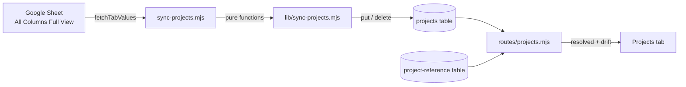

# feat: Projects sync and projects-admin Projects tab

## Summary

A new `projects` DynamoDB table of its own, reconciled against the sheet by a scheduled workflow driving a split script-plus-library pair modeled on `sync-ddb.mjs`, read through one capability-gated route module that resolves archetype labels at request time, and rendered as a third tab on the existing projects-admin shell.

---

## Problem Frame

The sheet extractor and the archetype records exist but nothing joins them, so no archetype value in the sheet is ever checked against the records it names. See the origin document for the full framing.

The plan-time problem is narrower, and it is mostly about boundaries. This repo has one well-worn shape for "sync an external source into DynamoDB" (`scripts/sync-registry-v2.mjs` plus the extracted `scripts/sync-ddb.mjs`) and one for "capability-gated admin tab" (`functions/api/routes/project-reference.mjs` plus `src/scripts/projects-admin/`). Both apply almost directly. What does not exist is a sync that **deletes**, or a CI job that writes a table the API also reads — and the immediately preceding plan deliberately kept CI away from the reference table, which is the constraint that decides where projects live.

---

## Requirements

Requirement IDs trace directly to the origin document.

**Sync**
- R1. Scheduled and manually dispatchable GitHub Action, staging before production.
- R2. Google service-account credential from a repository secret; no interactive flow, never committed or logged.
- R3. All columns carried except individuals (program manager, Nava contract PP, index owner, assigned reviewer) and the health *assessment* columns: program health status, team health status, and CPARS. The two health *link* columns are carried — they hold Confluence URLs, and the assessment they point at sits behind that page's own access control rather than in the cell. The exclusion is therefore a per-column list with a stated reason each, not the sheet's HEALTH group wholesale.
- R4. Every row imported. No code-prefix rule, no denylist, no reliance on the sheet's stated count.
- R5. Identity is the sheet-assigned project code, which is the `Database code` column. The adjacent `Database project code` column reads like the key but is empty on all 53 rows and must not be used.
- R6. Sheet authoritative; a stored project absent from the sheet is deleted.
- R7. Refuse to write on any of: zero rows; a >10% row-count drop since the last successful run; deletes exceeding 10% of stored projects; a surviving project count below an absolute floor. The refusal names the cause. All but zero-rows are overridable.
- R8. Each successful run records its time and its created/updated/deleted counts where the tab can read them.

**Projects tab**
- R9. Third tab on `/projects-admin`, same two roles, no others.
- R10. Drift summary leads: count of projects with an unresolved archetype value, plus data freshness.
- R11. Clean state states so plainly rather than rendering empty.
- R12. Each finding names its project and reproduces the offending string verbatim.
- R13. Both archetype columns validated; additional column separated, trimmed, resolved per value.
- R14. Table grouping follows the groups the sheet declares above its header row.
- R15. Unresolved values marked in place on the project row.

**Access**
- R16. Every read authorized server-side against the reference-data capability; explicit refusal, not an empty table.
- R17. No project field editable from the hub.

**Origin actors:** A1 (projects admin), A2 (site admin), A3 (Practice Leadership), A4 (sync workflow), A5 (Google service account)
**Origin flows:** F1 (scheduled sync), F2 (checking for drift), F3 (reading a project)
**Origin acceptance examples:** AE1 (R3), AE2–AE3 (R4), AE4 (R6), AE5–AE6 (R7), AE7 (R13), AE8 (R10, R12), AE9 (R11), AE10 (R16), AE11 (R8, R10), AE12 (R15), AE13 (R14)

---

## Scope Boundaries

- A `contracts` entity and project-has-many-contracts modeling.
- Importing ai-surveys, and any project→posture association.
- Posture reference counts and posture orphan surfacing.
- Lighting up the Archetypes tab's reference counts and orphan list. `functions/api/lib/program-data.mjs` is left exactly as it is, still reporting unavailable.
- The other six sheet tabs.
- Any write path from the hub to project data.
- Migrating Google auth to Workload Identity Federation.
- Moving the archetype seed into CI; it stays operator-run.
- Auto-creating an archetype record from an unrecognized value.
- Importing the sheet's per-column ownership labels as queryable data. They are read for grouping context only.

### Deferred to Follow-Up Work

- Widening `loadPrograms()` in `functions/api/lib/program-data.mjs` to accept a set of archetypes per project, which is what lighting up the Archetypes tab's counts would require. Its current contract assumes one archetype per program and cannot express this data.
- Rotating the Google service-account key, and the runbook for doing so.
- **Revisiting delete-on-absence before anything references a project code.** Hard deletion is cheap only because nothing reads project data; the moment an ai-survey or a contract keys to a project code, a routine sheet edit orphans it, and none of the three safety conditions protect against that — they bound volume, not referential consequence. Whoever builds the first record type that points at a project must decide between deactivation and deletion before doing so.
- Re-pricing the Archetypes tab's reference counts. The origin deferred them assuming the ingredients were absent; after this plan, projects are in DynamoDB and multi-value archetype resolution exists server-side, so the remaining work is narrower than the deferral assumed. Worth re-estimating rather than carrying as settled, since the tab keeps showing an unavailable state next to data the hub now holds.

---

## Context & Research

### Relevant Code and Patterns

- `scripts/lib/sheets-client.mjs` — `loadServiceAccountKey`, `authorize`, `fetchTabTitles`, `fetchTabValues`, and `SheetsError`. Already factored out of the CLI; a second consumer needs no changes to it.
- `scripts/lib/sheet-export.mjs` — `rowsToObjects(cells, headerRow)` returns `{ headerRow, headers, rows }` with deduped headers. The raw `cells` grid is what carries the group and owner rows above the header.
- `scripts/export-sheet.mjs` — the workbook id, and the fact that this tab's header row must be forced to sheet row 6 because auto-detection gets it wrong. Note the off-by-one: the CLI accepts the 1-based row an operator reads off the sheet and converts (`row - 1`) before calling `rowsToObjects`, which takes a **0-based grid index**. Reading the library directly means that conversion has no owner — sheet row 6 is grid index 5.
- `scripts/sync-ddb.mjs` — the precedent for extracting write-params logic into a testable module because the sync entry point needs live credentials. Also documents the discipline of never writing admin-owned fields.
- `scripts/prune-orphan-skills.mjs` — the closest thing to a delete path: aborts when the canonical set is empty, and treats deletion as requiring an explicit safety argument.
- `scripts/seed-project-reference.mjs` — `--env` flag handling and `createRequire` against `functions/api/package.json` for the AWS SDK.
- `.github/workflows/sync-anthropic.yml` — the leanest two-job staging-then-prod sync workflow, including AWS OIDC and a plain repo secret passed as an env var.
- `functions/api/routes/project-reference.mjs` — capability check on **every** route including reads, the paginated query loop, and the deliberate note about not copying `plugins.mjs`'s open reads.
- `functions/api/lib/project-reference.mjs` — where shared validation and constants live, and the cross-boundary duplication comment style.
- `src/scripts/projects-admin/index.mjs` — role allowlist, loader map, tab wiring.
- `src/components/projects-admin/ProjectsAdminTabs.astro` — local tab array; adding a tab is a one-line change here plus a loader.
- `src/scripts/projects-admin/archetypes.mjs` and `usage.mjs` — table rendering, and the established pattern of a secondary fetch failing soft into an unavailable state rather than taking the tab down.
- `terraform/dynamodb.tf` — the load-bearing comment about keeping deprecated `hash_key`/`range_key`, and `project_reference` as the two-key table template.
- `terraform/iam.tf` — the `DynamoDBSync` statement, currently `PutItem`/`GetItem`/`UpdateItem` on skills and plugins only. Critically, `data.aws_iam_policy_document.github_deploy` is attached twice: to `aws_iam_role_policy.github_deploy` and to `aws_iam_group_policy.github_automated_deploys`. Anything added to it reaches human operators as well as CI.
- `terraform/lambda.tf` — one `DynamoDB` statement whose action list includes `PutItem`, `UpdateItem`, and `DeleteItem` across every table ARN. There is no existing read-only statement to append to.

### Institutional Learnings

- No `docs/solutions/` directory exists, so there are no captured learnings to apply. The cross-boundary packaging constraint and the interpolated-Tailwind trap have both now recurred across two plans; worth capturing after this lands.
- Interpolated Tailwind class names emit no CSS. Any color rendered from data must be an inline style.

### External References

None. Every pattern this plan needs has multiple direct local examples, and the one genuinely new behavior — deleting rows from a sync — is a straightforward diff rather than a domain with external best practice worth fetching.

---

## Key Technical Decisions

- **Projects get their own table rather than joining the reference table.** The decisive reason is the admission rule the preceding plan wrote for that table — only entity types governed by the one `manage:project-reference` capability may join it — combined with a different data posture: reference records are admin-authored and not re-derivable, so that table is deletion-protected; projects are re-derivable from one sync run and are not. A table boundary also keeps the blast radius of a buggy sync inside project data. Partition-scoped IAM (`dynamodb:LeadingKeys`) *would* have let CI write only a project partition of the shared table, so this is not an IAM impossibility — it is a judgment that a table boundary is less fragile than a condition key, and it should not be cited later as a repo rule that every CI-written entity needs its own table.
- **The new table carries a record-type partition key, mirroring the reference table's shape.** Projects and the single sync-metadata record live in one table under different partitions, so freshness metadata is one query away from the projects it describes and needs no second table for one item.
- **Admission rule for this table, stated so the next plan has something to test against:** only record types that are wholly derived from an external sync and re-creatable by re-running it may live here. The deploy role holds `DeleteItem` on this table, so any hub-authored or human-authored record type — including the eventual `ai-survey`, if surveys are filled in through the hub — must not join it. `contracts` may, if and only if they are sheet-mirrored. This matters because the sketch's room-for-future-record-types convenience is exactly how a hand-authored record ends up in a table CI can empty.
- **The deploy role's new grant is a separate role-only policy document, not a widening of the shared one.** This is the repo's first CI job that deletes rows or queries a table, so `DeleteItem` and `Query` are new verbs for that role — and the existing `DynamoDBSync` statement lives in a policy document attached both to the OIDC role and to the `github_automated_deploys` human IAM group. Widening it would grant humans direct delete access to contract data outside the sync's gate. Resource scoping does not help; the problem is the principal set.
- **The sync reads the sheet in-process, not via the CLI's files.** `scripts/export-sheet.mjs` writes JSON and CSV to disk by design, which serves a local operator. A job piping its own output through the filesystem adds a failure mode (stale files from a previous run — the CLI already warns about exactly this) for no benefit, and both libraries it uses are already exported independently.
- **Sync logic splits into a dependency-free library plus a thin credentialed script.** Row shaping, column exclusion, group parsing, the safety check, and the reconcile diff are all pure functions of their inputs and are where the bugs will be. `sync-ddb.mjs` was extracted from `sync-registry-v2.mjs` for exactly this reason; following it means the delete path is unit-testable without AWS or Google.
- **Archetype resolution happens server-side at read time, not at sync time.** Storing a resolved archetype id on each project would make drift a property of the last sync: adding a missing archetype record would leave every affected project still flagged until the next scheduled run. Resolving on read costs one extra query per tab load — the archetype set is a handful of records — and means the Archetypes tab and this tab can never disagree.
- **Label normalization lives beside the existing record validation, in the API lib.** It is the same kind of knowledge as `validateRecord`, it is needed only server-side under the read-time decision above, and putting it there avoids a third cross-boundary duplication.
- **Column exclusion is a denylist, not an inclusion list.** The sheet gains columns; a new one should arrive in the hub automatically rather than being silently dropped until someone edits a list. The inverse risk — a newly added or renamed sensitive column arriving unnoticed — is handled by storing the previous run's header set and surfacing newly appeared columns in the tab beside the freshness line, not only in workflow output. A denylist matching header strings exactly means a rename is indistinguishable from a new column, which is precisely why the signal has to land where an admin already looks.
- **Group and owner metadata is synced, not restated hub-side.** Both live in the rows above the header and change when the sheet is reorganized. Parsing them each run means the tab's grouping cannot drift from the sheet; hardcoding them would guarantee it eventually does.
- **The safety check is four conditions, not one, because row count alone is blind twice.** A count comparison misses a wholesale re-key (53 deletes plus 53 creates at an unchanged count), which is why deletes are also bounded against the stored count; and because the baseline moves on every success, repeated under-threshold drops compound, which is why an absolute floor exists. First run has no baseline, so the count condition passes on any non-zero row count — the delete ceiling does the work there, since an empty table yields no deletes.
- **Apply is the default; `--dry-run` is opt-in.** This inverts `prune-orphan-skills.mjs`, deliberately — that is a one-off destructive cleanup where a human should see the diff first, while this is a scheduled reconciler whose whole job is to apply. The safety check is what stands in for dry-run-by-default here.
- **The tab renders the wide table as one row per project with grouped columns, not a grid of 34 columns.** Thirty-four columns cannot be scanned horizontally; the sheet's own grouping is the natural unit of disclosure.

---

## Open Questions

### Resolved During Planning

- Own table or shared reference table: own table, on the admission-rule and deletion-posture argument above. Partition-scoped IAM was available and rejected as more fragile than a table boundary — the earlier framing of this as an IAM impossibility was overstated.
- Whether the health link columns fall under R3's health exclusion: they are carried. Only the assessment columns are dropped.
- Stored attribute naming: slugs derived by one shared function, with original headers retained for display. The alternative — verbatim header strings as attribute names — was rejected because the same string then has to survive as a DynamoDB attribute name, a map key, and a UI lookup, and any one of them normalizing differently reports zero drift.
- Where the projects grant lives in Terraform: a role-only policy document, because the shared deploy policy document is also attached to a human IAM group.
- How the Lambda's read-only access is expressed: a new statement, because the existing DynamoDB statement grants write and delete across every table ARN in one action list.
- Where the run summary lives: a single metadata record in the new table, reachable in the same request as the projects.
- Extractor CLI or extractor libraries: libraries, in-process.
- How column-group metadata reaches the tab: parsed from the raw grid each run and stored on the metadata record. The group runs are not contiguous by column position — `Government Domain` sits inside the PROJECT INDEX block but is labeled FRAMEWORKS — so the mapping is stored per column, never as ranges.
- Whether archetype matching is stored or computed: computed at read time.
- Whether the seed must run before this ships: no. With no archetype records, every value is unresolved and the tab says so accurately. Seeding is a prerequisite for the tab being *useful*, not for it being correct.

### Deferred to Implementation

- The exact override mechanism for the safety check, and whether it is reachable on scheduled runs or only on manual dispatch. Leaning manual-only, since a scheduled run has no operator to judge the diff, but the workflow input plumbing is easier to settle against the real file. The override now covers four conditions rather than one, so decide whether it is all-or-nothing or per-condition.
- The absolute floor's value. It needs to be low enough not to block a legitimate portfolio contraction and high enough to catch a drain; 53 projects today is the only datapoint. Revisit whenever the portfolio changes materially, and note that a hardcoded number goes stale silently.
- Which disclosure shape the wide row uses. Accessibility requirements on it are settled; the shape is not.
- Endpoint paths for the projects routes, which ride on the still-open one-endpoint-or-two question and are needed for the OpenAPI entries U5 lists as deliverables.
- Whether the drift summary and the project list are one endpoint or two. Two would let the summary render before the wide table finishes, but the data is small enough that one may be simpler; decide against the rendered page.
- Whether an ai-survey, once imported, may live in this table. The admission rule above says only if it is sheet-derived and re-creatable; if surveys are filled in through the hub, it needs its own table.
- Whether any archetype cell uses a separator other than a comma. None do today; the parser should be written so a second separator is a one-line change rather than a rewrite.
- Whether the first run needs a manual dispatch against staging before the schedule is enabled. Likely yes, but it depends on when Terraform is applied.

---

## Output Structure

    scripts/
      sync-projects.mjs                  CLI entry: credentials, Sheets, DynamoDB
      lib/
        sync-projects.mjs                pure: shaping, exclusion, groups, safety, diff
    functions/api/
      lib/projects.mjs                   record type constants, label normalization
      routes/projects.mjs                gated list + drift + sync metadata
    src/scripts/projects-admin/
      projects.mjs                       drift summary + grouped project table
    .github/workflows/
      sync-projects.yml                  scheduled staging-then-prod sync
    tests/
      sync-projects-lib.test.mjs       pure logic: shaping, groups, gate, diff
      sync-projects.test.mjs           script: composed run against a fake client
      api/routes/projects.test.mjs
      api/lib/projects.test.mjs
      frontend/projects-admin-projects.test.mjs

---

## High-Level Technical Design

> *This illustrates the intended approach and is directional guidance for review, not implementation specification. The implementing agent should treat it as context, not code to reproduce.*

**Where each concern lives.** The sync never resolves archetypes; the API never talks to Sheets.

**Table shape.** One table, record type as partition key, so the metadata record cannot be mistaken for a project and future record types need no migration.

    record_type   project_code   (attributes — slugged from sheet headers)
    ──────────────────────────────────────────────────────────────
    project       FC026          database_code, project_name, portfolio,
                                 agency, archetype_primary,
                                 archetype_additional, capabilities_2026,
                                 … remaining carried columns
    project       FH013          …

    One slug function derives every attribute name from its header, and the
    same slugs key the column_groups map, so storage / grouping / UI lookup
    cannot disagree. Original header strings are retained for display.
    sync_meta     current        last_run_at, row_count, created,
                                 updated, deleted, column_groups[],
                                 column_names[]   ← previous run's header set,
                                                    so a new/renamed column is
                                                    detectable at all

**Reconcile, as a diff rather than a walk.** The safety check sits between computing the diff and applying it, so a refusal costs nothing.

    incoming  = rows keyed by project code
    stored    = existing project codes
    creates   = incoming - stored
    updates   = incoming ∩ stored
    deletes   = stored - incoming
    ── gate ──  refuse and write nothing when ANY holds:
                  incoming == 0
                  incoming    < 0.9 × last successful row_count
                  |deletes|   > 0.1 × |stored|        ← sees re-keying at stable count
                  |incoming|  < absolute floor        ← sees the compounding drain
    apply

**Drift, computed on read.** Archetype labels are normalized on both sides and compared; the raw string is what surfaces.

    for each project:
      primary    → [cell]
      additional → split on comma → trim → drop empties
      each value → normalize → match against normalized archetype labels
      unmatched  → { project_code, project_name, raw_value, column }

---

## Implementation Units

### Phase 1 — Foundation

- U1. **Provision the projects table and widen the CI grant**

**Goal:** A projects table exists in both environments, the API Lambda can read it, and the GitHub deploy role can reconcile it.

**Requirements:** R1, R5

**Dependencies:** None

**Files:**
- Modify: `terraform/dynamodb.tf`
- Modify: `terraform/iam.tf`
- Modify: `terraform/lambda.tf`
- Modify: `functions/api/lib/dynamo.mjs`
- Test: `tests/api/lib/dynamo.test.mjs`

**Approach:**
- One table, record type as partition key and project code as sort key, no GSIs. Every access path is a query on one partition or a direct get.
- Keep the deprecated `hash_key`/`range_key` form. The comment at the top of `terraform/dynamodb.tf` explains why, and violating it causes destructive GSI churn on the other tables.
- Point-in-time recovery on, matching every other table. **Deletion protection is not warranted here** — unlike the reference table, this data is fully re-derivable from the sheet by one workflow run, and that is the distinction the existing file draws.
- Add the table to the Lambda's environment block and to the `tables` accessor.
- **Give the Lambda a new read-only DynamoDB statement rather than appending to the existing one.** The existing `DynamoDB` statement in `terraform/lambda.tf` shares one action list — including `PutItem`, `UpdateItem`, and `DeleteItem` — across every table ARN, so appending the projects ARN there would make the API able to write and delete project data. A separate statement with `GetItem` and `Query` only, scoped to this table, is what makes R17 hold at the infrastructure layer and not just by route absence: a future write route would fail against IAM rather than succeed quietly.
- **Do not widen the existing `DynamoDBSync` statement.** `data.aws_iam_policy_document.github_deploy` has two attachment points — the OIDC role, and `aws_iam_group_policy.github_automated_deploys`, the group for humans with manual CLI deploy access. Adding `DeleteItem` there would hand every member of that group direct delete access to contract data, outside the sync's safety check and diff entirely. Resource scoping does not help; the problem is the principal set.
- Instead, put the projects-table grant in its own policy document attached only to the deploy role, with `PutItem`, `GetItem`, `Query`, and `DeleteItem` on the new table. Comment it as the first CI-deleting sync, and record why it is deliberately role-only rather than joining the shared document.

**Patterns to follow:**
- `terraform/dynamodb.tf` — the `project_reference` table for the two-key shape.
- `terraform/iam.tf` — the `DynamoDBSync` statement's existing structure.
- `functions/api/lib/dynamo.mjs` — the `tables` object's env-var indirection.

**Test scenarios:**
- Happy path: the `tables` accessor returns the configured projects table name when its environment variable is set.
- Edge case: the accessor returns undefined rather than throwing when the variable is unset, matching the sibling accessors so a misconfiguration surfaces as a DynamoDB error naming the table.

**Verification:**
- A Terraform plan shows one table added, one Lambda environment variable added, a new read-only Lambda DynamoDB statement, the deploy role gaining a projects-table grant, and **no changes to any existing table or index**.
- The plan shows **no change to `aws_iam_group_policy.github_automated_deploys`**. If it does, the grant landed in the shared policy document instead of the role-only one, and humans with CLI deploy access just gained delete rights on contract data.

---

- U2. **Sync library: shaping, exclusion, groups, safety, diff**

**Goal:** Every decision the sync makes is a pure function with tests, independent of Google and AWS.

**Requirements:** R3, R4, R5, R6, R7, R8, R14

**Dependencies:** None

**Files:**
- Create: `scripts/lib/sync-projects.mjs`
- Test: `tests/sync-projects-lib.test.mjs`

**Approach:**
- Take the raw cell grid plus the forced header row and produce project records: header-keyed rows via the existing `rowsToObjects`, minus the excluded columns, keyed by project code.
- Excluded columns are a named constant denylist carrying a per-column reason, because the set is not derivable from any group in the sheet: four individual-naming columns, plus program health status, team health status, and CPARS. **The two health link columns are deliberately kept** — a reader who assumes the rule is "the HEALTH group" would drop them, so the comment must say why they stay. Anything not on the list is carried. Also return the list of column names present now, so the caller can report ones that are new since the last run.
- **Each carried column is stored under a slug derived from its header, with the original header retained alongside.** One slug function owns the derivation, is used for the stored attribute name and for the group map's keys, and is the only place the sheet-to-storage naming rule lives. `Archetype (Primary)` → `archetype_primary`, `Database code` → `database_code`, `2026 Capabilities` → `capabilities_2026`. Slug two headers to the same value and shaping fails naming both, rather than one silently overwriting the other.
- The two archetype slugs are named constants shared with the API side, since U5 reads them by name and a typo there would report zero drift — a false all-clear rather than a visible error.
- R3 forbids renaming, and slugging is a naming transformation, so the original header string is stored per column and is what the UI displays. The rule the plan is applying: R3 governs which columns are carried and what their values are, not what the storage attribute is called. Nothing about the sheet is lost.
- Parse the group and owner rows into a per-column mapping. **Name the rows as explicit constants, do not describe them as "the rows above the header":** group row is sheet row 3, owner row is sheet row 4, header is sheet row 6 — grid indices 2, 3, and 5. Grid index 4 is an empty row, so anything that takes "the two rows immediately above the header" gets the owner row plus a blank and produces an empty group mapping, which fails R14 silently.
- Merged cells mean only the first column of a run carries a label, so a label carries forward until the next non-empty one — but the result is stored per column, never as ranges, because group runs are not contiguous. **Bound the parse to the header width:** the real group row has 44 cells against 43 headers (a stray `Workday Project ID` past the end), so an unbounded walk invents a group for a column that does not exist.
- Columns preceding the first group label get a synthetic `IDENTITY` group. Forward-fill from the left leaves the first four columns — including `Database code`, `Portfolio`, and `Project Name` — with no label, because the sheet's first group starts at column index 4. Without a synthetic group the most identifying fields in every row fall outside every heading and render as an unlabelled dangling block.
- **Import every row.** No prefix rule, no denylist, no reference to the sheet's stated count. Key on `Database code`; assert it is present in the resolved headers before shaping, since a shifted header row is otherwise indistinguishable from a valid one.
- A row where every carried cell is empty is skipped and counted in the run report — `rowsToObjects` keeps every grid row below the header and pads missing cells, so one blank spacer row in a hand-maintained sheet would otherwise halt all syncing with no hub-side fix. A row with a blank project code but at least one populated cell is a hard error, since it carries data that cannot be keyed.
- The safety check is its own function returning a refusal reason or null, and it applies **four** conditions, not one. Row count alone is insufficient — see below. Conditions 2 through 4 are overridable by the same flag; condition 1 is not. Every refusal names the numbers that tripped it.
  1. **Zero rows** always refuses, override or not.
  2. **Row-count drop** below 90% of the last successful run's count refuses. No baseline passes any non-zero count.
  3. **Delete volume** exceeding 10% of the *stored* project count refuses, computed from the diff rather than from row counts.
  4. **Absolute floor:** a surviving project count below a hard minimum refuses.
- Conditions 3 and 4 exist because condition 2 is blind in two directions. A header row that shifts two columns keys projects on `Project Name` — unique and populated on all 53 real rows, so no blank-code or duplicate error fires — and yields 53 deletes plus 53 creates at an *unchanged* row count of 53. That is the run that silently rebuilds the table from the wrong column, and only a delete ceiling sees it. Separately, because the baseline moves on every success, repeated under-threshold drops compound: 53 → 48 → 44 → 40 → 36 → 33 drains 38% without any single run tripping 10%, which is what the absolute floor catches.
- The reconcile diff is its own function returning creates, updates, and deletes from incoming keys and stored keys. It performs no I/O.

**Execution note:** Write the safety check and the diff test-first. A wrong diff deletes real data and the failure is invisible until someone notices missing projects.

**Patterns to follow:**
- `scripts/sync-ddb.mjs` — a pure module extracted from a credentialed sync so its logic is testable.
- `scripts/lib/sheet-export.mjs` — `rowsToObjects` and the existing header handling.

**Test scenarios:**
- Covers AE1. Happy path: given a grid whose header includes a program-manager column, the shaped record omits it and retains its neighbors.
- Happy path: given a column absent from the denylist and unknown to the sync, it is carried through under its sheet name.
- Happy path: the set of column names present is returned so a newly appeared column can be reported.
- Covers AE2. Happy path: given a grid containing a fabricated test row and an `x`-prefixed row, both appear in the shaped output as ordinary projects.
- Covers AE3. Edge case: given a grid whose row count disagrees with a count cell above the header, the shaped output is unaffected — nothing reads that cell.
- Error path: given a row with a blank project code, shaping fails naming the row rather than dropping it.
- Edge case: given two rows sharing a project code, shaping fails rather than silently keeping the last one.
- Happy path: given group and owner rows with merged-cell gaps, every column resolves to the group label of the most recent non-empty cell at or before it.
- Edge case: a group row wider than the header row produces no group for a column that does not exist.
- Happy path: columns preceding the first group label land in the synthetic IDENTITY group.
- Error path: two headers slugging to the same attribute name fail shaping, naming both, rather than one overwriting the other.
- Happy path: the archetype column slugs match the named constants the API side reads by, asserted directly so a rename on one side cannot silently report zero drift.
- Error path: a group row that is empty at its named index fails loudly rather than falling back to scanning for a plausible row.
- Edge case: given a group label that reappears after a different group (the FRAMEWORKS-inside-PROJECT-INDEX case), each column keeps its own label and no range is inferred.
- Covers AE5. Error path: the safety check refuses on zero incoming rows regardless of baseline, and regardless of override.
- Covers AE6. Error path: the safety check refuses when incoming rows fall below 90% of the baseline, and the reason names both counts.
- Error path: the safety check refuses a diff of 53 deletes plus 53 creates at an unchanged row count of 53 — the wholesale re-key case that the row-count condition cannot see — and the reason names the delete count.
- Error path: the safety check refuses when the surviving project count falls below the absolute floor, even though the per-run drop is under 10%.
- Happy path: five successive drops each under 10% are each individually permitted until the absolute floor is crossed, at which point the run refuses — asserting the compounding case terminates rather than draining indefinitely.
- Happy path: the safety check permits a drop of exactly the threshold boundary, and permits any non-zero count when there is no baseline.
- Happy path: the safety check permits a below-threshold count when overridden, and names which condition was overridden.
- Covers AE4. Happy path: the diff reports a stored code absent from incoming as a delete, a shared code as an update, and an incoming-only code as a create.
- Edge case: the diff over identical inputs reports no creates, no updates that change anything, and no deletes.

**Verification:**
- The delete path and the refusal thresholds are covered by tests that need neither AWS nor Google credentials.

---

### Phase 2 — Sync execution

- U3. **Sync script**

**Goal:** One command reconciles the projects table against the sheet, refusing rather than writing when the source looks wrong.

**Requirements:** R1, R2, R3, R4, R5, R6, R7, R8

**Dependencies:** U1, U2

**Files:**
- Create: `scripts/sync-projects.mjs`
- Test: `tests/sync-projects.test.mjs`

**Approach:**
- Flags mirroring the sibling scripts: `--env staging|prod`, `--credentials`, `--spreadsheet`, `--dry-run`, and an override for the safety check. Each falls back to an environment variable where a sibling script does the same.
- Force the header row to 6 for this tab rather than relying on detection, and fetch the tab by name so a renamed tab fails loudly instead of syncing the wrong sheet.
- Read existing projects as **whole items**, not a key-only projection. 53 small records is a single page, and the diff needs the stored values for two reasons: an update count computed without them reports "53 updated" on every run forever, which makes R8's counts a constant rather than an answer to "did anything change?"; and a whole-record write with no prior read cannot preserve a first-seen timestamp, so the table could never say when a project appeared.
- Count as updated only those records whose carried attributes actually differ. Carry `first_seen_at` forward from the existing item on rewrite.
- **Write an in-progress metadata record before applying**, carrying the incoming row count, then overwrite it with the completed counts and timestamp. Metadata-written-last alone conflates two states: a first run that wrote projects then died leaves a populated table with no metadata, which the tab would report as never-synced — a populated table labelled empty, with no column groups to group by and no baseline for the next run's gate. Three states, distinguishable: no record at all (never synced), an in-progress record (a run died partway), a completed record (synced).
- Apply in order: creates and updates as whole-record writes, then deletes, then overwrite the metadata record. A failure mid-apply leaves the in-progress marker, so the next run and the tab both know the table is mid-flight rather than trusting a half-applied baseline.
- Whole-record writes rather than field-level updates. Nothing else writes this table, so there is no admin-owned field to protect — the opposite of the situation `sync-ddb.mjs` documents, and worth a comment saying so, since the neighboring script's rule looks like it should apply.
- `--dry-run` reports the diff and the safety verdict and writes nothing. Apply is the default.
- Report per-run counts and any newly appeared column names. Distinguish "refused" from "nothing to do" in both the output and the exit code.
- **After applying, check drift and make the run the trigger.** Query the archetype partition, resolve every project's archetype values the same way U5 does, and write the unresolved count and the offending strings into the workflow job summary. A non-zero count of unresolved *values* fails the job, so a typo in the sheet surfaces as a red run rather than waiting for someone to open an unlinked page.
- **An empty archetype cell warns; it does not fail.** A newly added project whose archetype has not been assigned yet is normal in-progress state, not drift, and failing on it would train people to ignore red runs — which would cost more than the check buys. Only a value that is present and matches no record fails.
- This duplicates resolution logic that U5 also implements, which is deliberate and worth the cost: the tab must resolve on read so an archetype edit clears findings immediately, and the workflow must resolve at sync time so something reaches a human without a page load. Put the comparison rule in one place both can call rather than writing it twice.
- Resolve the AWS SDK through `createRequire` against `functions/api/package.json`, as the seed and prune scripts do.

**Execution note:** Start from a failing test for the refusal path — that the store is untouched when the safety check trips, including the metadata record.

**Patterns to follow:**
- `scripts/seed-project-reference.mjs` — flag parsing, `--env` validation, `createRequire` for the SDK, and its error class.
- `scripts/export-sheet.mjs` — the header-row override and the tab-not-found error shape.
- `scripts/prune-orphan-skills.mjs` — the posture that a delete path needs an explicit safety argument.

**Test scenarios:**
- Covers AE5. Error path: given zero rows from the sheet, the run exits non-zero, names zero-rows, and issues no write or delete of any kind.
- Covers AE6. Error path: given a >10% drop without an override, the run writes nothing — including leaving the metadata record's baseline unchanged — and names both counts.
- Happy path: given a >10% drop with the override, the run applies and records the new baseline.
- Covers AE4. Happy path: given a stored project absent from the sheet, the run deletes it and counts it as a delete.
- Error path: given a diff of 53 deletes plus 53 creates at an unchanged row count, the run writes nothing and names the delete count.
- Happy path: a run where no carried attribute changed reports zero updates, rather than reporting every project as updated.
- Happy path: a rewritten project retains its original first-seen timestamp.
- Error path: a run that dies after writing projects leaves an in-progress metadata record, and the following run reports the table as mid-flight rather than measuring against a stale baseline.
- Happy path: an unresolved archetype value fails the run and appears in the job summary with its project and exact string.
- Happy path: an empty archetype cell warns and appears in the job summary without failing the run.
- Happy path: a row where every carried cell is empty is skipped and counted, and does not fail the run.
- Error path: a row with a blank project code but other populated cells fails the run naming the row.
- Error path: a resolved header set missing `Database code` fails before any shaping, since a shifted header row is otherwise valid-looking.
- Happy path: `--dry-run` reports creates, updates, and deletes and performs no write.
- Covers AE11. Happy path: a successful run records its timestamp and its three counts on the metadata record.
- Happy path: a run whose sheet is unchanged reports zero creates and zero deletes and exits zero.
- Error path: a missing or unreadable credential file fails naming the file, not with a stack trace.
- Error path: a service account without access to the workbook fails with a message distinguishing that from bad credentials, as the extractor's client already does.
- Error path: the named tab missing from the workbook fails listing the tabs that exist.
- Error path: a failure partway through applying leaves the metadata record's previous baseline in place, so the next run's safety check is measured against a real prior count.
- Integration: shaping, safety check, and diff compose end to end against a fixture grid with a fake DynamoDB client, asserting the exact set of writes and deletes issued.

**Verification:**
- Run against staging with `--dry-run` and confirm the diff matches the sheet; run for real and confirm the table holds one project per sheet row plus one metadata record.

---

- U4. **Sync workflow**

**Goal:** The sync runs on a schedule and on demand, staging before production, without a human holding a key.

**Requirements:** R1, R2

**Dependencies:** U3

**Files:**
- Create: `.github/workflows/sync-projects.yml`

**Approach:**
- Two jobs, production needing staging, each in its named environment — the shape `sync-anthropic.yml` already uses.
- AWS via OIDC role assumption; the Google credential from a repository secret written to a runner-local file that the script is pointed at. Write it with a redirect from the secret rather than echoing it, and put it outside the workspace so it cannot be picked up by anything that archives the checkout.
- A manual-dispatch input for the safety-check override, defaulting off. The schedule never sets it.
- Install root dependencies and the API package's dependencies, since the script resolves the AWS SDK from the latter.
- Weekly is the right cadence to start: the sheet is hand-maintained and this is a read-only mirror, so hourly polling buys nothing. Manual dispatch covers the "I just edited the sheet" case.

**Patterns to follow:**
- `.github/workflows/sync-anthropic.yml` — job structure, OIDC step, secret-as-env-var, and the two dependency installs.
- `.github/workflows/sync.yml` — the dispatch-input-to-flag pattern for the override.

**Test scenarios:**
- Test expectation: none — workflow configuration with no unit-testable logic. Verified by dispatching it manually against staging.

**Verification:**
- A manual dispatch against staging completes, the table is populated, and the log shows the counts. The credential does not appear in the log, and production runs only after staging succeeds.

---

### Phase 3 — Read path

- U5. **Projects API routes**

**Goal:** Authorized clients can read the projects, their freshness, and the archetype values that resolve to nothing.

**Requirements:** R10, R12, R13, R14, R16, R17

**Dependencies:** U1

**Files:**
- Create: `functions/api/lib/projects.mjs`
- Create: `functions/api/routes/projects.mjs`
- Modify: `functions/api/index.mjs`
- Modify: `docs/api.md`
- Modify: `docs/openapi.yaml`
- Modify: `docs/rbac-permissions.md`
- Test: `tests/api/lib/projects.test.mjs`
- Test: `tests/api/routes/projects.test.mjs`

**Approach:**
- Reuse the existing `manage:project-reference` capability rather than adding one. The origin scoped this tab to the same audience as the other two, and a second action nobody can hold independently would be unused surface. Note in the module that this couples the two, so splitting them later means a permission change as well as a route change.
- **Gate every route, reads included.** Follow `project-reference.mjs`, not `plugins.mjs` — the latter's list routes are deliberately open and copying it literally is the likely way this gate goes missing.
- Read-only. No create, update, or delete route exists for projects at all. R17 is guarded on two sides so it cannot erode silently: the Lambda's IAM grant is read-only (U1), so even a future write route fails against the infrastructure; and a route test asserts POST, PUT, PATCH, and DELETE against the projects paths are refused for an authorized holder, so adding a write route requires deleting a test that states R17. Absence alone is not an invariant a future change has to argue with.
- The lib module holds the record-type constants and label normalization: trim, collapse internal whitespace, case-fold. Splitting the additional-archetype cell also lives here — separate on comma, trim each, drop empties.
- The routes module resolves archetype labels by querying the archetype partition of the reference table and normalizing both sides. Unmatched values are reported with the project code, project name, the column they came from, and the **raw** string exactly as stored — normalization is for comparison only and must never reach the response.
- Inactive archetype records still count as resolved. A deactivated archetype is a real record; treating its projects as drift would report a deliberate admin action as an error.
- Return the sync metadata alongside, so one response can answer both "how current is this" and "what is broken".
- Three sync states are reported distinctly, not two: no metadata record (never synced), an in-progress record (a run died partway, so the table is mid-flight and its contents are not trustworthy), and a completed record. None is an error.
- An empty archetype cell is reported as a **missing** finding — project code, project name, column, no raw value — separate from unresolved findings. An empty string is not a typo, R12's "reproduce the offending string" has nothing to reproduce, and conflating them would make an unassigned new project look like a data error. This is also what keeps the sync's job-failure signal meaningful: unresolved fails, missing warns.
- Return the column names that are new since the previous run, read off the metadata record's stored header set, so the UI can surface them.
- Absent metadata — before the first sync — is not an error.

**Execution note:** Start with a failing test that an unauthorized read is refused before any table is touched.

**Patterns to follow:**
- `functions/api/routes/project-reference.mjs` — per-route capability check, the paginated query loop, and the 400/403/404 shapes.
- `functions/api/lib/project-reference.mjs` — where shared server-side knowledge lives and how its comments explain constraints.

**Test scenarios:**
- Covers AE10. Error path: listing projects is refused for a `maintain` holder, a plain user, and an unauthenticated request — asserted per endpoint, not once.
- Error path: an unauthorized request performs no table read.
- Happy path: a `projects-admin` holder and an admin both receive the projects.
- Happy path: the project partition is queried such that the metadata record never appears among the projects.
- Covers AE7. Happy path: an additional-archetype value of `Strategic Consulting Team, Data Modernization Team` resolves as two values, the leading space on the second is not part of the label, and neither is reported unresolved.
- Edge case: a project with an empty primary archetype yields a missing finding, not an unresolved finding, and that finding carries no raw value.
- Error path: writes against the projects paths — POST, PUT, PATCH, DELETE — are refused for an authorized `projects-admin` holder, asserting R17 at the route layer.
- Edge case: an in-progress metadata record is reported as its own state, distinct from both never-synced and synced.
- Happy path: a column present now but absent from the previous run's stored header set is returned as newly appeared.
- Covers AE8. Happy path: a primary archetype of `Prodcut Team` is reported unresolved, carrying the project code, the project name, the column, and the string verbatim.
- Happy path: an archetype label differing only in case or surrounding whitespace resolves rather than being reported.
- Edge case: a project with an empty additional-archetype cell yields no findings from that column.
- Edge case: a cell containing only separators and whitespace yields no findings and no empty-string value.
- Edge case: a project referencing a deactivated archetype record is not reported as drift.
- Covers AE11. Happy path: the response carries the last sync's timestamp and counts.
- Edge case: with no metadata record, the response reports never-synced rather than erroring or reporting zero.
- Happy path: the column-group mapping recorded by the sync is returned for the tab to group by.
- Edge case: with no archetype records at all, every archetype value is reported unresolved rather than the endpoint failing.

**Verification:**
- Every endpoint has a passing unauthorized-read test; a mistyped archetype surfaces with its exact string; `docs/api.md` and `docs/openapi.yaml` describe the new endpoints.

---

### Phase 4 — UI

- U6. **Projects tab**

**Goal:** An authorized user opens the tab and immediately knows whether the sheet and the archetype records agree, and how current the answer is.

**Requirements:** R9, R10, R11, R12, R13, R14, R15, R16, R17

**Dependencies:** U5

**Files:**
- Create: `src/scripts/projects-admin/projects.mjs`
- Modify: `src/components/projects-admin/ProjectsAdminTabs.astro`
- Modify: `src/scripts/projects-admin/index.mjs`
- Test: `tests/frontend/projects-admin-projects.test.mjs`

**Approach:**
- Add one entry to the tab array and one loader to the map. The tab controller and the role allowlist are reused unchanged.
- Drift summary first: the count, the freshness line, and the findings. Each finding names its project and shows the raw string. Nothing about the summary depends on the wide table having rendered.
- **Each finding links to its project's row** and moves focus there. With 53 rows and no search, a finding that names a code but gives no way to reach it forces manual scanning for every correction — and R12's whole purpose is to make the finding actionable.
- **Newly appeared or renamed columns are surfaced next to the freshness line.** The excluded-column denylist matches header strings exactly, so a rename upstream — `Program Manager` becoming `Program Manager (Nava)` — is indistinguishable from a new column and re-admits an excluded people-column. Workflow output is not a place anyone looks unprompted, so the signal has to land where an admin already is.
- Missing findings (unassigned archetype) render distinctly from unresolved findings (typo), matching the sync's warn-versus-fail split, so the two do not read as the same problem.
- **The clean state is a first-class render, not an absent element.** Steady state is zero findings, so the common case must read as a positive confirmation with the timestamp attached. An empty region would be indistinguishable from a broken tab.
- Never-synced is a third state, distinct from clean and from drifted. Zero findings because nothing has been imported is not good news.
- The project table groups columns using the mapping the API returns, with the wide detail behind per-row disclosure rather than 34 columns side by side.
- Unresolved values are marked on the row itself, so someone scanning the table sees the same fact the summary reports. **The marker pairs a non-color signal — an inline text badge — with color, and is exposed to assistive technology.** The existing tabs mark status with colored text alone; a color-only marker here would be invisible to colorblind and screen-reader users for the one fact the tab exists to convey.
- **The disclosure control is a real button with `aria-expanded` and keyboard activation**, not a div toggle or a hover reveal, and it manages focus the way `archetypes.mjs` already does for its form reveal. Which disclosure shape is chosen is still open; that it is operable without a mouse is not.
- Columns absent from the group mapping render under an explicit `Ungrouped` heading, distinct from the sheet's own `OTHER` group, so it reads as a hub-side fallback rather than a sheet-declared category.
- Default row order is the sheet's own row order, so the table and the sheet can be read side by side without reconciling two sortings.
- Desktop-first, consistent with every existing admin tab. Not a new decision, but stated so nobody treats a wide table as a responsive regression.
- All interpolated values escaped. This content is human-authored upstream and rendered into markup.
- No control on this tab mutates anything — no edit, no delete, no retry. The tab is a window.
- A failure fetching projects renders an error in the panel rather than an empty table.

**Patterns to follow:**
- `src/scripts/projects-admin/archetypes.mjs` — table rendering and panel composition.
- `src/scripts/projects-admin/usage.mjs` — the unavailable-versus-empty distinction and its soft-failure posture.
- `src/lib/render.mjs` — the escaping helper every admin script uses.
- `src/components/projects-admin/ProjectsAdminTabs.astro` — the local tab array.

**Test scenarios:**
- Covers AE8, AE12. Happy path: given a project with one unresolved and one resolved archetype value, the summary reports one finding naming that project and string, and the row marks only the unresolved one.
- Covers AE9. Happy path: given all values resolving, the summary states that none were found rather than rendering empty.
- Covers AE11. Happy path: the summary shows when the last sync ran.
- Edge case: given no sync metadata, the tab reports never-synced rather than a clean state.
- Covers AE13. Happy path: project fields render under the group names the API returned, not as one flat list.
- Happy path: the four identity columns render under the synthetic IDENTITY group rather than outside every heading.
- Edge case: given a column absent from the group mapping, it renders under an explicit `Ungrouped` heading rather than disappearing or joining `OTHER`.
- Happy path: activating a finding moves focus to that project's row, using the keyboard alone.
- Happy path: the disclosure control exposes `aria-expanded` and toggles on keyboard activation without any pointer event.
- Happy path: an unresolved value's marker carries text, not color alone, and is readable by assistive technology.
- Happy path: a column newly appeared since the previous run is surfaced beside the freshness line.
- Edge case: a missing (unassigned) archetype renders distinctly from an unresolved (mistyped) one.
- Edge case: given an in-progress sync record, the tab says the table is mid-flight rather than reporting it as synced or never-synced.
- Edge case: given zero projects, the tab renders an empty state rather than an empty table.
- Error path: a project name or archetype value containing markup characters renders as text.
- Error path: a failed projects fetch renders an error in the panel, not an empty table.
- Covers AE10. Error path: a user holding neither role never reaches the loader, and the refusal is what renders.
- Error path: no control that mutates project data is rendered anywhere on the tab.
- Happy path: the summary renders from its own data and does not depend on the project table having rendered.

**Verification:**
- With the archetype records seeded, the tab reports a clean state and a timestamp; changing one archetype value in the sheet and re-syncing makes it report that project and string by name.

---

## System-Wide Impact

- **Interaction graph:** The new route module joins the existing `manage:project-reference` capability, so any future change to that capability now affects three tabs rather than two. `functions/api/lib/program-data.mjs` is untouched and still reports unavailable, so the Archetypes and Policy tabs behave exactly as they do today. The projects-admin tab controller and role allowlist gain a third consumer without changing.
- **Error propagation:** New routes return the same 400/403/404 shapes as the existing ones, so the shared client helper and tab controller surface them without new plumbing. The sync's failures surface as workflow failures and a stale timestamp on the tab, which is why the freshness line is load-bearing rather than decorative.
- **State lifecycle risks:** The sync is the only writer, so there is no concurrent-edit hazard, but a mid-apply failure can leave the table partially reconciled. The in-progress metadata record written before applying is what makes that state legible to both the next run and the tab, rather than being mistaken for never-synced. Two runs overlapping would interleave writes; the schedule is weekly and the job is short, so this is accepted rather than locked against.
- **API surface parity:** The excluded-column denylist is the one place where a decision about sensitive data lives, and it matches header strings exactly, so an upstream rename re-admits an excluded column and is indistinguishable from a new one. The signal is now surfaced in the tab beside the freshness line rather than only in workflow output, which is the difference between a guard someone sees and one nobody reads. The archetype column slugs are a second cross-boundary agreement, guarded by a direct test because a mismatch there reports zero drift — a false all-clear rather than an error.
- **Integration coverage:** That an unauthorized read touches no table cannot be proven by testing the permission module alone; it needs a route test. That the safety check actually prevents deletes needs the composed sync test, not just the pure function's.
- **Unchanged invariants:** No existing table, index, or environment variable changes. The existing CI DynamoDB grant keeps its narrow action set on skills and plugins. The archetype seed stays operator-run. `/admin` is untouched. The reference table's contents cannot be written by CI.

---

## Risks & Dependencies

| Risk | Mitigation |
|------|------------|
| A buggy diff deletes real projects | Four gate conditions rather than one: zero-rows, row-count drop, delete volume against stored count, and an absolute floor. The delete ceiling is what sees a wholesale re-key at unchanged row count; the floor is what stops a compounding drain. Diff and gate are pure functions tested independently, and the composed sync is tested against a fake client asserting the exact deletes issued |
| A run dies partway and the next run trusts a half-applied table | An in-progress metadata record is written before applying, so both the next run and the tab can tell mid-flight from complete |
| Two runs overlap and interleave writes and deletes on the same partition | Accepted: the schedule is weekly and the job is short. Noted because apply is the default, so a manual dispatch during a scheduled run is the reachable case |
| The safety check's first run has no baseline and cannot protect anything | Accepted and explicit: any non-zero count passes on first run. The first run is a manual dispatch against staging where the diff is inspected |
| CI gains delete access to a table the API reads | Scoped to the new table only, with the existing skills and plugins ARNs keeping their upsert-only action set, and a comment recording why the asymmetry exists |
| The archetype records are never seeded, so the tab reports every project as drifted | Correct behavior, not a failure — but it will read as broken. The never-synced and drifted states are visually distinct, and seeding is named as a prerequisite for usefulness |
| Archetype labels are renamed in the admin tab, silently breaking every project referencing them | This is the drift the tab exists to surface; it will report it on the next page load, not the next sync, because resolution happens on read |
| A new sensitive column appears in the sheet and is imported by the denylist default | Newly appeared column names are reported per run; the alternative (inclusion list) trades this for silently dropping every new column, which is worse for a mirror |
| The Google service-account key leaks from CI | Written to a runner-local file outside the workspace via redirect rather than echo, scoped to a single read-only sheet, and the service account has no other access. Rotation is deferred follow-up work |
| Terraform is not applied by CI, so merging U1 does not provision the table; the workflow or the API would fail against a missing table | Sequence the apply before U3 runs anywhere and before U5 deploys. The tab is unlinked and the workflow is manually dispatchable first, so the blast radius is small |
| The sheet's tab is renamed or its header row moves, and the sync silently imports the wrong shape | The tab is fetched by name and fails listing available tabs; the header row is forced rather than detected; the resolved headers must contain `Database code` before shaping proceeds; and a shift that keys projects on another unique column is caught by the delete ceiling rather than by row count, which would not move |
| 34 columns produce an unreadable tab | Grouping comes from the sheet's own structure and wide detail sits behind per-row disclosure; the summary is the primary surface and does not depend on the table |
| The two archetype-related surfaces disagree about what is resolved | The comparison rule exists in one shared place, called by both the read path and the sync-time check, rather than implemented twice |
| **No end-user consumer exists when this ships.** This is the second consecutive plan to deepen an unconsumed layer: the Contract Explorer read path is out of scope, `program-data.mjs` still reports unavailable, and after this lands the hub holds two tables, a scheduled sync, and three admin tabs that no end user has seen. Each layer added raises the cost and coordination burden of the read path that would make any of it visible | Named as a standing constraint rather than mitigated, carried forward from the preceding plan's identical risk. Reviewers should not read the six units as delivering an end-user outcome — the audience for everything here is a handful of admin role holders |

---

## Documentation / Operational Notes

- `docs/api.md` and `docs/openapi.yaml` need the new read endpoints (U5).
- `docs/rbac-permissions.md` documents what the `manage:project-reference` capability grants. It now covers a third tab and a second table; the matrix needs that, and the capability's name is now narrower than its scope — worth a note rather than a rename.
- Two new repository secrets or reuses: the Google service-account key, and confirmation that the existing AWS deploy role ARN secret is available in both environments (it is, for the sibling sync workflows).
- Rollout order: apply Terraform, dispatch the sync against staging with `--dry-run`, dispatch for real, deploy the API, then enable the schedule. The tab is reachable only by direct URL for two roles, so shipping the UI ahead of the first sync is safe — it will report never-synced.
- The projects table holds contract names, agencies, offices, and period-of-performance dates. It is not deletion-protected because it is re-derivable, but it is not public: the read path is gated and no unauthenticated route touches it.
- This repository is public. The workbook id is already committed in `scripts/export-sheet.mjs`; the credential and the exported data must stay out of git, as they already are.

---

## Sources & References

- **Origin document:** [docs/brainstorms/2026-08-06-projects-sync-and-admin-tab-requirements.md](docs/brainstorms/2026-08-06-projects-sync-and-admin-tab-requirements.md)
- Preceding plan, which built the archetype and posture tabs this one joins: [docs/plans/2026-08-06-001-feat-projects-admin-archetypes-policy-plan.md](docs/plans/2026-08-06-001-feat-projects-admin-archetypes-policy-plan.md)
- Upstream extractor requirements: [docs/brainstorms/2026-08-05-sheets-contract-data-export-requirements.md](docs/brainstorms/2026-08-05-sheets-contract-data-export-requirements.md)
- Sheet access libraries: `scripts/lib/sheets-client.mjs`, `scripts/lib/sheet-export.mjs`
- Sync precedents: `scripts/sync-registry-v2.mjs`, `scripts/sync-ddb.mjs`, `scripts/prune-orphan-skills.mjs`
- Gated route precedent: `functions/api/routes/project-reference.mjs`
- Workflow precedents: `.github/workflows/sync-anthropic.yml`, `.github/workflows/sync.yml`
- Infrastructure: `terraform/dynamodb.tf`, `terraform/iam.tf`, `terraform/lambda.tf`
