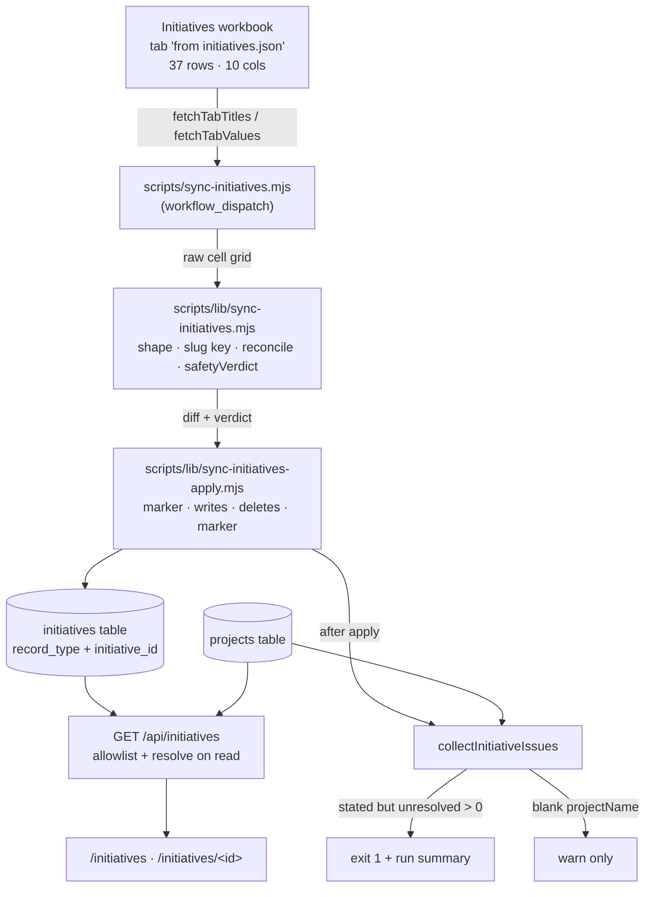
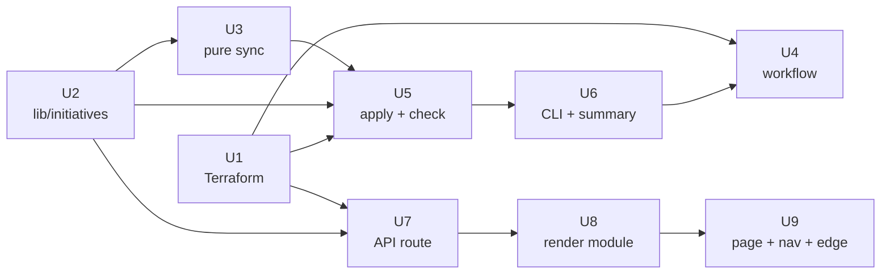

# feat: Initiatives table, sync-initiatives action, and Initiatives Hub

## Summary

Mirror the only tab of the initiatives workbook — 37 rows, 10 columns, measured 2026-08-10 — into a fresh `initiatives` DynamoDB table via a manually-dispatched GitHub Action, resolve each row's `projectName` against `project_name` in the `projects` table and fail the run when a stated name resolves to nothing, then serve the result at `/initiatives` as a card grid filterable by `useCaseLabel`, `exposure`, and `tags`, with a per-initiative detail page carrying a Project section. Every layer copies an existing sibling: the sync mirrors `scripts/sync-projects.mjs` and its pure/apply/CLI split, the API mirrors `functions/api/routes/contracts.mjs`, and the pages mirror `src/pages/contracts/index.astro` plus `src/lib/contracts-render.mjs`.

---

## Problem Frame

The hub already answers "may I use AI on my contract?" through the Contract Explorer. It cannot answer "what AI initiatives are running, on which projects, at what exposure?" — that data lives only in a hand-maintained Google Sheet nobody outside its editors can see. The same three-layer machinery that made contracts browsable (sheet mirror → DynamoDB table → authenticated read-only page) has not been pointed at it.

Unlike the contracts survey, an initiative that *names* a project which does not exist is a defect rather than a state of nature. That is the one place this plan deliberately diverges from the contracts posture it otherwise copies, and the measurements below show the divergence is affordable: all 14 stated project names resolve today, so the alarm starts silent and only speaks when something breaks.

---

## Measured Facts About the Source Workbook

Captured 2026-08-10 from `1IOBjzJJ7J_LhTlkAf4iWzNevsWCv1jqRakKdOYBwdtg` via `node scripts/export-sheet.mjs --spreadsheet <url> --out tmp/initiatives-export`, after the sheet owner removed the `id` column and corrected the ADEPT project name. These replace what would otherwise have been deferred guesses; the constants in U3 come straight from here.

**Shape.** Exactly one tab, titled `from initiatives.json`. Header row is grid index **0** (sheet row 1) — no title banners, no spacer rows, no blank or duplicate headers, no unnamed leading column. 37 data rows, 38 grid rows total.

**Columns**, in sheet order, all camelCase and all slugging cleanly:

| Header | Slug | Character | Blanks |
|---|---|---|---|
| `title` | `title` | short prose, the card heading and the key source | 0 |
| `desc` | `desc` | one to three sentences | 0 |
| `useCaseLabel` | `use_case_label` | 14 distinct, single-valued | 0 |
| `useCaseTheme` | `use_case_theme` | prose restatement of the label | 0 |
| `exposure` | `exposure` | 4 distinct, single-valued, lower-case | 0 |
| `people` | `people` | `; `-separated staff names | some |
| `status` | `status` | free-text dates (`Apr 7–14, 2026`, `Fall 2025 – present`) | 6 |
| `tags` | `tags` | 3 distinct, single-valued **today** | 0 |
| `links` | `links` | `Label: URL; Label: URL` | 11 |
| `projectName` | `project_name` | 14 distinct stated values | **14** |

**There is no `id` column, and no `programId` column.** Both were present at earlier measurements and have since been removed by the sheet owner — `id` on 2026-08-10, `programId` immediately after. The range key must therefore be derived, and `title` is the only fully-populated unique column that remains. See the key decision below.

**Key-candidate measurements.** Slugged, over all 37 rows:

| Candidate | Unique | Blank | Max slug length |
|---|---|---|---|
| `title` | 37/37 | 0 | 89 |
| `title` + `useCaseLabel` | 37/37 | 0 | 119 |
| `projectName` + `title` | 37/37 | 0 | 128 |

`title` alone is unique and fully populated, and adding a second column buys no uniqueness while making every URL 30–40 characters longer. The now-removed `programId` was also measured while it existed: blank on the same 14 rows as `projectName`, and `programId + useCaseLabel` yielded only 29 distinct keys over 37 rows — recorded here so the option is not re-proposed.

**Facet values.** `exposure` ∈ {`client`, `internal`, `infra`, `learning`}. `tags` ∈ {`internal`, `live`, `proto`}. `useCaseLabel` has 14 values (`AI-powered benefits assistant`, `Delivery prototyping`, `Knowledge management`, `BD & growth`, …). All three facets are small enough for flat `<select>` controls.

**Multi-value separator is `;`, not `,`.** No `tags` or `exposure` cell contains a separator today, but `people` and `links` both do. `links` cells look like `April 2026 Demo: https://…; PBIF product requirements MURAL: https://…`.

**Titles are prose, and long.** Up to 91 characters, containing em dashes, ampersands, apostrophes, and parentheses — e.g. `MD PBIF's HR1 SNAP document upload and verification MVP & AI-assisted document verification`. Every one of those survives slugging, but the length and the editability are what drive the top risk below.

**`projectName` resolution, measured against `skills-registry-projects-staging` (53 project records):**

- 14 of 37 rows state no project name at all — 38%. **A blank must therefore warn, not fail**, or every run is red. This matches `collectContractIssues`' treatment and is consistent with the requirement, which is about a name that cannot be resolved, not about an absent one.
- All 14 stated names **resolve exactly** on `project_name` after case-fold and whitespace collapse. **Zero misses.** The earlier `MD … (ADEPT) WO4` mismatch was corrected in the sheet on 2026-08-10 and now reads `MD Agile Digital Experience Product Transformation (ADEPT)`.
- Adding a `contract_name` fallback (as `resolveProject` in `contracts.mjs` has) was checked and rescues zero additional rows.

**Implication for the first run:** a live dispatch applies all 37 rows and exits 0. The resolution alarm starts silent, which is what makes a future red run meaningful.

---

## Requirements

- R1. A `sync-initiatives` GitHub Action imports the first tab of workbook `1IOBjzJJ7J_LhTlkAf4iWzNevsWCv1jqRakKdOYBwdtg` into a new `initiatives` DynamoDB table, on manual dispatch only, for staging then prod.
- R2. Every stated `projectName` resolves against `project_name` on a `projects`-table record. A stated value matching nothing prints an error naming the row and the raw value, and fails the action. A blank value warns and does not fail — 38% of rows are blank.
- R3. An "Initiatives Hub" sidebar link is visible to every signed-in user and leads to `/initiatives`.
- R4. `/initiatives` renders initiatives as cards, filterable by `useCaseLabel`, `exposure`, and `tags`.
- R5. Clicking a card opens `/initiatives/<id>`, which includes a Project section equivalent to the Contract detail page's.
- R6. The sync is idempotent and reconciling: the sheet is authoritative, a row it no longer lists is deleted, and a re-run with no sheet change writes nothing.
- R7. A safety gate refuses a destructive run before writing anything, with a never-overridable zero-row refusal.
- R8. The API serves initiatives read-only. No create, update, or delete route exists, and the Lambda's IAM grant omits write actions.

---

## Scope Boundaries

- No write surface in the hub. The sheet is the only place an initiative is authored; this plan builds a mirror, not an editor.
- No initiative→posture or initiative→archetype join. `exposure` is served as the sheet's own value with no guidance records behind it.
- No scheduled cron. Manual dispatch only (confirmed decision).
- No admin tab for initiatives drift. The action's failure and its run summary are the whole alarm surface.
- No change to the contracts or projects tables, routes, or pages. `functions/api/lib/projects.mjs` is imported, not edited.
- No analytics instrumentation on the new pages.

### Deferred to Follow-Up Work

- A weekly `schedule:` trigger, once one manual run has confirmed the workbook is stable.
- A stable, sheet-supplied id column, if title churn proves to be a real problem. See Risks.
- A searchable tag facet, if `tags` ever grows past a flat control's comfort. Three values today.

---

## Context & Research

### Relevant Code and Patterns

The three-file split every sync in this repo uses, and which this plan reproduces:

- `scripts/sync-projects.mjs` — CLI entry. Arg parsing with the value-eating-flag guard, tab-title fetch, DynamoDB client construction via `createRequire` against `functions/api/package.json` (the AWS SDK is installed there, not at the root), run summary on every exit path, and the post-apply drift check that fails the run. This is the closest model for R2's failure behavior.
- `scripts/lib/sync-projects.mjs` / `scripts/lib/sync-contracts.mjs` — pure shaping, key derivation, `reconcile`, `safetyVerdict`. No I/O.
- `scripts/lib/sync-contracts-apply.mjs` — DynamoDB orchestration with `ddb` and command constructors injected, so the composed read→diff→gate→apply flow is testable against a fake client. Its ordering comment (in-progress marker before any write, completed marker last) is load-bearing and should be copied.
- `scripts/lib/sync-projects-summary.mjs` — pure markdown for the Actions run summary, written on every run including clean ones.
- `scripts/lib/sheets-client.mjs` — `loadServiceAccountKey`, `authorize`, `fetchTabTitles`, `fetchTabValues`. `fetchTabTitles` returns titles in workbook order, so the first tab is `titles[0]`.
- `scripts/lib/sheet-export.mjs` — `parseSpreadsheetId` accepts a pasted URL or a bare ID.

The shared-resolution-rule pattern, which R2 must join:

- `functions/api/lib/contracts.mjs` — `resolveProject`, `resolvePosture`, `collectContractIssues`. Lives under `functions/api/` because both the API (resolving on read) and the sync (resolving after apply) must call the same rule. The dependency direction is forced: the API Lambda zip is built from `functions/api/` alone, so nothing there may import from `scripts/` or `src/`.
- `functions/api/lib/projects.mjs` — `normalizeLabel` (case-fold, trim, collapse whitespace; never reaches a response), `splitArchetypeCell` (separator split, trim, drop empties), `RECORD_PROJECT`.

The API and frontend patterns:

- `functions/api/routes/contracts.mjs` — the single-endpoint read, the `CONTRACT_FIELDS` / `PROJECT_FIELDS` allowlists and why they are allowlists while the sync uses a denylist, `queryPartition` paging, `describePopulation`'s three states, the 503 on unconfigured tables, and the deliberate absence of write routes.
- `functions/api/lib/dynamo.mjs` — the `tables` map.
- `functions/api/index.mjs` — route registration.
- `src/lib/contracts-render.mjs` — `filterContracts`, `portfoliosOf`, `renderContractCard`, `renderContractGrid`, `row`/`stackedRow`/`plain`/`NONE_LISTED`, `renderProjectSection`, `renderProjectNameLink`, `renderPolicyLink`, `formatCapturedAt`, `describePopulationNotice`. Also the inline-style rule for runtime colors.
- `src/pages/contracts/index.astro` — one page serving both `/contracts` and `/contracts/<id>`, branching on `window.location.pathname`, with the `decodeURIComponent` guard and the `Unauthorized`-suppression on `fetchApi` failure.
- `functions/edge/auth-check.js.tpl:33` — the CSR-shell rewrite. Without an entry here every detail URL serves the 404 page.
- `src/components/Sidebar.astro:6-15` — `mainNav`, with the comment recording why `/contracts` is linked and `/projects-admin` is not.

The infrastructure:

- `terraform/dynamodb.tf:111-188` — the `projects` and `contracts` tables and, more importantly, their **admission rules**. `projects` admits only record types wholly derived from an external sync and re-creatable by re-running it, because the GitHub deploy role holds `DeleteItem` on it. `contracts` admits only records readable by every signed-in user, and is operator-populated.
- `terraform/iam.tf:145-178` — `github_deploy_projects`, a second policy document attached to the deploy role **alone**, deliberately not merged into the shared document. `DynamoDBProjectsSync` grants Put/Get/Query/Delete on the projects table; `DynamoDBArchetypeRead` grants `Query` only on the reference table and carries an explicit "do not add write actions here" instruction.
- `terraform/lambda.tf:175-178, 205-220` — `DynamoDBContractsRead` (`GetItem`, `Query` only) and the API Lambda's environment variables.
- `.github/workflows/sync-projects.yml` — the two-job staging→prod shape, OIDC role assumption, the service-account key written outside the workspace via `printf` redirect (never `echo`, so the key never enters an argument list), and the `if: always()` credential removal.

### Institutional Learnings

`docs/solutions/` does not exist in this repo, so there are no institutional learning docs to carry forward. The nearest equivalents are the origin plans, which the code comments cite directly:

- `docs/plans/2026-08-07-001-feat-contracts-table-and-population-plan.md`
- `docs/plans/2026-08-07-002-feat-contract-explorer-page-plan.md`
- `docs/plans/2026-08-06-002-feat-projects-sync-admin-tab-plan.md`

Two hard-won lessons in that code that this plan must not relearn:

1. **Interpolated Tailwind classes emit no CSS.** Classes are generated at build time from source text, so a class name assembled at runtime renders blank. Runtime-sourced colors must be inline styles (`src/lib/contracts-render.mjs:12-18`).
2. **A denylist upstream composed with a spread downstream is an unreviewed data leak.** The contracts sync carries new sheet columns automatically so nothing is silently dropped; the API therefore uses an allowlist, or a new column would ship to every signed-in user with no code change (`functions/api/routes/contracts.mjs:103-115`). This plan keeps that pairing exactly.

### External References

None fetched. Every layer here has two or three direct in-repo precedents, the technology stack is unchanged (Node 22, Hono on Lambda, Astro CSR shells, DynamoDB, Terraform, Sheets v4), and no high-risk unfamiliar domain is involved.

---

## Key Technical Decisions

- **A new `initiatives` table, not a partition of `contracts` or `projects`.** Both neighbours carry explicit admission rules forbidding this. `contracts` admits only operator-populated records; this is CI-populated. `projects` admits only records re-creatable by re-running its own sync and is keyed on `project_code`; initiatives are keyed differently and come from a different workbook. A fourth table costs nothing at PAY_PER_REQUEST and keeps three documented invariants intact.
- **`record_type` hash key, `initiative_id` range key.** Mirrors both neighbours: the `seed_meta` record lives in its own partition so it can never be returned among the initiatives, and each read is a single `Query` on one partition — no GSI.
- **The range key is a slug of `title` alone.** Measured: 37/37 populated, 37/37 unique, max slug length 89. Every alternative was measured and loses: adding `useCaseLabel` or `projectName` to `title` buys no uniqueness and makes every URL 30–40 characters longer, and the `programId` column that might have supplied a stable slug has since been removed from the sheet (it was blank on 14 rows and yielded only 29 distinct keys when combined with `useCaseLabel`). This is the same reasoning `sync-contracts.mjs:78-82` records for its own key: an id drawn from a sparse column re-keys itself as the sheet is filled in, and the reconcile reads that as a delete plus a create. `title` is the only fully-populated unique column left after the `id` and `programId` columns were removed.
  - **The cost, stated plainly:** `title` is editable prose, so rewording a title re-keys the row. That is a correct delete-plus-create for a genuinely renamed initiative, but it loses `first_seen_at` and changes the URL. See Risks for what bounds the blast radius, and Deferred for the real fix.
- **First tab by index, with its title pinned.** `titles[0]` is read, then compared against `EXPECTED_TAB_TITLE = 'from initiatives.json'`; a mismatch fails naming both. Satisfies "the first sheet" while keeping the repo's loud-failure rule. The workbook has exactly one tab today, so the check is cheap insurance rather than a live constraint.
- **Write, then fail, on a stated-but-unresolvable project.** The run applies the sheet, *then* the resolution check fails it — exactly `scripts/sync-projects.mjs`'s archetype drift alarm. The table stays current and the red run reads as "the sheet names a project that does not exist", not "the sync broke". (Confirmed decision.)
- **A blank `projectName` warns; it never fails.** 14 of 37 rows are blank. Failing on them would make every run red and train the operator to ignore it — the exact reasoning `functions/api/lib/projects.mjs:86-91` records for absent archetypes. This is a measured refinement of the original instruction, which concerns a name that cannot be *resolved*.
- **Resolution matches `project_name` only.** `resolveProject` in `contracts.mjs` also matches `contract_name` because the contracts survey's naming follows neither consistently. Measured here: `project_name` alone resolves 14 of 14, and a `contract_name` fallback rescues zero rows. The narrower rule costs nothing and is what the requirement asks for.
- **Resolution rules live in `functions/api/lib/initiatives.mjs`, not in `scripts/`.** Forced by the dependency direction: the API resolves on read (so fixing a sheet value clears the finding on the next page load) and the sync resolves after apply (so a typo fails CI without a page load). One module, two callers, no drift.
- **Denylist in the sync, allowlist in the API.** New sheet columns reach the table automatically so a column is never silently dropped; the API's `INITIATIVE_FIELDS` allowlist is what stops a new column shipping to every signed-in user unreviewed.
- **Read-only API, enforced twice.** No write route exists, and the Lambda's IAM statement grants `GetItem` and `Query` only — so a future write route fails against infrastructure rather than succeeding quietly.
- **CI holds write access on this table, unlike `contracts`.** R1 requires a GitHub Action, so `github_deploy_projects` gains a statement for the initiatives table. The data is wholly sheet-derived and re-creatable by one workflow run, which is precisely the `projects` admission rule, so the grant does not weaken an existing invariant.
- **The multi-value separator is `;`, with `,` also accepted.** Measured from `people` and `links`. `tags` and `exposure` are single-valued today, but the filter still uses *containment* rather than equality so a second tag in a cell starts working rather than silently dropping the row out of every facet.
- **One `/api/initiatives` endpoint.** Grid, detail, and capture date share a response so they cannot disagree about freshness.
- **One Astro page serving both routes.** `/initiatives` and `/initiatives/<id>` branch on pathname in a single CSR shell, matching `/contracts` and `/skills`.

---

## Open Questions

### Resolved During Planning

- Workbook access: shared with `contract-explorer@contract-explorer-504620.iam.gserviceaccount.com` and read successfully on 2026-08-10.
- Tab title, header row, column list, facet cardinality, separator, and row count: all measured. See Measured Facts.
- `initiative_id` derivation: a slug of `title`, after measuring four candidates. The sheet's own `id` column was removed by its owner, so a derived key is now the only option, and `title` is the only fully-populated unique column.
- Whether a blank `projectName` fails: no, it warns. 38% of rows are blank.
- Whether to add a `contract_name` fallback to resolution: no. Measured to rescue zero rows.
- Whether the ADEPT mismatch needs code: no. Fixed in the sheet; all 14 stated names now resolve.
- `ABSOLUTE_FLOOR`: 30, against a measured 37 rows. See U3.
- Tab selection, failure timing, page audience, and trigger: user decisions, recorded in Key Technical Decisions.

### Deferred to Implementation

- **Which of the 10 columns are `REQUIRED_HEADERS`.** `title` and `projectName` are certain — the first is the key source, the second is the join. `useCaseLabel`, `exposure`, and `tags` are the filter facets, and a page with a silently-empty facet is worse than a failed run, so they belong too. The remaining five (`desc`, `useCaseTheme`, `people`, `status`, `links`) are carried but not required.
- **Whether `useCaseTheme` earns a place on the detail page** or is redundant beside `useCaseLabel`. It reads as a prose restatement. Render it once and judge; it costs one row either way.
- **How `links` is rendered.** The cell is `Label: URL; Label: URL`. Splitting on `; ` then on the first `: ` preceding something URL-shaped is the obvious parse, but a label can itself contain a colon. Fall back to rendering the raw part when the parse is ambiguous rather than dropping a link — and reuse `renderPolicyLink`'s http/https-only guard, since these are sheet-authored URLs and a sheet any staffer can edit is not a trusted source.
- **Whether to cap the slugged `initiative_id` length.** Max is 89 today, well under DynamoDB's range-key limit, so no cap is needed for correctness. A cap would only be cosmetic for URLs, and truncation reintroduces the collision class the duplicate check exists to catch. Default to no cap; if one is added it must be long enough that no two current titles collide, and the duplicate check stays.

---

## High-Level Technical Design

> *This illustrates the intended approach and is directional guidance for review, not implementation specification. The implementing agent should treat it as context, not code to reproduce.*

Data flow, from sheet to page:



Resolution happens twice, deliberately — once on read so a sheet fix clears the finding on the next page load, once after apply so a typo reaches CI without a page load. Both call the same function.

The apply ordering, which is load-bearing and copied from `populateContracts`:

```
1. shape + diff            no writes yet
2. gate                    a refusal costs nothing, nothing is written
3. in-progress marker      so a death mid-apply is legible afterwards
4. creates, updates, then deletes
5. completed marker        carrying the new baseline
6. resolve + fail          the table is already correct at this point
```

Steps 5 and 6 in that order matter: the marker must record a complete run before the resolution alarm fires, or a red run would leave the table looking half-written when it is not.

---

## Output Structure

```
functions/api/lib/initiatives.mjs          record types, seed states, resolution rules
functions/api/routes/initiatives.mjs       GET /api/initiatives
scripts/sync-initiatives.mjs               CLI entry
scripts/lib/sync-initiatives.mjs           pure shaping, key derivation, reconcile, gate
scripts/lib/sync-initiatives-apply.mjs     DynamoDB orchestration + resolution check
scripts/lib/sync-initiatives-summary.mjs   Actions run-summary markdown
.github/workflows/sync-initiatives.yml     manual-dispatch workflow, staging then prod
src/lib/initiatives-render.mjs             filtering + card/detail markup
src/pages/initiatives/index.astro          CSR shell for both routes
tests/sync-initiatives-lib.test.mjs
tests/sync-initiatives-apply.test.mjs
tests/sync-initiatives-summary.test.mjs
tests/api/lib/initiatives.test.mjs
tests/api/routes/initiatives.test.mjs
tests/frontend/initiatives-render.test.mjs
```

A scope declaration, not a constraint — the per-unit **Files** sections are authoritative.

---

## Implementation Units



U1 and U2 are independent and can start together. The read path (U7→U9) does not depend on the write path (U4, U6) beyond U2, so the page can be built against a hand-seeded table.

---

- U1. **Provision the initiatives table, its IAM grants, and the Lambda env var**

**Goal:** The table exists in both environments, CI can write it, the Lambda can read it and nothing more.

**Requirements:** R1, R8

**Dependencies:** None

**Files:**
- Modify: `terraform/dynamodb.tf`
- Modify: `terraform/iam.tf`
- Modify: `terraform/lambda.tf`
- Modify: `functions/api/lib/dynamo.mjs`
- Test: `tests/api/lib/dynamo.test.mjs`

**Approach:**
- `aws_dynamodb_table.initiatives`, named `${var.project_name}-initiatives-${var.environment}`, `PAY_PER_REQUEST`, hash `record_type`, range `initiative_id`, PITR enabled.
- `deletion_protection_enabled = var.environment == "prod"`, matching `contracts`. The data is re-derivable, but only while the workbook stays shared with the service account, and nothing exercises that share on a schedule (manual dispatch only).
- Write the admission rule as a comment, in the voice of its neighbours: this table admits only records wholly derived from the initiatives workbook and re-creatable by re-running the sync, because the GitHub deploy role holds `DeleteItem` on it. State why it is not a partition of `contracts` (operator-populated) or `projects` (different key, different workbook). Note that the range key is a slug of the source's `title` column, and why — the sheet supplies no id column, and `title` is the only fully-populated unique one. A reader who does not know that will assume the key is arbitrary.
- Note the 37-row scale so a later reader knows the numbers in U3's gate are not arbitrary.
- Add a `DynamoDBInitiativesSync` statement to `data.aws_iam_policy_document.github_deploy_projects` — Put/Get/Query/Delete scoped to the initiatives table ARN. That document is attached to the deploy role alone and is the correct home; do not touch the shared document, and leave `DynamoDBArchetypeRead`'s read-only instruction exactly as written.
- The post-apply check reads the projects partition, and `DynamoDBProjectsSync` already grants `Query` on `aws_dynamodb_table.projects.arn`. Note that in a comment so a later reader does not add a redundant statement.
- Add `DynamoDBInitiativesRead` to `data.aws_iam_policy_document.lambda_api_policy`: `GetItem` and `Query` only, scoped to the initiatives ARN, with a comment saying write actions are omitted on purpose so a future write route fails against infrastructure.
- Add `INITIATIVES_TABLE` to the API Lambda's `environment.variables`, and `initiatives: () => process.env.INITIATIVES_TABLE` to the `tables` map.

**Patterns to follow:**
- `terraform/dynamodb.tf:143-188` (the `contracts` resource and its admission-rule comment)
- `terraform/iam.tf:145-178` (`github_deploy_projects`)
- `terraform/lambda.tf:175-178` (`DynamoDBContractsRead`)

**Test scenarios:**
- Happy path: `tables.initiatives()` returns `INITIATIVES_TABLE` when set, and `undefined` when unset — the latter is what the route's 503 branch depends on.

**Verification:**
- `terraform plan` for staging shows exactly one new table, two new IAM statements, and one new Lambda environment variable — no diffs on the projects, contracts, or reference tables.
- `terraform apply` in staging creates the table; `describe-table` shows the `record_type`/`initiative_id` key schema.

---

- U2. **Shared initiatives knowledge and the project-resolution rule**

**Goal:** One module both the API and the sync import, holding the record types, the population states, and the rule for resolving an initiative's project.

**Requirements:** R2, R6

**Dependencies:** None

**Files:**
- Create: `functions/api/lib/initiatives.mjs`
- Test: `tests/api/lib/initiatives.test.mjs`

**Approach:**
- Export `RECORD_INITIATIVE`, `RECORD_SEED_META`, `SEED_META_KEY`, `SEED_IN_PROGRESS`, `SEED_COMPLETE`, `SEED_NEVER`, mirroring `functions/api/lib/contracts.mjs`. Declare them here rather than importing from `contracts.mjs`: the values coincide today, but the two tables' lifecycles are independent and a shared constant would couple them.
- Export the slugged attribute names the rules and the page read — `PROJECT_NAME_ATTR = 'project_name'`, `USE_CASE_LABEL_ATTR = 'use_case_label'`, `EXPOSURE_ATTR = 'exposure'`, `TAGS_ATTR = 'tags'`, and `TITLE_ATTR = 'title'`. Defining them here makes a rename one edit, and gives U3 something to assert its slug function reproduces — the trick `functions/api/lib/projects.mjs:36-42` uses to stop a silent false all-clear. `TITLE_ATTR` matters more than the others: it is the key source, so a slug change there re-keys the whole table.
- `resolveProject(initiative, projectRecords)` — normalize with `normalizeLabel` imported from `./projects.mjs`, return `null` for a blank value, otherwise find the record whose `project_name` normalizes equal. **Only `project_name`.** Say so in the docstring, and record the measurement: a `contract_name` fallback was checked against the real data and rescues zero rows, so the narrower rule is free. Without that note the next reader will "restore" the fallback for consistency with `contracts.mjs`.
- `collectInitiativeIssues(initiatives, projectRecords)` returning two buckets with different severities, which is the whole point of separating them:
  - `unresolvedProjects` — a name is stated and matches nothing. Carries `raw_value` as the sheet's own string, never the normalized form. **This is what fails a run.** Zero rows today.
  - `missingProject` — no name stated. No `raw_value`, because there is nothing to reproduce. **Warns only.** 14 rows today; failing on them would make every run red.
  Record both counts as measured in the module header, and record that the severity split diverges from `collectContractIssues`, where a stated-but-unresolved name also only warns. The divergence is on `unresolvedProjects`, not on `missingProject`, and a reader needs that stated precisely or they will flatten both.
- Each finding carries `initiative_id` and `title`, so a message can name a row a human can find in the sheet.

**Patterns to follow:**
- `functions/api/lib/contracts.mjs` in full — structure, comment density, and the "single home for the resolution rules because they have two callers that must never disagree" framing.
- `functions/api/lib/projects.mjs:55-64` for `normalizeLabel` and the rule that a normalized form never reaches a response.

**Test scenarios:**
- Happy path: an initiative whose `project_name` exactly matches a project record resolves to that record.
- Happy path: case, leading/trailing whitespace, and collapsed internal whitespace all still resolve.
- Happy path: `"MD Public Benefit Innovation Fund (PBIF)"` and `"PA HR1 IDP 1 & 2"` resolve — real values with parentheses and an ampersand, pinning that punctuation is not stripped.
- Edge case: a blank `project_name` returns `null` from `resolveProject` and lands in `missingProject`, not `unresolvedProjects`.
- Edge case: an empty `projectRecords` array returns `null` rather than throwing.
- Edge case: an initiative naming a project by its `contract_name` does **not** resolve — pinning the deliberate divergence from `contracts.mjs`, so a later widening is a visible test change.
- Error path: a near-miss fixture — `"MD Agile Digital Experience Product Transformation (ADEPT) WO4"` against a project named `"…(ADEPT)"` — lands in `unresolvedProjects` with the raw value intact. This was a real sheet defect, corrected on 2026-08-10; keep it as the synthetic regression case, because it is the exact shape of drift the alarm exists for.
- Happy path: `collectInitiativeIssues` over a mixed set puts stated-unresolved and blank rows in different buckets and double-counts nothing.
- Happy path: a finding's `raw_value` is the sheet's original string, not the normalized one.

**Verification:**
- The module imports only from `./projects.mjs` — nothing from `scripts/` or `src/`, or the Lambda zip breaks at runtime.

---

- U3. **Pure shaping, key derivation, reconcile, and the safety gate**

**Goal:** Turn a raw cell grid into initiatives keyed by a slug of their title, diff them against stored records, and decide whether a run may write — all without I/O.

**Requirements:** R1, R6, R7

**Dependencies:** U2

**Files:**
- Create: `scripts/lib/sync-initiatives.mjs`
- Test: `tests/sync-initiatives-lib.test.mjs`

**Execution note:** Write the shaping, key-derivation, and reconcile tests first. A wrong key or a wrong diff destroys real data and the failure is invisible until someone notices missing initiatives — exactly why `scripts/lib/sync-contracts.mjs` was split out as pure. Key derivation deserves the most attention of anything in this plan: it is the one function whose output is a primary key.

**Approach:**
- Export `SyncInitiativesError` and these constants, all taken from the measured facts rather than guessed:
  - `EXPECTED_TAB_TITLE = 'from initiatives.json'`
  - `HEADER_ROW = 0` — sheet row 1. The projects tab needed row 6 and the contracts tab row 2; this one genuinely starts at the top, so the constant carries a comment saying it was verified rather than assumed.
  - `ID_COLUMNS = ['title']` — a one-element list rather than a bare string, matching `sync-contracts.mjs`' shape so adding a second column later is a data change. Comment must record the measurement that chose it: `title` is 37/37 unique and 37/37 populated, and it is the only column with that property now that the sheet's `id` and `programId` columns have both been removed.
  - `EXCLUDED_HEADERS = []` with a comment: nothing is excluded today, and it is a denylist so a new column arrives automatically.
  - `RESERVED_ATTRIBUTES = ['record_type', 'initiative_id', 'first_seen_at', 'last_synced_at']` — attributes the population writes itself. A column slugging onto one would reach the item through the record spread and win; for a key attribute that means writing to a phantom range key, so the real record is never updated again and there is no delete for the gate to notice.
  - `REQUIRED_HEADERS` — see Open Questions for membership; `title` and `projectName` are non-negotiable.
  - `MAX_DELETE_FRACTION = 0.1`, `MAX_ROW_DROP_FRACTION = 0.1`, `ABSOLUTE_FLOOR = 30`.
- **Note the small-N consequence of the fractions in a comment.** At 37 rows, a 10% delete ceiling refuses at 4 deletes and a 10% row-drop refuses below 34 incoming rows. That is tight — a legitimate pruning of five initiatives needs `--force`. It is the right default for a table this small (the whole dataset is one accidental sort away from destruction), but an operator who hits it should read a comment explaining the arithmetic rather than guessing. It is also the guard that catches a mass re-key, which matters more here than on the sibling tabs.
- `slugAttribute` — the camelCase-splitting snake_case rule from `scripts/lib/sync-contracts.mjs:113`. Assert in a test that it maps all ten real headers to their expected slugs, and that `title`/`projectName`/`useCaseLabel`/`exposure`/`tags` equal the constants U2 exports. A mismatch there produces a false all-clear, not a visible failure.
- `slugInitiativeId(...parts)` — join, case-fold, replace non-alphanumerics with hyphens, collapse and trim hyphens. It doubles as the detail-page URL segment, so it must be slug-safe. **No length cap** (see Open Questions): the longest real title slugs to 89 characters, far under DynamoDB's range-key limit, and truncating reintroduces the collision class the duplicate check exists to catch. The function must handle the real punctuation in titles — em dashes, ampersands, apostrophes, parentheses — collapsing runs of them to a single hyphen rather than leaving doubles.
- `shapeInitiatives(cells)`:
  - Read the header row directly at `HEADER_ROW`. Do not route through `rowsToObjects`, which renames duplicates and blanks and would let a reintroduced duplicate through as a new attribute instead of failing.
  - Check `REQUIRED_HEADERS` first and throw naming the missing headers, the expected grid index, the 1-based sheet row, and the headers actually found. A shifted header row otherwise yields a plausible-looking wrong result.
  - Carry every non-excluded, non-blank header. Throw on a reserved-attribute collision and on two headers slugging to the same attribute.
  - Derive `initiative_id` via `slugInitiativeId` over `ID_COLUMNS`, resolved by `headers.indexOf` so the position is not hardcoded. Throw on a populated row whose id comes out empty, naming the 1-based sheet row and the columns the id is built from — a row with a title of only punctuation would do this.
  - Throw on two rows producing the same id, naming both sheet rows and stating that ids come from `title`, so one row would silently overwrite the other. **This check is load-bearing now in a way it was not when the sheet supplied ids**: two initiatives whose titles differ only in punctuation collide, and the sheet is hand-edited.
  - Keep `title` as a carried attribute even though it sources the key. Unlike the removed `id` column, `title` is real display content the card and detail page both render; dropping it would make the page reconstruct prose from a slug.
  - Skip fully-blank rows, counted and reported. There are none today, but the sheet is hand-editable and erroring would halt all population with no hub-side fix.
  - Store every carried value as `''` rather than absent or null, so a reader can tell "recorded as blank" from "attribute does not exist".
  - Return `{ initiatives, headers, columnHeaders, skippedBlankRows }`.
- `reconcile(incoming, stored)` — creates, updates, deletes, where updates are only records whose carried attributes actually differ. Excluding the non-carried fields is what stops all 37 rows reporting as updated on every run forever. Carry `first_seen_at` forward from the stored record, since a whole-record `Put` with no prior read cannot preserve it.
- `safetyVerdict({ incoming, storedCount, deletes, baseline, override })` — four conditions, each blind to what the others catch:
  - Zero incoming rows → refuse, **never overridable**. A zero-row read means the tab, its share, or its shape changed, not that every initiative was retired.
  - Baseline drop beyond `MAX_ROW_DROP_FRACTION`, measured against the last *completed* run.
  - Deletes beyond `MAX_DELETE_FRACTION` of `storedCount`, only when `storedCount > 0` — a shifted header row, or a bulk title rewrite, produces a full delete-and-recreate at an unchanged row count, which the row count alone cannot see. With a title-derived key this is the condition most likely to fire in practice.
  - `incoming < ABSOLUTE_FLOOR`, only when `storedCount > 0`. The floor is what terminates a compounding drain: the delete ceiling is measured against a `storedCount` that shrinks with the damage, so successive under-ceiling runs walk the table down with every run exiting clean.
  - Carry the same KNOWN LIMIT note as `sync-contracts.mjs:349-353`: every condition counts records, none inspects values, so a sub-range sort in the sheet presents as all-updates-no-deletes and passes untouched.

**Patterns to follow:**
- `scripts/lib/sync-contracts.mjs` in full. It is the closest match and its comments explain the failure each guard prevents; carry that density. Its `slugContractId` and `ID_COLUMNS` treatment is the direct model, including the "populated on every row is the property that makes the id stable" reasoning.
- `scripts/lib/sync-projects.mjs` for the new-column reporting shape.

**Test scenarios:**
- Happy path: a grid with the 10 real headers at row 0 and three populated rows yields three initiatives keyed by the title slug, each carrying all ten columns including `title`.
- Happy path: `slugAttribute` maps all ten real headers to their expected slugs, and the five named slugs equal U2's constants.
- Happy path: `slugInitiativeId` on the real title `"Government Services Navigator prototype — (Labs user-facing AI Team)"` produces a slug with no double hyphens and no leading or trailing hyphen — the em dash and parentheses are the interesting part.
- Happy path: `slugInitiativeId` on `"MD PBIF's HR1 SNAP document upload and verification MVP & AI-assisted document verification"` round-trips to a stable slug, and the apostrophe and ampersand do not produce adjacent hyphens.
- Happy path: all 37 real titles slug to 37 distinct ids — a fixture-driven assertion over the exported sheet, which is the regression guard for the collision risk.
- Edge case: `slugInitiativeId` is stable under case and surrounding whitespace, so `"  AskCA  "` and `"askca"` key identically.
- Edge case: a blank spacer row is skipped and counted in `skippedBlankRows`.
- Edge case: a `people` value with semicolons and a `links` value with a URL survive shaping byte-identical — shaping must not parse or split anything.
- Edge case: a genuinely empty cell becomes `''`, never `undefined` or `null`.
- Error path: a missing `title` header throws naming it, the expected row, and the headers found — the key source's absence must not degrade into empty ids.
- Error path: a missing `projectName` header throws — the join column's absence must not degrade into "every row unlinked".
- Error path: two headers slugging to the same attribute throws naming both.
- Error path: a header slugging onto a reserved attribute throws naming the header and the attribute.
- Error path: a populated row whose title is only punctuation throws naming the 1-based sheet row and the id columns.
- Error path: two rows whose titles differ only in punctuation (`"AskCA chatbot"` and `"AskCA — chatbot"`) throw naming both sheet rows. This is the collision the removed `id` column used to prevent.
- Happy path: `reconcile` with identical incoming and stored yields zero creates, updates, and deletes.
- Happy path: `reconcile` preserves `first_seen_at` on an update.
- Edge case: `reconcile` ignores a `last_synced_at`-only difference and reports no update.
- Happy path: `reconcile` reports a stored id absent from incoming as a delete.
- Integration: a title edit yields one create plus one delete, not an update — pinning the documented consequence of a title-derived key so nobody is surprised by it later.
- Error path: `safetyVerdict` refuses zero incoming rows even with `override: true`.
- Error path: `safetyVerdict` refuses at 4 deletes against 37 stored, and permits them under `override` — pinning the measured small-N arithmetic so a later constant change is a visible test change.
- Error path: `safetyVerdict` refuses 33 incoming against a 37 baseline, and permits it under `override`.
- Error path: `safetyVerdict` refuses 29 incoming on the floor, and permits it under `override`.
- Edge case: `safetyVerdict` permits any delete count against `storedCount === 0`, so a first population is never blocked.
- Edge case: `safetyVerdict` with a null/undefined baseline (never-synced) skips the baseline check rather than throwing.

**Verification:**
- Nothing in the file performs I/O — no `fs`, no AWS SDK, no `googleapis` import.
- Every test runs without credentials.
- Shaping the real exported grid produces 37 initiatives, 37 distinct ids, and zero skipped rows.

---

- U4. **The `sync-initiatives` workflow**

**Goal:** A manually-dispatched workflow that syncs staging, then prod, with the same credential hygiene as `sync-projects.yml`.

**Requirements:** R1

**Dependencies:** U1, U6

**Files:**
- Create: `.github/workflows/sync-initiatives.yml`

**Approach:**
- Copy `.github/workflows/sync-projects.yml`'s two-job shape: `sync-staging` (environment `staging`), then `sync-prod` (environment `production`, `needs: sync-staging`). Failing staging must stop prod — that is what makes R2's failure protective rather than merely noisy.
- `on: workflow_dispatch` only, with `dry_run` and `force` boolean inputs. **No `schedule:` block.** Say in the header comment that manual dispatch is deliberate until the workbook proves stable, and point at this plan's Deferred section.
- Same steps: `actions/checkout@v6`, `pnpm/action-setup@v6`, `actions/setup-node@v7` with Node 22 and pnpm cache, root install, `functions/api` install (the AWS SDK lives there), `aws-actions/configure-aws-credentials@v6` with `secrets.AWS_DEPLOY_ROLE_ARN`, `permissions: { contents: read, id-token: write }`.
- Write the service-account key to `$RUNNER_TEMP/google-credentials.json` with `umask 077` and `printf '%s' > file` — outside the workspace so nothing archiving the checkout can pick it up, and via redirect rather than `echo` so the key never appears in an argument list. Remove it with `if: always()`.
- Pass `$DRY_RUN_FLAG` / `$FORCE_FLAG` built from the inputs.
- Header comment must state what a red run means: the initiatives synced, and the sheet names a project that does not exist. It should record that as of 2026-08-10 all 14 stated project names resolve, so **the expected steady state is green** — which is what makes a red run worth reading. It should also warn that the range key is derived from `title`, so a bulk title rewrite in the sheet presents as a mass delete-and-recreate and will hit the delete ceiling; that is the gate working, and the response is to check the sheet before reaching for `force`.

**Patterns to follow:**
- `.github/workflows/sync-projects.yml` in full, including its header comment explaining why a drift failure is the alarm rather than a sync error.

**Test scenarios:**
- Test expectation: none — CI configuration with no importable behavior. Correctness is proved by the dispatches in Verification.

**Verification:**
- A `workflow_dispatch` run with `dry_run: true` completes green, reports 37 rows and a 37-create diff against an empty table, and writes nothing.
- A live staging dispatch applies 37 records, reports 14 rows with no project stated as a warning, zero unresolved, and exits 0.
- A re-dispatch immediately after reports zero creates, zero updates, zero deletes.
- A dispatch against a scratch copy of the sheet with one deliberately-broken `projectName` fails at the resolution step *after* the apply step succeeded, and the log names the row and the raw value.
- The prod job does not start when the staging job fails.

---

- U5. **DynamoDB orchestration and the post-apply resolution check**

**Goal:** The composed read→diff→gate→apply flow against the initiatives table, plus the resolution check against the projects table, both testable without AWS.

**Requirements:** R1, R2, R6, R7

**Dependencies:** U1, U2, U3

**Files:**
- Create: `scripts/lib/sync-initiatives-apply.mjs`
- Test: `tests/sync-initiatives-apply.test.mjs`

**Approach:**
- Take `ddb` and the command constructors (`PutCommand`, `DeleteCommand`, `GetCommand`, `QueryCommand`) as arguments so the whole flow runs against a fake client. The gate preventing deletes is exactly the behavior a pure-function test alone cannot prove.
- `readSeedMeta` — three observable states. Absent item is `SEED_NEVER` with a `null` baseline; `status === SEED_IN_PROGRESS` means a run wrote records and died. Without that distinction a populated table reports as never-populated.
- `readStoredInitiatives` and a shared `readPartition` helper that pages until `LastEvaluatedKey` is exhausted. 37 rows is one page, but paginate anyway — the alternative is a silent truncation that reconcile reads as a mass delete.
- `populateInitiatives({ ddb, table, grid, now, override, dryRun, ...commands })` following the load-bearing order in High-Level Technical Design. Specifically: gate before any write; in-progress marker before the first record write, carrying `incoming_row_count` but deliberately *not* `row_count` (the baseline must keep describing the last completed run, or a death mid-apply leaves the next run measuring against a table that was never fully written); creates and updates, then deletes; completed marker last, carrying the new baseline.
- Return a report shaped like `populateContracts`'s — including the shaped `initiatives` themselves, so the caller's resolution check reuses this shaping rather than repeating it. Two shapings of the same grid could diverge.
- `checkInitiativeResolution({ ddb, projectsTable, initiatives, QueryCommand })` — read the `RECORD_PROJECT` partition, call `collectInitiativeIssues`, return `{ unresolvedProjects, missingProject, projectCount }`. This function *reports*; U6 decides to fail. Keeping the decision in the CLI is what lets the failure message distinguish "the initiatives synced, the sheet is wrong" from "the sync broke".

**Patterns to follow:**
- `scripts/lib/sync-contracts-apply.mjs` in full, including its ordering comment and the reason the in-progress marker omits `row_count`.

**Test scenarios:**
- Happy path: a first population against an empty table writes the in-progress marker, then one `Put` per row, then the completed marker with `row_count` equal to the incoming count.
- Happy path: a re-run with an unchanged grid issues no record `Put`s and no `Delete`s, and still writes both markers.
- Happy path: an update carries `first_seen_at` forward and refreshes `last_synced_at`.
- Happy path: a stored id absent from the sheet is deleted with the correct `record_type`/`initiative_id` key.
- Integration: the write order is marker → creates/updates → deletes → marker. Assert on the recorded call sequence, not just final state — the ordering is the recovery guarantee.
- Error path: a refusal returns the report with `refusal` set and `applied: false`, and issues **zero** write calls, including the in-progress marker.
- Integration: a grid where every title has been reworded trips the delete ceiling and writes nothing — the mass-re-key scenario the title-derived key makes plausible, proved end to end rather than only in `safetyVerdict`.
- Edge case: `dryRun: true` issues only the reads — no marker, no `Put`, no `Delete`.
- Edge case: a stored `seed_meta` with `status: in_progress` yields `previousState === SEED_IN_PROGRESS`, and the gate measures against the stored `row_count` from the last completed run rather than that partial one.
- Edge case: absent `seed_meta` yields `SEED_NEVER` and a `null` baseline, and the baseline check is skipped rather than throwing.
- Edge case: a paged `Query` response with a `LastEvaluatedKey` is followed, and items across both pages appear in the diff.
- Happy path: `checkInitiativeResolution` over a set containing one stated-unresolved and several blank rows returns both buckets correctly and neither throws nor exits.
- Integration: `checkInitiativeResolution` queries the `RECORD_PROJECT` partition of the *projects* table, not the initiatives table.

**Verification:**
- Every test in the file runs with no AWS credentials present.
- A refusal leaves the fake client with zero write calls recorded.

---

- U6. **CLI entry point and Actions run summary**

**Goal:** One command an operator or the workflow runs, which prints a legible report, writes a run summary on every exit path, and exits non-zero when a stated `projectName` does not resolve.

**Requirements:** R1, R2, R7

**Dependencies:** U5

**Files:**
- Create: `scripts/sync-initiatives.mjs`
- Create: `scripts/lib/sync-initiatives-summary.mjs`
- Test: `tests/sync-initiatives-summary.test.mjs`

**Approach:**
- Header comment carrying the operating manual, as both sibling scripts do: usage, every flag with its env-var and default fallback, exit codes, prerequisites, and what a red run means. State that a *stated but unresolvable* project name FAILS here, that a *blank* one warns, and that 14 of 37 rows are blank today — so the warning is the normal state and the failure is the alarm. State that the range key is derived from `title`, so renaming an initiative in the sheet is a delete plus a create.
- Flags: `--env <staging|prod>` (required), `--credentials`, `--spreadsheet`, `--table`, `--projects-table`, `--dry-run`, `--force`. Reuse the `requireValue` guard that rejects a value-taking flag whose next token starts with `--`: this script deletes records, and the flag it is most likely to eat is the safety one.
- **No `--allow-unlinked` flag.** Blank project names warn unconditionally, so there is nothing to waive. Adding a flag for it would imply blanks are exceptional when they are 38% of the sheet.
- Table names derived from `--env` with env-var fallbacks (`INITIATIVES_TABLE`, `PROJECTS_TABLE`), keeping table configuration out of the invocation so a name cannot drift between Terraform and shell history.
- Fetch tab titles, take `titles[0]`, compare to `EXPECTED_TAB_TITLE`. On mismatch fail naming both the expected and the actual first tab and listing all titles, and say the fix is either restoring the tab order or renaming the tab back.
- Build the DynamoDB client through `createRequire` against `functions/api/package.json` — the AWS SDK is not installed at the root.
- Print the counts block the siblings print, plus `NEW COLUMNS since the last run` when applicable, with the note that a renamed column is indistinguishable from a new one.
- **When a run reports both creates and deletes, say what that usually means.** With a title-derived key the overwhelmingly likely cause is a retitled initiative, not a removed-and-added pair. One line pointing at that saves an operator from investigating a data loss that did not happen.
- Print the two resolution buckets distinctly: unresolved rows to `console.error` with the raw value, blank rows to `console.log` as a count plus row titles. A reader must be able to tell the alarm from the background at a glance.
- Write the run summary on **every** exit path including the clean one. A run that reports nothing is indistinguishable on the Actions page from a run that did nothing, and the steady state here is "no drift" — the reassuring case is the one that has to be legible.
- Wrap the resolution check in try/catch and, on failure, fail with a message saying the initiatives synced correctly and only the alarm broke, pointing at `DynamoDBProjectsSync` in `terraform/iam.tf` as the likely cause. Letting the exception escape produces a stack trace on a run that did its job.
- Final failure message names the count of unresolved values and states that the initiatives synced successfully — this failure is the resolution alarm, not a sync error.
- Top-level catch mapping `ResourceNotFoundException` to "run `terraform apply` for this environment first" and `AccessDeniedException` to a message naming the IAM statement, as `scripts/sync-contracts.mjs:255-278` does.
- `sync-initiatives-summary.mjs` is pure string building — the CLI calls `main()` at import and cannot be imported by a test.

**Patterns to follow:**
- `scripts/sync-projects.mjs:150-291` for the main flow, the `summarise()`-on-every-path discipline, and the drift-check try/catch.
- `scripts/sync-contracts.mjs:87-150` for `parseArgs` and `requireValue`; `:255-278` for the error mapping.
- `scripts/lib/sync-projects-summary.mjs` for the summary's shape and its "written on every run" reasoning.

**Test scenarios:**
- Happy path: `buildRunSummary` for a clean applied run renders the counts table and names the environment.
- Happy path: `buildRunSummary` with one unresolved project lists it with its raw value and states the records were written.
- Happy path: `buildRunSummary` with 14 blank-project rows renders them as a warning count, visually distinct from the unresolved section.
- Edge case: `buildRunSummary` with blanks but zero unresolved does not read as a failure — the measured steady state.
- Happy path: `buildRunSummary` with both creates and deletes surfaces the retitle explanation.
- Edge case: `buildRunSummary` for a dry run says nothing was written.
- Error path: `buildRunSummary` for a refusal says the table is untouched and that a zero-row read is never overridable.
- Edge case: `buildRunSummary` with a `driftError` says the initiatives synced and only the check failed.
- Edge case: a value containing a pipe or a backtick does not break the markdown table — real titles contain em dashes, ampersands, apostrophes, and parentheses.
- Test expectation for `scripts/sync-initiatives.mjs` itself: none — it calls `main()` at import, which is why every testable piece was pushed into U3, U5, and the summary module. Behavior is covered by U4's dispatches.

**Verification:**
- `node scripts/sync-initiatives.mjs` with no flags prints usage and exits 1.
- `--env staging --dry-run` against the real workbook reports 37 rows, writes nothing, exits 0.
- `--env staging` live applies 37 records, warns on 14 unlinked rows, and exits 0.
- `--projects-table --dry-run` is rejected rather than silently running live against an unnamed table.

---

- U7. **`GET /api/initiatives`**

**Goal:** One authenticated, read-only endpoint serving every initiative with its resolved project and the population state.

**Requirements:** R3, R4, R5, R8

**Dependencies:** U1, U2

**Files:**
- Create: `functions/api/routes/initiatives.mjs`
- Modify: `functions/api/index.mjs`
- Test: `tests/api/routes/initiatives.test.mjs`

**Approach:**
- One endpoint, not three. The grid, the detail view, and the capture date share a response so they cannot disagree about freshness. 37 records is far below a payload where splitting buys anything.
- Authenticated but **not** capability-gated, matching `contracts.mjs`. Carry a comment recording that this is the deliberate decision: the hub exists to let any delivery team member browse initiatives, and a capability role would be assigned to nobody. The auth middleware 401s before any handler runs.
- No create, update, or delete route. Say so in a comment and point at `DynamoDBInitiativesRead`, so a future write route fails against infrastructure rather than succeeding quietly.
- `INITIATIVE_FIELDS` **allowlist**, not a spread — the sync uses a denylist so new sheet columns are never silently dropped, and composed with a spread here a new column would ship to every signed-in user with no review. The list is now known: `initiative_id`, `title`, `desc`, `use_case_label`, `use_case_theme`, `exposure`, `people`, `status`, `tags`, `links`, `project_name`, `first_seen_at`, `last_synced_at`. `initiative_id` is required, not cosmetic — it is every card's href and the detail lookup key, and dropping it renders every link as `/initiatives/undefined`.
- `people` carries named individuals. Include it: the page's reader needs to know who to ask, which is the same basis on which `contracts.mjs` includes `nava_program_mgr` and `nava_contract_pp`. Note in a comment that these are Nava staff on an authenticated internal page, so the exposure is the same as the Contract Explorer's.
- `PROJECT_FIELDS` projection for the resolved project, reusing the exact list in `contracts.mjs:86-98`: `project_code`, `project_index_code`, `project_name`, `portfolio`, `agency`, `program_manager`, `nava_contract_pp`, `archetype_primary`, `archetype_additional`. A projection rather than the whole record — the projects table is `manage:project-reference`-gated and carries period-of-performance dates and health links this page has no reason to publish. `project_index_code` is required or the Confluence link points at `/wiki/spaces/undefined`.
- Attach the resolved project as `resolved_project`, never as `project`. The initiatives sheet has no `project` column today, but `contracts.mjs` learned this the hard way and the naming should not depend on that staying true.
- Resolve on read, not from storage: fixing a project name in the sheet then changes the page on the next load rather than the next sync run.
- Check `tables.initiatives()` **and** `tables.projects()` before querying; a partial config rollout would otherwise degrade a deliberate 503 into an opaque SDK 500 from `TableName: undefined`.
- On read failure return 500 with an error body, not an empty success — the page *is* the initiatives, so an empty success would be a lie. Mirrors the contracts route and deliberately differs from the projects route's degrade-to-empty.
- `describePopulation` with the three states, so the page can distinguish never-populated from mid-flight from complete.
- Register `initiativesRoutes(app)` in `functions/api/index.mjs`.

**Patterns to follow:**
- `functions/api/routes/contracts.mjs` in full — it is the template, including the allowlist rationale comment and `queryPartition`.

**Test scenarios:**
- Happy path: an authenticated GET returns 200 with `initiatives`, `population`, and `resolved_project` populated for a matching project.
- Happy path: an initiative with a blank `project_name` gets `resolved_project: null` and is still returned — 38% of the data, so this is the common case, not an edge one.
- Happy path: an initiative with a stated-but-unmatched `project_name` gets `resolved_project: null` and retains its raw `project_name`, so the page can say which name failed.
- Error path: an unauthenticated GET returns 401 before any DynamoDB call is issued.
- Error path: `INITIATIVES_TABLE` unset returns 503, not 500.
- Error path: `PROJECTS_TABLE` unset returns 503 — the partial-rollout case.
- Error path: a `send` rejection returns 500 with an error body and no `initiatives` key.
- Edge case: a stored initiative carrying an attribute absent from `INITIATIVE_FIELDS` does not appear in the response. This is the leak-prevention assertion; it must fail if someone replaces the allowlist with a spread.
- Edge case: a resolved project's non-projected attributes do not appear under `resolved_project`.
- Edge case: absent `seed_meta` yields `population.state === 'never_populated'` with a null `captured_at`.
- Edge case: `seed_meta` with `status: in_progress` yields `population.state === 'in_progress'`.
- Integration: the handler queries the `RECORD_INITIATIVE` partition of the initiatives table and the `RECORD_PROJECT` partition of the projects table, and pages when a `LastEvaluatedKey` is returned.
- Edge case: there is no `POST`, `PUT`, `PATCH`, or `DELETE` route under `/api/initiatives` — assert the status rather than trusting absence.

**Verification:**
- `/api/initiatives` returns 37 records in staging for a signed-in session, 23 of them with a non-null `resolved_project`.
- The response body contains no attribute outside `INITIATIVE_FIELDS` plus `resolved_project`.

---

- U8. **Filtering and rendering for the Initiatives Hub**

**Goal:** A unit-testable module holding the filter predicate, the facet extractors, the card grid, and the detail markup including the Project section.

**Requirements:** R4, R5

**Dependencies:** U7

**Files:**
- Create: `src/lib/initiatives-render.mjs`
- Test: `tests/frontend/initiatives-render.test.mjs`

**Approach:**
- Separate module rather than an addition to `src/lib/contracts-render.mjs`. The two share only `escapeHtml` from `src/lib/render.mjs`, and a separate file keeps these functions testable without pulling the contracts renderers into every initiatives test — the reasoning `contracts-render.mjs:1-6` records for itself.
- `splitList(value)` — split on `;` or `,`, trim, drop empties. Written as a character class so a third separator is a one-line change, mirroring `splitArchetypeCell`. Semicolon first because that is what the sheet actually uses.
- `filterInitiatives(initiatives, { useCaseLabel, exposure, tag, query })` — each facet defaults to `'all'`. All three use **containment against `splitList`**, not equality, even though all three are single-valued today: if an editor writes `live; proto` in a tags cell, containment starts working while equality silently drops that row out of every facet. Search across `title`, `desc`, `use_case_label`, `use_case_theme`, `people`, `tags`, and `project_name`, lower-cased.
- `useCaseLabelsOf`, `exposuresOf`, `tagsOf` — distinct values in stable sorted order, flattened through `splitList` and de-duplicated. Expect 14, 4, and 3 values respectively.
- **No hidden-by-default filter.** The Contract Explorer hides unclassified contracts by default because 82 of 119 carry no posture, making the landing view mostly unanswered. Nothing here is comparably empty — every initiative has a title, a use case, an exposure, and a tag — so all 37 render by default and there is no unclassified toggle. Say so, since the sibling's toggle is otherwise an obvious thing to copy.
- Card: exposure and the primary tag as badges, `title` as the heading, the resolved project name (or the raw `project_name`, or nothing) as a subtitle, and a clamped `desc`. Href is `/initiatives/${encodeURIComponent(initiative.initiative_id)}`. Titles run to 91 characters, so the heading needs a line clamp of its own rather than assuming two lines.
- **Any color sourced from data is an inline style, never an interpolated Tailwind class.** Classes are generated at build time from source text, so a runtime-assembled class name emits no CSS and the badge renders blank. `exposure` has exactly four known values, so prefer a static map whose values are complete literal class strings written out in source — that keeps the classes discoverable by the build and avoids inline styles entirely. The map must have a fallback branch for an unrecognised fifth value, since the sheet can gain one without a deploy.
- Detail page: reuse the `row` / `stackedRow` / `plain` / `NONE_LISTED` shape from `contracts-render.mjs:191-275`. Every field renders, blank or not — dropping empty rows makes the grid a different shape on every record and leaves a reader unable to tell "the sheet has no answer" from "this page does not show that field". `NONE_LISTED` is styled unlike a real value so an absent answer never reads as one.
- Explicit field lists, not iteration over the record, so a new sheet column is a deliberate addition rather than appearing unlabelled the moment someone edits the sheet:
  - Two-column grid: `Use case`, `Exposure`, `Tags`, `Status`, `People`. `status` is free-text dates (`Fall 2025 – present`, `Apr 7–14, 2026`) — render it as written, never parsed. `people` renders as a list via `splitList`.
  - Full-width stacked rows: `Description`, `Use case theme`, `Links`.
- `renderLinks(value)` — split on `;`, then split each part on the first `: ` that precedes something URL-shaped, and render `Label` → anchor. Reuse `renderPolicyLink`'s guard: only `http:` and `https:` are linked, a scheme-less host is linked as `https` rather than left relative (a relative href would resolve against `/initiatives/<id>` and 404 on our own site), and anything else renders as the plain text it is. When a part does not parse into label-plus-URL, render the raw part rather than dropping it — 26 of 37 rows have links and losing one silently is worse than showing it unlinked.
- `renderProjectSection(initiative)` — equivalent to `contracts-render.mjs:428-454`: on a resolved project, a Project heading and a two-column `dl` with the project name linked to its Confluence space via `project_index_code`, portfolio, agency, both differently-labelled managers (`program_manager` as "Project program manager", `nava_contract_pp` as "Contracts program manager" — they are often different people and identical labels would read as a contradiction), and both archetypes. `renderProjectNameLink` must render plain text when the space key is blank — a link built from a missing key points at `/wiki/spaces/`, a page that exists and is wrong, which is worse than no link.
- The unresolved branch needs **two** distinct messages, because the two causes have different owners and together they are 14 of 37 records:
  - `project_name` blank → a neutral "not linked to a project" note. Normal for 14 rows; an alarming panel here would cry wolf on 38% of the page.
  - `project_name` stated but unresolved → an amber note naming the raw value, as `contracts-render.mjs:430-438` does. Zero rows today, and the sync now fails on it, so this branch should be rare — but it is still reachable between a sheet edit and the next sync, which is exactly when a reader needs to be told.
- `describePopulationNotice` and `formatCapturedAt` equivalents for the three population states.

**Patterns to follow:**
- `src/lib/contracts-render.mjs` in full.
- `functions/api/lib/projects.mjs:52-78` for the list-splitting shape.

**Test scenarios:**
- Happy path: `filterInitiatives` with all facets `'all'` and an empty query returns every initiative.
- Happy path: filtering by `useCaseLabel`, by `exposure`, and by `tag` each returns only matching initiatives.
- Happy path: filtering by `tag` returns an initiative whose tags cell contains that tag among several — the containment assertion, which an equality implementation fails.
- Happy path: three facets plus a query compose as AND, not OR.
- Happy path: `exposure: 'client'` and `tag: 'proto'` together return only rows satisfying both, using real value spellings.
- Edge case: a query matches case-insensitively, ignores surrounding whitespace, and matches on `people` (searching a colleague's name is the obvious use).
- Edge case: an initiative with an empty `tags` cell is excluded by a specific tag filter but included under `'all'`.
- Edge case: `tagsOf` de-duplicates across initiatives, drops empties, and returns a stable sorted order; `exposuresOf` returns the four real values.
- Edge case: `splitList('a; ;b')`, `splitList('a,b')`, `splitList(';')`, and `splitList('')` behave as specified.
- Happy path: `renderInitiativeCard` href is `/initiatives/<encoded id>` and the heading is the full `title`.
- Edge case: an unrecognised `exposure` value renders through the fallback branch rather than producing an empty badge.
- Error path: a title containing `<script>` is escaped in both card and detail output — assert the escaped text appears and the raw tag does not.
- Error path: a `links` cell containing `javascript:alert(1)` renders as plain text, never as an anchor.
- Happy path: `renderLinks` on the real two-link PBIF cell produces two anchors with the right labels and hrefs.
- Edge case: `renderLinks` on a single unlabelled bare URL still produces an anchor.
- Edge case: `renderLinks` on an unparseable part renders that part as text rather than dropping it.
- Edge case: `renderLinks` on a blank cell renders the "None listed" placeholder.
- Edge case: `renderInitiativeGrid` with an empty array renders an explicit "no initiatives matched" message, not empty markup.
- Happy path: `renderProjectSection` with a resolved project renders every projected field's label and links the name to `…/wiki/spaces/<project_index_code>`.
- Edge case: `renderProjectSection` with a blank `project_index_code` renders the name as plain text with no anchor.
- Edge case: `renderProjectSection` with a blank `agency` renders the label with the placeholder, not a dropped row.
- Edge case: `renderProjectSection` with `resolved_project: null` and a blank `project_name` renders the neutral note, not the amber one.
- Edge case: `renderProjectSection` with `resolved_project: null` and a stated `project_name` renders the amber note naming the raw value.
- Edge case: every detail-field label appears for a record where every value is blank — the same-shape-every-record assertion.
- Edge case: `formatCapturedAt(null)` and an unparseable string both yield `'unknown'`.
- Edge case: `describePopulationNotice` renders distinguishable output for all three states.
- Edge case: no template literal in the module's output interpolates a runtime value into a `class` attribute.

**Verification:**
- No function in the module imports from `functions/` or `scripts/`.
- All 37 real records render without throwing when the module is exercised against the exported fixture.

---

- U9. **The `/initiatives` page, the sidebar link, and edge routing**

**Goal:** A reachable, filterable Initiatives Hub whose detail URLs resolve.

**Requirements:** R3, R4, R5

**Dependencies:** U8

**Files:**
- Create: `src/pages/initiatives/index.astro`
- Modify: `src/components/Sidebar.astro`
- Modify: `functions/edge/auth-check.js.tpl`
- Test: `tests/edge-auth-check.test.mjs`

**Approach:**
- One page serving both `/initiatives` and `/initiatives/<id>`, branching on `window.location.pathname` — the shape `src/pages/contracts/index.astro` and `src/pages/skills/index.astro` both use. Two pages would duplicate the fetch, the loading state, and the not-found rendering.
- Wrap the `decodeURIComponent` of the path segment in try/catch. A malformed escape (`/initiatives/50%`) throws, and falling back to the raw segment lets the not-found path render instead of pinning the loading skeleton forever.
- Skeleton markup in the Astro body matching the grid it becomes, so the first paint is not a blank page.
- On `fetchApi` failure, suppress rendering when the message starts with `Unauthorized`: `fetchApi` has already started a redirect to `/login`, and rendering an error flashes a broken screen before the browser navigates. Every sibling page suppresses it the same way.
- Grid view: heading, the population notice, a search input, and three `<select>` controls for use case (14 options), exposure (4), and tags (3) — each with an `all` option and an `aria-label`, styled with the same `selectClass` string the contracts page uses. A visible shown-of-total count. Re-render on `input`/`change`. Options come from the facet extractors, not from hardcoded lists, so a new `exposure` value appears without a deploy.
- Detail view: set `document.title` from the initiative's `title`, render the detail markup, and render a distinct "Initiative not found" panel with a link back to `/initiatives` when the id matches nothing. The not-found copy should mention that an initiative may have been retitled, since a title-derived key means a rename genuinely does change the URL — a reader arriving from an old bookmark deserves that explanation rather than "it was deleted".
- Add `{ id: 'nav-initiatives', href: '/initiatives', icon: <glyph>, label: 'Initiatives Hub' }` to `mainNav` in `src/components/Sidebar.astro`, next to the Contract Explorer entry, with a comment recording that it is visible to every signed-in user with no role condition — the same note `/contracts` carries. Pick a glyph not already used in `mainNav` or `resources` (`⊞ ★ ◈ ◆ § + ? ◎ ◷` are taken).
- Add `if (uri.indexOf('/initiatives') === 0) return '/initiatives/index.html';` to `rewriteUri` in `functions/edge/auth-check.js.tpl`. **Without this entry the grid works and every detail URL serves the 404 page** — silent on the route that matters least, total on the one that matters most.

**Patterns to follow:**
- `src/pages/contracts/index.astro` in full.
- `src/components/Sidebar.astro:6-15`.
- `functions/edge/auth-check.js.tpl:26-36`.

**Test scenarios:**
- Happy path: `rewriteUri('/initiatives')` returns `/initiatives/index.html`.
- Happy path: `rewriteUri('/initiatives/askca-california-wide-chatbot')` returns `/initiatives/index.html` — the assertion that would have caught a missing rewrite entry.
- Edge case: `rewriteUri('/initiatives/foo.json')` returns the URI unchanged, since the last segment contains a dot.
- Edge case: a long real slug (89 characters) still rewrites correctly.
- Edge case: the new rewrite does not change the result for `/contracts`, `/skills`, or `/`.
- Test expectation for the Astro page: none beyond the above — it is a CSR shell whose logic lives in U8's module. Behavior is verified in the browser below.

**Verification:**
- `/initiatives` lists 37 cards for a signed-in user; each of the three filters narrows the set and the count updates.
- Clicking a card navigates to `/initiatives/<id>` and the Project section shows the resolved project, with the name linking to its Confluence space where a space key exists.
- An initiative with a blank `project_name` shows the neutral not-linked note.
- A hand-typed nonexistent id renders the not-found panel mentioning a possible retitle, not a pinned skeleton.
- A deep link straight to `/initiatives/<id>` (not via a click) resolves rather than 404ing — the edge-rewrite check.
- The sidebar link appears for a non-admin signed-in user and works in both expanded and collapsed states.

---

## System-Wide Impact

- **Interaction graph:** `functions/api/index.mjs` gains one route registration and `functions/api/lib/dynamo.mjs` one `tables` entry. `functions/edge/auth-check.js.tpl` is a CloudFront function template, so a change redeploys the edge function and affects every request path; the added branch must be a prefix check that cannot shadow an existing one. `src/components/Sidebar.astro` renders on every page, so a malformed nav entry breaks the whole app rather than one route.
- **Error propagation:** Sheet and shaping errors surface as typed `SyncInitiativesError` / `SheetsError` and become a one-line CLI failure, never a stack trace. AWS `ResourceNotFoundException` and `AccessDeniedException` map to operator-actionable messages. The API returns 401 (middleware), 503 (unconfigured), or 500 (read failure) — never an empty success, because the page *is* the initiatives. A resolution-check failure is reported as distinct from a sync failure, since the table is already correct at that point.
- **State lifecycle risks:** A run that dies mid-apply leaves the in-progress marker and a partially-written table. That is the designed observable state: the next run's gate measures against the last *completed* baseline, and both the API and the page report `in_progress` so a reader is told the data may be incomplete. The marker ordering in U5 is what makes this true; reordering it silently breaks recovery. Separately, the title-derived key means a retitle is a delete plus a create, so `first_seen_at` does not survive a rename and neither does the URL.
- **API surface parity:** No parity obligation created. There is no CLI, MCP, or agent-facing surface over contracts today, so initiatives does not owe one either. If one is later added for contracts, initiatives should get the same treatment in the same change.
- **Integration coverage:** Three seams unit tests will not prove, all covered in Verification rather than by mocks: the edge rewrite (a deep link to a detail URL), the IAM grants (a real staging dispatch, and a real signed-in read), and the workbook share (`fetchTabTitles` against the live sheet).
- **Unchanged invariants:** The `contracts` and `projects` tables, routes, pages, and IAM grants are untouched. `functions/api/lib/projects.mjs` and `functions/api/lib/contracts.mjs` are imported, never edited. `DynamoDBArchetypeRead`'s read-only grant on `project_reference` stays read-only. The contracts sync stays operator-run with no CI access; only the new table gets a CI grant, and only because it satisfies the `projects` admission rule.

---

## Risks & Dependencies

| Risk | Likelihood | Impact | Mitigation |
|------|-----------|--------|------------|
| **The range key is a slug of editable prose.** Rewording a title re-keys the row: delete plus create, losing `first_seen_at` and changing the URL. A bulk retitle looks like mass data loss | High | Medium | Unavoidable once the `id` column was removed — every alternative was measured and is worse (see Measured Facts). Bounded rather than prevented: the delete ceiling refuses at 4 deletes against 37 rows, so a bulk retitle is stopped and reported instead of applied. U6 explains a creates-and-deletes run as a probable retitle so an operator does not chase a phantom deletion. U3 pins the single-retitle behavior with a test so it is documented rather than discovered. The real fix is a stable sheet-supplied id, in Deferred. |
| Two titles differing only in punctuation slug to the same id, and one row silently overwrites the other | Medium | High | U3 throws naming both sheet rows. A fixture test asserts all 37 real titles produce 37 distinct ids, so a future collision fails CI rather than shipping. This check was less critical when the sheet supplied ids; it is now the primary uniqueness guard. |
| The 10% fractions are tight at 37 rows — a legitimate pruning of 4+ initiatives refuses | Medium | Low | Correct default for a dataset this small, and `--force` exists. The arithmetic is spelled out in a comment so an operator who hits it understands rather than guesses, and U3 pins it with a test. Tightness is a feature here given the retitle risk above. |
| A future sheet edit makes `projectName` values unresolvable, so runs go red | Low | Medium | Measured baseline is 0 of 14 stated names failing, so the alarm starts silent and a red run is meaningful. `--dry-run` reports resolution before a live run. If the rate ever becomes structural the fix is a decision about the join, not `--force`; `--force` waives the data-loss gate, not the resolution check. |
| A shifted or reorganized header row produces a plausible-looking wrong result | Low | High | `REQUIRED_HEADERS` checked before any shaping, with a message naming the expected row and the headers found. Header row verified at index 0 with no banners, so there is less to shift than on the sibling tabs. Delete ceiling catches the delete-and-recreate pattern the row count cannot see. |
| CI gains `DeleteItem` on a new table, widening the deploy role's blast radius | Low | Medium | Scoped to the new table ARN in the role-only policy document, never the shared one. The data is wholly sheet-derived and re-creatable by one dispatch, exactly the `projects` admission rule, which is written into `dynamodb.tf` so a future hub-authored record type cannot join without contradicting a comment. |
| A new sheet column ships to every signed-in user unreviewed | Low | Medium | Denylist upstream paired with the `INITIATIVE_FIELDS` allowlist in U7, plus a test asserting an unlisted attribute does not appear in the response. |
| A `links` cell carries a `javascript:` URL from a sheet any staffer can edit | Low | Medium | `renderLinks` reuses `renderPolicyLink`'s http/https-only guard and renders anything else as plain text. Pinned by a test. |
| A fifth `exposure` value appears and renders as a blank badge | Low | Low | The static class map carries a fallback branch, pinned by a test. Facet options come from the data, so the filter picks the new value up without a deploy. |
| An interpolated Tailwind class renders a blank badge | Medium | Low | U8 specifies a static literal-class map over the four known values. Pinned by a test. |
| The edge rewrite is forgotten, so the grid works and every detail URL 404s | Medium | Medium | U9 includes the rewrite in the same unit as the page, with `tests/edge-auth-check.test.mjs` cases and a deep-link check in Verification. |

**External dependencies:** the workbook share (done, verified 2026-08-10); `secrets.GOOGLE_SERVICE_ACCOUNT_KEY` and `secrets.AWS_DEPLOY_ROLE_ARN`, already configured for `sync-projects.yml`; `terraform apply` run per environment, which is manual (`docs/DEPLOY.md`) and therefore trails the code — hence U6's `ResourceNotFoundException` message. No outstanding sheet fixes: the ADEPT project name was corrected on 2026-08-10 and all 14 stated names resolve.

---

## Documentation / Operational Notes

- `docs/api.md` and `docs/openapi.yaml` both document the API surface. Add `GET /api/initiatives` to both, matching how `/api/contracts` is described.
- `docs/ARCHITECTURE.md` describes the tables; add the initiatives table, its admission rule, and the title-derived key with its retitle consequence.
- The Actions run summary is the operational surface. It is written on every run including clean ones, for the reason `sync-projects-summary.mjs` records: the steady state is "no drift", so the reassuring case is the one that has to be legible.
- **Tell the sheet's editors that retitling an initiative changes its URL and resets its first-seen date.** This is the one behavior the hub cannot hide, and it is a consequence of the `id` column's removal. If shared links to initiatives become common, that is the trigger to revisit a stable id.
- `tmp/initiatives-export/` holds non-public initiative data. `tmp/` is untracked; confirm before committing anything near it.
- Rollout order is forced by the dependencies: `terraform apply` staging → dispatch with `dry_run: true` → dispatch live → verify `/api/initiatives` and the page in staging → repeat for prod. The Lambda reads the table by environment variable, so the API returns 503 rather than 500 until U1 is applied in that environment.
- No monitoring beyond the workflow's own success/failure. Manual dispatch means someone is already watching the run.

---

## Sources & References

- Origin: authored directly from the user's request; there is no upstream requirements document in `docs/brainstorms/`.
- Source workbook: `https://docs.google.com/spreadsheets/d/1IOBjzJJ7J_LhTlkAf4iWzNevsWCv1jqRakKdOYBwdtg/edit?gid=0#gid=0`, read three times on 2026-08-10 via `scripts/export-sheet.mjs` — before and after the owner corrected the ADEPT project name and removed first the `id` column and then the `programId` column. Resolution measured against `skills-registry-projects-staging` (53 project records).
- Prior plans whose code this reproduces: `docs/plans/2026-08-07-001-feat-contracts-table-and-population-plan.md`, `docs/plans/2026-08-07-002-feat-contract-explorer-page-plan.md`, `docs/plans/2026-08-06-002-feat-projects-sync-admin-tab-plan.md`
- Reference code: `.github/workflows/sync-projects.yml`, `scripts/sync-projects.mjs`, `scripts/sync-contracts.mjs`, `scripts/lib/sync-contracts.mjs`, `scripts/lib/sync-contracts-apply.mjs`, `scripts/lib/sync-projects-summary.mjs`, `scripts/lib/sheets-client.mjs`, `functions/api/lib/contracts.mjs`, `functions/api/lib/projects.mjs`, `functions/api/routes/contracts.mjs`, `src/lib/contracts-render.mjs`, `src/pages/contracts/index.astro`, `src/components/Sidebar.astro`, `functions/edge/auth-check.js.tpl`, `terraform/dynamodb.tf`, `terraform/iam.tf`, `terraform/lambda.tf`
