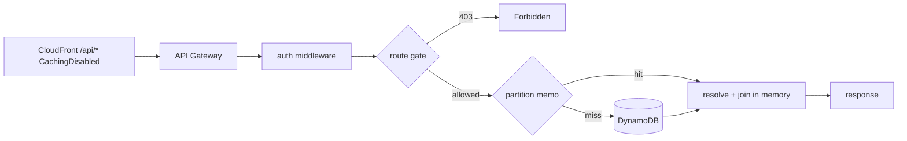

# Cache DynamoDB partition reads for projects, contracts, and initiatives

## Summary

Add a 60-second, module-scope read cache inside the API Lambda so `GET /api/projects`, `GET /api/contracts`, and `GET /api/initiatives` stop re-reading the same DynamoDB partitions on every request. The cache sits at the *partition-read* layer rather than the response layer, behind the existing auth middleware and capability checks, so no response is ever shared between users and no data becomes reachable without a session.

---

## Problem Frame

These three endpoints are the heaviest reads in the API and the only uncached ones. Each request re-reads whole partitions and re-joins them in memory:

| Endpoint | DynamoDB operations per request |
|---|---|
| `GET /api/projects` | sync-meta `GetItem`, projects partition, archetypes partition, contracts partition, postures partition — **5** |
| `GET /api/contracts` | seed-meta `GetItem`, contracts partition, postures partition, projects partition — **4** |
| `GET /api/initiatives` | seed-meta `GetItem`, initiatives partition, projects partition, + contracts partition when `?id=` resolves a project — **3–4** |

Meanwhile `/api/skills` and `/api/plugins` — far cheaper reads — are the two endpoints that *do* get a CloudFront cache ([terraform/cloudfront.tf:176-225](../../terraform/cloudfront.tf#L176-L225)). The caching is inverted relative to cost.

The partitions overlap heavily: the projects partition is read by all three endpoints, the contracts partition by all three, the postures partition by two. A read-layer cache collapses that overlap across endpoints, not just across repeat requests to one endpoint.

---

## Requirements

- R1. Repeat requests to these three endpoints within the TTL perform no DynamoDB partition reads.
- R2. No response body is shared across users, and no response becomes reachable without a valid session. The `manage:project-reference` gate on `/api/projects` remains evaluated per request.
- R3. `GET /api/initiatives?id=X` continues to return `related_contracts` for X and only X; the cache must not let one initiative's join leak into another's response.
- R4. A failed DynamoDB read is never cached — the next request retries against DynamoDB.
- R5. The existing 92 route tests across the three endpoints continue to pass, with cache state isolated between tests.
- R6. The four-state `related_contracts` contract (absent / `null` / `[]` / populated) documented at [functions/api/routes/initiatives.mjs:229-242](../../functions/api/routes/initiatives.mjs#L229-L242) is preserved, including `null` on read failure.

---

## Scope Boundaries

- No CloudFront cache behaviors are added for these paths. `/api/*` continues to route to the `CachingDisabled` catch-all at [terraform/cloudfront.tf:228-240](../../terraform/cloudfront.tf#L228-L240). No terraform changes at all.
- No changes to [functions/edge/auth-check.js.tpl](../../functions/edge/auth-check.js.tpl).
- No cache invalidation hooks in the sync workflows or admin write routes. Staleness is bounded by TTL alone.
- No change to any response body, status code, or error semantics. This is a read-path optimization only; every route's contract is byte-identical.
- Write routes and their tables are untouched. These three tables are read-only from the API by IAM grant.

### Deferred to Follow-Up Work

- **`/api/skills` shared-cache correctness**: `/api/skills` is cached at CloudFront with `cookie_behavior = "none"`, but [functions/api/routes/skills.mjs:48](../../functions/api/routes/skills.mjs#L48) filters the list with `can(user, 'read:skill', s)`, which returns true for a user's *own* unapproved skills ([functions/api/lib/permissions.mjs:37](../../functions/api/lib/permissions.mjs#L37)). The cached list therefore does vary by user, contradicting the justification comment at [terraform/cloudfront.tf:70-73](../../terraform/cloudfront.tf#L70-L73). Pre-existing, unrelated to this plan, and worth its own investigation.
- **Edge caching for `/api/contracts` and `/api/initiatives`**: both return a byte-identical body to every signed-in user, so they *are* shared-cache-safe in principle — but only if the `auth_check` CloudFront Function is attached at viewer-request so a cache hit still requires a valid JWT. That requires an `/api/` passthrough in the function's `rewriteUri`, which currently rewrites `/api/contracts` to `/api/contracts/index.html`. Deferred: it touches the component whose failure logs out every user, for a latency win on three low-traffic pages.

---

## Context & Research

### Relevant Code and Patterns

- [functions/api/middleware/auth.mjs:7-14](../../functions/api/middleware/auth.mjs#L7-L14) — `paramCache`, the existing module-scope container-lifetime cache in this Lambda. Same shape, no TTL. This is the pattern to follow.
- [functions/api/routes/projects.mjs:36-52](../../functions/api/routes/projects.mjs#L36-L52), [functions/api/routes/contracts.mjs:121-138](../../functions/api/routes/contracts.mjs#L121-L138), [functions/api/routes/initiatives.mjs:142-165](../../functions/api/routes/initiatives.mjs#L142-L165) — three near-identical `queryPartition` helpers. The initiatives copy is the superset: it takes an optional `fields` projection.
- [functions/api/lib/dynamo.mjs](../../functions/api/lib/dynamo.mjs) — the shared client and `tables` accessors. The new helper belongs alongside it in `functions/api/lib/`.
- [tests/api/routes/contracts.test.mjs:128-138](../../tests/api/routes/contracts.test.mjs#L128-L138) — the `beforeEach`/`afterEach` shape all three test files share: `mockSend.mockReset()` plus env-var save/restore.

### Test-harness constraint

This is the one place the change is not invisible. All three test files drive the routes through sequenced `mockSend.mockResolvedValueOnce(...)` chains and reset only the mock, not module state. A module-scope cache surviving between tests means the second test in a file reads a payload the first test seeded, and the mocked sequence desynchronizes. The helper must therefore export a reset hook, and every affected test file must call it in `beforeEach`. Without this, expect broad failures across 92 tests.

### Institutional Learnings

`docs/solutions/` is empty in this repo — no prior learnings to carry.

---

## Key Technical Decisions

- **Cache at the partition-read layer, not the response layer.** Three reasons. (1) `/api/initiatives` varies by `?id=`, so a response-level cache needs an entry per initiative and a correct key; a read-level cache is one entry per partition and stays correct for every id automatically, satisfying R3 structurally rather than by careful keying. (2) The three endpoints share partitions, so one cached read of the contracts partition serves the contract explorer, the projects drift summary, and the initiatives join. (3) The per-request join work that remains — resolving postures, archetypes, and projects over ≤119 records — is microseconds and preserves the deliberate resolve-on-read semantics those routes document.

- **Cache the in-flight promise, not the resolved value.** Two concurrent requests that both miss would otherwise both query. Storing the promise dedupes them for free on a single-threaded event loop.

- **Delete the entry on rejection.** A cached rejected promise would pin a transient DynamoDB failure for the full TTL and, worse, would make `readContractDrift`'s `read_failed` state sticky. Satisfies R4.

- **60-second TTL, no invalidation.** Sheet syncs are scheduled or dispatched; nobody watches for instant propagation. Admin posture and archetype edits surface within a minute, which preserves the *spirit* of the resolve-on-read design those routes document without the machinery of invalidation hooks.

- **Per-container, not shared.** Each warm Lambda container keeps its own copy with its own expiry. Ten containers means ten independent caches. Acceptable for read-only sheet data, and it means there is no distributed cache to operate.

- **Keep the meta `GetItem` reads uncached.** They are single-item gets, not partition scans, and leaving them live keeps the freshness banner honest about the sync state even when rows are up to 60s stale. See the Risks table.

---

## Open Questions

### Resolved During Planning

- *Should this be a CloudFront cache like skills and plugins?* No. A cache hit at CloudFront bypasses the Lambda entirely, so the auth middleware never runs — the body would be reachable with no session. And `/api/projects` returns 403 or 200 depending on `manage:project-reference`, which a shared cache key with `cookie_behavior = "none"` cannot express; whichever response arrives first would be served to everyone.
- *Where does the TTL come from?* A module constant, not an environment variable. Nothing operationally tunes this, and a var would need plumbing through terraform for no current use.

### Deferred to Implementation

- Whether `describeSync`/`describePopulation`'s meta `GetItem` reads should join the cache for payload coherence. Decided against for now (see Risks), but revisit if the incoherence shows up in practice.
- Exact helper and module naming.

---

## High-Level Technical Design

> *This illustrates the intended approach and is directional guidance for review, not implementation specification. The implementing agent should treat it as context, not code to reproduce.*

```
cachedQueryPartition(table, keyName, keyValue, fields?)
  key := join(table, keyName, keyValue, fields ?? "")

  entry := cache[key]
  if entry exists and entry.expiresAt > now:
      return entry.promise          # may still be in flight — dedupes concurrent misses

  promise := queryPartition(...)    # existing paging loop, unchanged
  promise.catch(() => delete cache[key])   # never pin a failure
  cache[key] = { promise, expiresAt: now + TTL }
  return promise
```

Read-path shape after the change:



The gate is evaluated before the memo is consulted on every request, which is what keeps R2 true.

---

## Implementation Units

- U1. **Shared cached partition reader**

**Goal:** One `queryPartition` implementation with a TTL memo in front of it, replacing three copies.

**Requirements:** R1, R4

**Dependencies:** None

**Files:**
- Create: `functions/api/lib/partition-cache.mjs`
- Test: `tests/api/lib/partition-cache.test.mjs`

**Approach:**
- Export a cached read that takes `(table, keyName, keyValue, fields = null)` — the initiatives signature, since it is the superset. The paging loop and the `ProjectionExpression` aliasing move over verbatim from [functions/api/routes/initiatives.mjs:142-165](../../functions/api/routes/initiatives.mjs#L142-L165); that aliasing comment is load-bearing and should travel with the code.
- The cache key must include the serialized `fields` list. The contracts partition is read unprojected by `/api/contracts` and projected by `/api/initiatives`; collapsing those into one entry would serve a six-field record where a thirty-column one is expected.
- Store `{ promise, expiresAt }`. Attach a rejection handler that removes the entry, and make sure that handler does not itself surface an unhandled rejection when no caller is awaiting.
- Export a reset hook for tests. Name it so it reads as test-only (e.g. a `__`-prefixed export) and document why it exists — a future reader will otherwise assume it is a runtime invalidation seam and try to call it from a route.
- No eviction policy. The key space is bounded by the number of distinct partition/projection pairs in the codebase, currently five.

**Patterns to follow:**
- [functions/api/middleware/auth.mjs:7-14](../../functions/api/middleware/auth.mjs#L7-L14) for module-scope cache shape.
- The comment density and rationale-first style of [functions/api/lib/contracts.mjs](../../functions/api/lib/contracts.mjs) — this repo documents *why* at every non-obvious decision.

**Test scenarios:**
- Happy path: two successive reads of the same partition issue one `QueryCommand`; the second resolves to the same items.
- Happy path: a read whose partition spans two pages (`LastEvaluatedKey` on the first response) returns the concatenated items and caches the concatenation, not the first page.
- Edge case: reads differing only in the `fields` projection do not share an entry — each issues its own query and returns its own shape.
- Edge case: reads differing only in `keyValue` (e.g. `project` vs `sync_meta`) do not share an entry.
- Edge case: a read after the TTU has elapsed re-queries DynamoDB. Drive the clock with fake timers rather than sleeping.
- Edge case: two concurrent reads of the same key issue exactly one `QueryCommand` and both resolve to the same items.
- Error path: a rejected read propagates the rejection to the caller, and the immediately following read re-queries rather than replaying the failure.
- Error path: a rejected read with no second caller does not produce an unhandled promise rejection.
- Integration: the reset hook clears all entries, so a read after reset re-queries.

**Verification:**
- A repeated read is served without touching the DynamoDB client, and a failed read is never replayed from cache.

---

- U2. **Adopt the cached reader in `/api/contracts`**

**Goal:** `GET /api/contracts` performs one `GetItem` and zero partition queries on a warm cache.

**Requirements:** R1, R2, R5

**Dependencies:** U1

**Files:**
- Modify: `functions/api/routes/contracts.mjs`
- Modify: `tests/api/routes/contracts.test.mjs`

**Approach:**
- Delete the local `queryPartition` and route the three partition reads through the shared helper. Leave the seed-meta `GetItem` as-is.
- No change to `serveContracts`' structure, the allowlist projection, the 503 config guard, or the 500 error path. This route stays authenticated-but-ungated by design ([functions/api/routes/contracts.mjs:15-23](../../functions/api/routes/contracts.mjs#L15-L23)) and this change does not revisit that.
- Add the cache reset to the file's existing `beforeEach` alongside `mockSend.mockReset()`.

**Patterns to follow:**
- The existing `beforeEach`/`afterEach` block at [tests/api/routes/contracts.test.mjs:128-138](../../tests/api/routes/contracts.test.mjs#L128-L138).

**Test scenarios:**
- Happy path: all 20 existing tests in the file pass unchanged once the reset hook is wired in.
- Happy path: two successive `GET /api/contracts` requests in one test return identical bodies while the second issues no `QueryCommand`.
- Integration: a posture record edited between two requests is *not* reflected until the TTL elapses — asserted deliberately, because it documents the accepted trade-off against the route's resolve-on-read comment at [functions/api/routes/contracts.mjs:200-204](../../functions/api/routes/contracts.mjs#L200-L204).
- Error path: an unconfigured table still returns 503 and caches nothing.
- Error path: a failing partition read still returns 500, and the next request retries the read rather than returning a cached 500.

**Verification:**
- The contracts response is unchanged in shape and content; a second request within the TTL reaches DynamoDB only for the meta item.

---

- U3. **Adopt the cached reader in `/api/initiatives`**

**Goal:** Same for initiatives, with the `?id=` join preserved exactly.

**Requirements:** R1, R2, R3, R6

**Dependencies:** U1

**Files:**
- Modify: `functions/api/routes/initiatives.mjs`
- Modify: `tests/api/routes/initiatives.test.mjs`

**Approach:**
- The local `queryPartition` is the one the shared helper was derived from; delete it and re-point the three call sites, keeping the projected contracts read's `fields` argument intact.
- The `related_contracts` join stays entirely per-request. Only the underlying partition reads are cached, so the four-state contract and the id-specific attachment logic are untouched.
- The contracts read inside the `try` block still needs its rejection to reach the local `catch` and produce `related_contracts: null`. Confirm the helper's rejection path preserves that, and that the failure is not cached.
- Wire the reset hook into `beforeEach`.

**Patterns to follow:**
- The four-state documentation block at [functions/api/routes/initiatives.mjs:229-242](../../functions/api/routes/initiatives.mjs#L229-L242) — the reason this unit caches reads rather than responses. Worth a one-line note at the new call site.

**Test scenarios:**
- Happy path: all 32 existing tests pass once the reset hook is wired in.
- Happy path (R3): `GET /api/initiatives?id=A` followed by `?id=B` returns B's related contracts on the second request, not A's, despite both being served from the same cached partitions.
- Happy path: `?id=A` followed by a bare `GET /api/initiatives` returns no `related_contracts` key on any record.
- Edge case: `?id=` naming an initiative with no resolved project omits `related_contracts` and issues no contracts query, cached or otherwise.
- Edge case: `?id=` naming nothing omits the key.
- Error path (R6): a failing contracts read yields `related_contracts: null` — distinct from `[]` — and the next request with the same id retries the read.
- Integration: the projected contracts read and an unprojected read of the same partition from another route do not collide.

**Verification:**
- Initiative detail responses remain id-correct across cached requests, and all four `related_contracts` states still reachable.

---

- U4. **Adopt the cached reader in `/api/projects`**

**Goal:** Same for projects, with the capability gate provably still evaluated per request.

**Requirements:** R1, R2, R5

**Dependencies:** U1

**Files:**
- Modify: `functions/api/routes/projects.mjs`
- Modify: `tests/api/routes/projects.test.mjs`

**Approach:**
- Delete the local `queryPartition`; route the projects and archetypes reads, plus both reads inside `readContractDrift`, through the shared helper.
- The `can(user, CAPABILITY)` check at [functions/api/routes/projects.mjs:156-157](../../functions/api/routes/projects.mjs#L156-L157) stays exactly where it is — before any read. This ordering is the whole reason the plan chose an in-Lambda cache; a test should pin it.
- `readContractDrift`'s degradation contract is delicate: `not_configured` versus `read_failed` are deliberately distinguished ([functions/api/routes/projects.mjs:103-148](../../functions/api/routes/projects.mjs#L103-L148)). A cached rejection would make `read_failed` stick for the TTL, which U1's rejection handling prevents — verify it here rather than assuming.
- Wire the reset hook into `beforeEach`.

**Test scenarios:**
- Happy path: all 40 existing tests pass once the reset hook is wired in.
- Happy path: two successive authorized requests return identical bodies with no repeated partition query.
- Integration (R2): an authorized request that populates the cache, followed by a request from a `user`-role account, returns 403 — the cached data is never served to an ungated caller. Run the same assertion in the reverse order: a 403 first must not prevent a subsequent authorized request from receiving the full body.
- Integration (R2): the 403 path issues no DynamoDB reads at all.
- Error path: a contracts-partition failure yields `contract_drift.available === false` with `reason: 'read_failed'`, and the next request retries — the drift section recovers without waiting for the TTL.
- Edge case: an unconfigured contracts table still yields `reason: 'not_configured'` and never enters the cache.

**Verification:**
- Role-dependent behavior is identical to today in both orderings, and drift-read failures remain transient.

---

- U5. **Document the caching behavior**

**Goal:** A reader of the API docs learns these responses can be up to a minute stale, and a future maintainer learns why the cache is in the Lambda and not at the edge.

**Requirements:** R2

**Dependencies:** U2, U3, U4

**Files:**
- Modify: `docs/api.md`
- Modify: `docs/ARCHITECTURE.md`

**Approach:**
- In [docs/api.md](../../docs/api.md), note the TTL on each of the three endpoint sections. Match the surrounding documentation style rather than adding a new section shape.
- In [docs/ARCHITECTURE.md](../../docs/ARCHITECTURE.md), record the two-layer caching picture: CloudFront for the skills and plugins catalog, in-Lambda for the project-data reads, and the reason they differ — a CloudFront hit skips the Lambda and therefore skips authorization, which `/api/projects` cannot tolerate. This is the note that stops someone from "finishing the job" later by adding the missing edge behaviors.
- `docs/openapi.yaml` needs no change: no schema, parameter, or status code moves.

**Test scenarios:**
- Test expectation: none — documentation only, no behavioral change.

**Verification:**
- Both docs state the staleness bound and the rationale for the layer choice.

---

## System-Wide Impact

- **Interaction graph:** The memo sits below all three routes and above the shared DynamoDB client. Because entries are keyed by table and partition, a read cached on behalf of `/api/contracts` is reused by `/api/projects`' drift summary and `/api/initiatives`' join. That cross-endpoint reuse is intended, and it means a change to one route's read arguments can silently change another's cache hit rate.
- **Error propagation:** Unchanged in every route. Rejections propagate to the same handlers as today; the only new rule is that a rejection evicts its entry so failures stay transient.
- **State lifecycle risks:** Per-container caches expire independently, so two requests seconds apart can land on containers holding different generations of the same partition. For scheduled sheet data with a 60s bound, this is not observable in practice.
- **API surface parity:** None. No response body, status code, or header changes. `docs/openapi.yaml` stays valid as written.
- **Unchanged invariants:** The `manage:project-reference` gate on `/api/projects`; the deliberate absence of a gate on `/api/contracts` and `/api/initiatives`; the read-only IAM posture on all three tables; the resolve-on-read joins; the four-state `related_contracts` contract; every CloudFront behavior.

---

## Risks & Dependencies

| Risk | Mitigation |
|------|------------|
| The 92 existing route tests break because module state survives between tests | U1 ships the reset hook and U2–U4 each wire it into their own test file's `beforeEach`. This is the expected failure mode, called out explicitly so it reads as anticipated rather than as a regression. |
| Cached partitions paired with an uncached meta `GetItem` produce a response claiming a fresher sync than the rows reflect | Bounded at 60s on data that syncs on an hours-scale cadence. Accepted rather than mitigated; caching the meta read too would only move the incoherence rather than remove it, since entries would still expire independently. |
| Admin edits to postures and archetypes take up to a minute to appear, weakening the resolve-on-read behavior those routes deliberately document | Documented in U5 and asserted by a test in U2 so the trade-off is visible in the suite rather than discovered in use. Revisit with a targeted cache bump on the admin write routes if it proves annoying. |
| A future maintainer "completes" the work by adding CloudFront behaviors for these paths, reintroducing the exposure this plan avoided | U5's ARCHITECTURE.md note states the reason directly. The rejected-alternative entry below carries the same reasoning. |
| Cross-endpoint key collision between the projected and unprojected contracts reads | The projection is part of the cache key, with a dedicated test in U1 and an integration assertion in U3. |

---

## Alternative Approaches Considered

- **CloudFront behaviors mirroring `/api/skills` and `/api/plugins`.** Rejected. A cache hit is served from the edge without invoking the Lambda, so the auth middleware never runs and an unauthenticated request receives the body — for `/api/contracts` that means customer names, `client_policy_summary`, `notes`, and named individuals. For `/api/projects` it also breaks in both directions: the cache stores whichever of the 403 or the 200 arrives first and serves it to everyone for the TTL.
- **Edge caching with the `auth_check` function attached.** Sound for `/api/contracts` and `/api/initiatives`, which return identical bodies to every signed-in user, and it would eliminate the Lambda hop entirely. Deferred rather than rejected: it requires an `/api/` passthrough in `rewriteUri`, and that function's failure mode is logging out every user. Not a trade worth making for three low-traffic pages in the same change that fixes the read amplification.
- **Response-level caching inside the Lambda.** Simpler to write, but needs a per-`?id=` key for initiatives and would cache the fully-joined payload, defeating the cross-endpoint partition reuse that makes the read-layer version worthwhile.
- **A DAX cluster or ElastiCache in front of DynamoDB.** Wildly disproportionate. The largest table here holds 119 items.

---

## Sources & References

- Route implementations: [functions/api/routes/projects.mjs](../../functions/api/routes/projects.mjs), [functions/api/routes/contracts.mjs](../../functions/api/routes/contracts.mjs), [functions/api/routes/initiatives.mjs](../../functions/api/routes/initiatives.mjs)
- Existing cache precedent: [terraform/cloudfront.tf:70-98](../../terraform/cloudfront.tf#L70-L98), [functions/api/middleware/auth.mjs](../../functions/api/middleware/auth.mjs)
- Edge auth: [functions/edge/auth-check.js.tpl](../../functions/edge/auth-check.js.tpl)
- Permission model: [functions/api/lib/permissions.mjs](../../functions/api/lib/permissions.mjs), [docs/rbac-permissions.md](../rbac-permissions.md)
