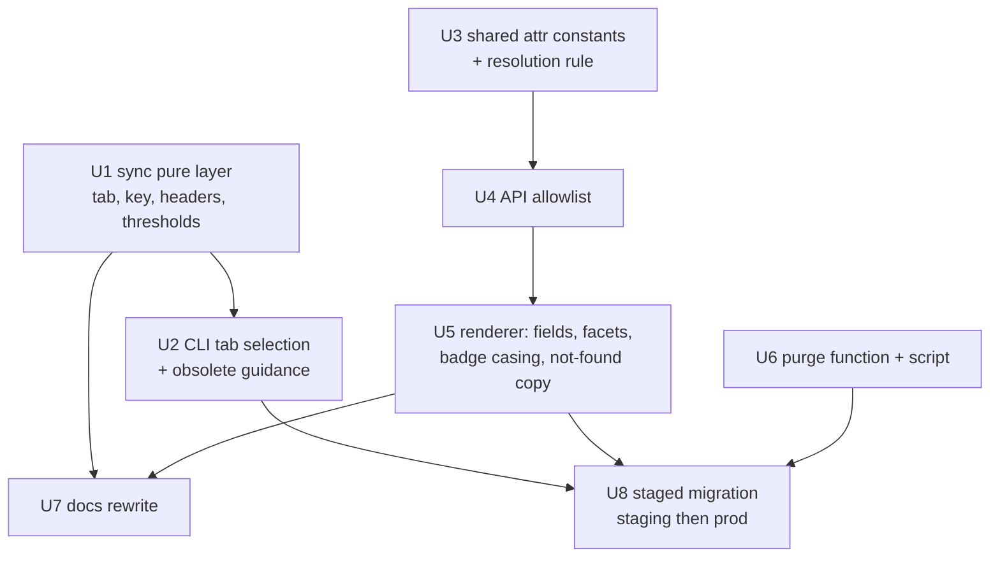

# feat: Re-point the initiatives sync at the v2 sheet and key off its id column

## Summary

Re-point `scripts/sync-initiatives.mjs` at the `v2` tab of the AI-initiatives workbook, whose columns have been renamed and extended, and move the record key from a slug of the initiative title to the sheet's now-populated `id` column. Because every key changes, the existing table is purged by a new operator-run script and repopulated by a normal sync run.

---

## Problem Frame

The initiatives sync reads the workbook tab named `from initiatives.json`, whose columns are machine-named camelCase (`desc`, `useCaseLabel`, `projectName`). That tab has been superseded: the sheet's owners built a `v2` tab with human-readable headers, dropped a column, added seven, and — critically — populated an `id` column that the workbook did not supply when this feature was designed.

The absence of that id column is the root of a cost documented in three places today. `initiative_id` is a slug of the initiative's title, so retitling an initiative re-keys the record: the sync reads it as a delete plus a create, `first_seen_at` does not survive, and the detail-page URL changes. A populated `id` column retires that whole class of problem.

The workbook has also been reorganized around v2 while this was being planned: `v2` is now tab index 0 and the previous tab was renamed `OLD: v1 from initiatives.json`. The sync pins `titles[0]` to an expected title, so it currently fails loudly against the workbook as it now stands — the correct behaviour, and the reason this is a re-point rather than a repair.

---

## Requirements

- R1. The sync reads the `v2` tab of the same workbook (`1IOBjzJJ7J_LhTlkAf4iWzNevsWCv1jqRakKdOYBwdtg`), selected by title, and fails loudly if that tab is absent.
- R2. `initiative_id` is derived from the sheet's `id` column, not from `Title`. Retitling an initiative no longer re-keys its record.
- R3. Stored attribute names follow the v2 headers 1:1 through the existing slug rule — no alias or translation layer between sheet name and stored name.
- R4. `Summary`, `Practice`, `AI Governance`, `Submitted By`, and `Timestamp` are served by the API and rendered on the initiative detail page. `Source Location` reaches the table only.
- R5. The exposure badge renders the sheet's own capitalization — `Infrastructure`, not `INFRASTRUCTURE` and not `infrastructure` — and carries a colour for the new `Infrastructure` value.
- R6. Every project name stated in v2 still resolves to a project record after the attribute rename, so the sync's resolution alarm stays green.
- R7. The existing initiative records are deleted and recreated from v2, by an explicit operator-run purge followed by a normal sync run, staging before prod.
- R8. The sync's safety gate still refuses a zero-row read, an over-ceiling delete, and a sub-floor row count, with thresholds re-scaled to the v2 row count.
- R9. Documentation that explains the title-derived key is rewritten, not trimmed, so the next reader is not told a fact that stopped being true.

---

## Scope Boundaries

- No redirect map from old title-slug URLs (`/initiatives/benefits-navigator-prototype`) to the new `init-N` addresses. Old links 404 into the existing not-found state.
- `Source Location` is not surfaced on the page (0 of 46 rows populated).
- No cron added to the sync workflow — it stays `workflow_dispatch` only.
- The `Slack Workflow Form Responses` tab is not treated as a second source.
- No change to how contracts or projects are synced or resolved, beyond keeping the initiatives→project join working.
- No change to the partition-cache layer or the 60-second read cache.

---

## Context & Research

### Verified sheet state

Read directly from the workbook on 2026-08-24 via `scripts/lib/sheets-client.mjs`, not assumed.

Tabs, in order: `v2`, `Slack Workflow Form Responses`, `OLD: changes to v1: Columns desired`, `OLD: v1 from initiatives.json`.

The `v2` tab has its headers at grid index 0 with no title banner, and 46 populated data rows.

| v2 header | Stored attribute | Filled | Notes |
|---|---|---|---|
| `Title` | `title` | 46/46 | No longer the key source |
| `Summary` | `summary` | 46/46 | New. The universal short field |
| `Description` | `description` | 37/46 | Was `desc`. Long-form; absent on the 9 new rows |
| `Practice` | `practice` | 0/46 | New, entirely empty today |
| `Exposure` | `exposure` | 37/46 | Values recased: `Client`, `Internal`, `Infrastructure`, `Learning` |
| `Contacts` | `contacts` | 43/46 | Was `people` |
| `Project` | `project` | 23/46 | Was `project_name`. The resolution join key |
| `Link` | `link` | 35/46 | Was `links` |
| `Submitted By` | `submitted_by` | 46/46 | New. Only 2 distinct values |
| `Timestamp` | `timestamp` | 46/46 | New. Free text, e.g. `Jun 25, 2026, 7:00:00 PM` |
| `Source Location` | `source_location` | 0/46 | New, entirely empty today |
| `id` | — (key source) | 46/46 | `init-2`…`init-47`, 46 distinct, already slug-safe |
| `Use Case` | `use_case` | 37/46 | Was `use_case_label` |
| `AI Governance` | `ai_governance` | 0/46 | New, entirely empty today |
| `tags` | `tags` | 46/46 | Gained prose values, e.g. `Public Content & Marketing` |
| `status` | `status` | 22/46 | Unchanged name |

Dropped from v1: `useCaseTheme` (`use_case_theme`).

Three measurements that shape decisions below:

- The `id` values are 6–7 characters, all lowercase, all `[a-z0-9-]`, so `slugInitiativeId` is a no-op on them. They are usable as range keys and URL segments unchanged.
- The 9 rows added since v1 are exactly the rows with blank `Exposure`, `Use Case`, and `Description` — Substack and marketing items carrying `Summary` instead. Required-header checks must therefore test column presence, not cell fill.
- The set of stated project names is identical between v1 and v2: 14 distinct values across 23 rows, with no additions and no removals. R6 is therefore satisfied by wiring the renamed attribute correctly; no resolution regression is expected.

### Relevant code and patterns

- `scripts/lib/sync-initiatives.mjs` — the pure layer. All the constants this plan changes live here: `EXPECTED_TAB_TITLE`, `HEADER_ROW`, `ID_COLUMNS`, `EXCLUDED_HEADERS`, `RESERVED_ATTRIBUTES`, `REQUIRED_HEADERS`, and the three gate thresholds. Its comments carry extensive rationale keyed to the title-derived id; that rationale is now obsolete and is rewritten, not deleted.
- `scripts/lib/sync-initiatives-apply.mjs` — the injected-client orchestration layer. `populateInitiatives` already writes whole items with `PutCommand`, and the purge in U6 belongs here for the same reason the rest does: it is testable against a fake client.
- `functions/api/lib/initiatives.mjs` — the shared attribute constants and the resolution rule, with two callers that must not disagree (the route resolves on read, the sync resolves after apply).
- `functions/api/routes/initiatives.mjs` — `INITIATIVE_FIELDS`, the deliberate allowlist that pairs with the sync's denylist.
- `src/lib/initiatives-render.mjs` — `DETAIL_FIELDS`, `NARRATIVE_FIELDS`, `EXPOSURE_CLASSES`, the facet helpers, and the search haystack.
- `scripts/prune-orphan-skills.mjs` — the precedent for a destructive one-off: dry-run by default, `--apply` to write, `--env`, staging verified before prod.
- `tests/sync-initiatives-apply.test.mjs` — the `fakeDdb` harness the purge tests reuse.

### Institutional learnings

`docs/solutions/` does not exist in this repo, so there are no prior recorded learnings to carry forward. The rationale comments in the three sync modules serve that role here and are treated as the institutional record — which is why R9 requires rewriting rather than deleting them.

---

## Key Technical Decisions

- **Select the tab by title, not by index.** The workbook's tab order and names changed during planning (`v2` moved to index 0; the old tab gained an `OLD:` prefix). Index 0 happens to be correct right now and is not a durable contract. Looking the title up among the fetched titles, and failing with the available titles listed, keeps the loud-failure property without depending on order.
- **`id` is the key source only, not also a stored attribute.** Adding `id` to `EXCLUDED_HEADERS` keeps it out of the carried record; otherwise every item would hold `initiative_id` and an identical `id`, and a reader would have two candidate keys with no rule for choosing. The header is still required, and `ID_COLUMNS` still reads it from the raw header row, which is independent of the carry denylist.
- **Rename the initiatives-side constant to `PROJECT_ATTR`, not just its value.** `functions/api/routes/initiatives.mjs` already imports a `PROJECT_NAME_ATTR` from `contracts.mjs`, whose value stays `project_name`. Leaving the initiatives constant under the same name with the new value `project` would put two identically-named constants with different values one import line apart, in the file that performs the join between them. The rename is the guard.
- **Attribute names track the sheet 1:1, with no alias map.** An alias layer would keep the API and renderer untouched, but the sheet's names and the table's names would then diverge permanently and every future reader would need the map to connect them. Paying the rename cost once across the API, renderer, and tests keeps the sync's one-way slug rule the only thing standing between a header and an attribute.
- **`Summary` is the primary short field, `Description` the optional long-form one.** `Summary` is populated on all 46 rows and `Description` on 37, so the card blurb reads `Summary` and the detail page shows both. This inverts the earlier reading of these columns, taken when `Summary` was populated on only 9 rows.
- **`Timestamp` renders as written and is never parsed as a date.** It arrives as free text (`Jun 25, 2026, 7:00:00 PM`), and the renderer already establishes this rule for `status`, whose values include things like `Fall 2025 – present`. Reformatting would hide what the record actually says, and a parse failure would be worse than the raw string.
- **Purge as a separate operator-run script, not a `--purge` flag on the sync.** A flag would put a gate-bypassing mass delete inside the tool whose entire safety design assumes it never mass-deletes; the flag most likely to be typed by accident would be the destructive one. A separate script that is dry-run by default keeps the sync's gate intact and unbypassable, and matches `prune-orphan-skills.mjs`.
- **The delete ceiling stays at 10% but changes meaning.** With a title-derived key it guarded against bulk retitles. With an `id`-derived key it guards against the sheet's ids being renumbered or re-sorted — a `init-N` sequence is positional-looking and a re-sort is the plausible mass re-key now. The threshold is unchanged; only the rationale comment is rewritten.
- **No URL redirect layer.** Every address changes from a title slug to `init-N`. The plan accepts 404s on old links rather than building a mapping table, because the old ids are about to be deleted and nothing in the repo records which title produced which slug. The not-found copy is corrected so the page stops attributing the 404 to a retitle.

---

## Open Questions

### Resolved During Planning

- Which tab and workbook: the `v2` tab of the existing workbook, confirmed by direct read.
- Whether stored attributes should alias to the old names or follow v2: follow v2 1:1.
- Which new columns reach the page: `Summary`, `Practice`, `AI Governance`, `Submitted By`, `Timestamp`. Not `Source Location`.
- Whether the migration needs a purge: yes. Moving the key to `id` means reconciliation alone would present as 46 creates plus 37 deletes — a 100% delete of stored records, which trips the ceiling and would need `--force`. An explicit purge is the honest path.
- Whether `first_seen_at` can be preserved: no. Every key changes, so the history does not survive under any migration path. Not a cost of the purge specifically.
- Whether project resolution regresses: no. The stated project-name set is identical between v1 and v2.

### Deferred to Implementation

- Whether `DETAIL_FIELDS` or `NARRATIVE_FIELDS` is the right home for each new field, and their reading order. This is a layout judgement best made against the rendered page, not decided in advance.
- Whether the three all-empty columns (`Practice`, `AI Governance`, and the table-only `Source Location`) need any distinct empty-state treatment beyond the existing "None listed", once seen on a real record.
- The exact prod cutover window. Staging is verified first; prod follows once the page is confirmed.

---

## High-Level Technical Design

> *This illustrates the intended approach and is directional guidance for review, not implementation specification. The implementing agent should treat it as context, not code to reproduce.*

The header-to-attribute path is unchanged in mechanism and changed only in inputs. What moves is which column sources the key, and which names come out the other side:

```
v2 header row ──► REQUIRED_HEADERS presence check (fails loudly on a shifted row)
                        │
        ┌───────────────┴────────────────┐
        │                                │
   ID_COLUMNS = ['id']            carried columns
   (raw header lookup,            (all headers minus
    ignores the denylist)          EXCLUDED_HEADERS = ['id'])
        │                                │
        ▼                                ▼
   initiative_id                   slugAttribute(header)
   = 'init-2'                      'Use Case'     -> use_case
   (slug is a no-op)               'Project'      -> project
                                   'Submitted By' -> submitted_by
                                          │
                                          ▼
                              stored item, whole-item Put
```

Unit dependencies — the API-side and sync-side chains are independent until the migration:



---

## Implementation Units

- U1. **Re-point the sync's pure layer at v2 and key off `id`**

**Goal:** The shaping layer reads v2's headers, derives `initiative_id` from the `id` column, and carries the renamed and added columns under their v2 slugs.

**Requirements:** R1, R2, R3, R8

**Dependencies:** None

**Files:**
- Modify: `scripts/lib/sync-initiatives.mjs`
- Test: `tests/sync-initiatives-lib.test.mjs`

**Approach:**
- `EXPECTED_TAB_TITLE` becomes `v2`. Keep it as the single exported constant the CLI compares against, so the tab contract has one home.
- `ID_COLUMNS` becomes `['id']`. `HEADER_ROW` stays 0 — verified against the v2 tab, which has no title banner.
- `EXCLUDED_HEADERS` becomes `['id']`, so the key source is not also carried as a duplicate attribute.
- `REQUIRED_HEADERS` becomes the v2 names whose absence means the header row shifted or was reorganized: `id`, `Title`, `Exposure`, `tags`, `Project`, `Use Case`. Presence of the column, not fill of the cell — 9 rows legitimately leave `Exposure` and `Use Case` blank.
- `RESERVED_ATTRIBUTES` is unchanged in value; verify no v2 header slugs onto one of its entries.
- Re-scale `ABSOLUTE_FLOOR` from 30 to a value proportionate to 46 rows, and refresh the small-N arithmetic worked example in the comment so the stated refusal points match the new count.
- Rewrite the rationale comments that explain the title-derived key: the `ID_COLUMNS` block, the retitle cost in the `MAX_DELETE_FRACTION` block, and the retitle sentence in `reconcile`'s doc comment. The delete ceiling's new justification is a renumbering or re-sort of the `id` sequence.

**Patterns to follow:**
- The existing constant-plus-rationale structure in this file. Every threshold carries a measured justification; the new values need the same treatment rather than a bare number.
- `scripts/lib/sync-contracts.mjs` for the multi-column `ID_COLUMNS` shape, which `['id']` keeps compatible with.

**Test scenarios:**
- Happy path: a v2-shaped grid yields one initiative per row keyed by the `id` cell, with `init-2` passing through unchanged.
- Happy path: `Use Case`, `Project`, `Submitted By`, and `AI Governance` land as `use_case`, `project`, `submitted_by`, and `ai_governance`.
- Happy path: `id` does not appear as a stored attribute on any record, while `initiative_id` does.
- Happy path: `slugAttribute` reproduces each renamed constant exported by `functions/api/lib/initiatives.mjs` — the assertion that keeps the two modules in agreement without a runtime coupling.
- Edge case: a row with `Exposure`, `Use Case`, and `Description` all blank still imports, with those attributes present as empty strings rather than absent.
- Edge case: a row carrying only an `id` and no other populated cell is treated as blank and counted in `skippedBlankRows`, because the blank-row test reads carried columns and `id` is no longer carried. Assert the count so the behaviour is chosen rather than incidental.
- Error path: a grid missing the `id` header throws, naming `id` in the message.
- Error path: a grid missing `Project` throws, since every row would otherwise read as unlinked and produce a false all-clear.
- Error path: two rows sharing an `id` throw, naming both sheet rows.
- Error path: a row whose `id` is only punctuation throws rather than being silently dropped.
- Error path: a header that slugs onto `initiative_id` still throws.
- Happy path: `safetyVerdict` refuses at the new floor and permits just above it; the zero-row refusal remains non-overridable.

**Verification:**
- `shapeInitiatives` applied to the real v2 header row yields 46 initiatives keyed `init-*`, no reserved-attribute or collision throw, and no `id` attribute on any record.

---

- U2. **Select the v2 tab by title in the CLI and retire the obsolete retitle guidance**

**Goal:** The entry point finds the `v2` tab wherever it sits in the workbook, and its operator-facing text no longer explains a cost that no longer exists.

**Requirements:** R1, R2, R9

**Dependencies:** U1

**Files:**
- Modify: `scripts/sync-initiatives.mjs`
- Modify: `.github/workflows/sync-initiatives.yml`

**Approach:**
- Replace the `titles[0]` comparison with a lookup of `EXPECTED_TAB_TITLE` among the fetched titles. Keep the failure message's existing shape — it already lists the available titles in order, which is exactly what an operator needs when a tab has been renamed.
- Rewrite the module header: the `IDS COME FROM THE TITLE` block, the "first tab" description, and the note that a run reporting both creates and deletes is probably a retitle. Under an `id` key that combination means a genuine addition and removal, or a renumbering — the opposite of reassuring, so the note must not keep telling the reader to relax.
- Update the `NEW COLUMNS` warning to point at the current allowlist location, and the workflow's header comment where it repeats the retitle rationale.

**Patterns to follow:**
- `scripts/sync-projects.mjs` and `scripts/sync-contracts.mjs` for tab selection and failure-message shape.

**Test scenarios:**
- Test expectation: none for the tab lookup itself — this file calls `main()` at import and needs live credentials, which is why the testable logic lives in the two lib modules. The behaviour is covered by U8's staging dry run against the real workbook.

**Verification:**
- A dry run against staging authenticates, selects the `v2` tab by name, and reports 46 rows with no shaping error.
- Temporarily pointing `EXPECTED_TAB_TITLE` at a non-existent title produces the loud failure with the available titles listed, not a silent read of the wrong tab.

---

- U3. **Move the shared attribute constants and resolution rule to v2 names**

**Goal:** The one module both the API and the sync read agrees with the sheet's new attribute names, and the initiatives-side project constant is no longer confusable with the contracts-side one.

**Requirements:** R3, R4, R6

**Dependencies:** None

**Files:**
- Modify: `functions/api/lib/initiatives.mjs`
- Test: `tests/api/lib/initiatives.test.mjs`

**Approach:**
- `PROJECT_NAME_ATTR` becomes `PROJECT_ATTR` with value `project`; `USE_CASE_LABEL_ATTR` becomes `USE_CASE_ATTR` with value `use_case`. `TITLE_ATTR`, `EXPOSURE_ATTR`, and `TAGS_ATTR` keep their values.
- Add constants for the new fields the resolution rule or the page reads, following the existing reason for their existence: so the sync can assert its slug function reproduces them.
- `resolveProject` and `collectInitiativeIssues` read the renamed constant. The rule itself is unchanged — `project_name` on the project side against `project` on the initiative side, case-folded and whitespace-collapsed — and the comment explaining why `contract_name` is deliberately not consulted stays, since that measurement still holds.
- Update the comment on `TITLE_ATTR` that says it is the source of the range key. It is not any more, and that sentence is load-bearing for the next reader's mental model.
- Refresh the measured row counts in the `collectInitiativeIssues` comment (currently "14 of 37") to the v2 figures.

**Patterns to follow:**
- The existing constants block and its stated reason for existing.
- `functions/api/lib/contracts.mjs` for the parallel constant naming — and specifically for the collision this rename avoids.

**Test scenarios:**
- Happy path: each exported constant has its expected new value, asserted literally, since these strings are the contract with the sync's slug function.
- Happy path: an initiative whose `project` matches a project's `project_name` resolves, including across case and whitespace differences.
- Happy path: an initiative with a blank `project` resolves to null and lands in `missingProject`, not `unresolvedProjects`.
- Error path: an initiative whose `project` matches nothing lands in `unresolvedProjects` carrying `raw_value` exactly as the sheet holds it, not normalized.
- Integration: `contractsForProject` still runs the contracts-side rule against a single-project list, unaffected by the initiatives-side rename — the case that would silently drop every contract resolving via `contract_name`.

**Verification:**
- The resolution rule returns the same answers for the 23 stated project names under the new attribute name as it did under the old one.

---

- U4. **Update the API allowlist to the v2 field set**

**Goal:** `/api/initiatives` serves the renamed fields and the five newly surfaced ones, and stops serving a field that no longer exists.

**Requirements:** R3, R4

**Dependencies:** U3

**Files:**
- Modify: `functions/api/routes/initiatives.mjs`
- Test: `tests/api/routes/initiatives.test.mjs`

**Approach:**
- `INITIATIVE_FIELDS` becomes: `initiative_id`, `title`, `summary`, `description`, `practice`, `exposure`, `contacts`, `project`, `link`, `submitted_by`, `timestamp`, `use_case`, `ai_governance`, `tags`, `status`, `first_seen_at`, `last_synced_at`. `desc`, `use_case_theme`, `people`, `links`, and `project_name` come out; `source_location` is deliberately not added.
- Leave the `resolved_project` naming alone and keep its comment. The sheet now genuinely has a `project` column, which is precisely the collision that comment predicted — it is now a live constraint rather than a hypothetical, and the comment should say so.
- Verify the contracts-side `PROJECT_NAME_ATTR` import and the projection that uses it are untouched by the rename.
- Update the `people`-exposure rationale comment to name `contacts`.

**Patterns to follow:**
- The existing allowlist-with-rationale structure and its stated pairing with the sync's denylist.

**Test scenarios:**
- Happy path: a stored record surfaces exactly the allowlisted keys, asserted as a set so an accidental addition fails.
- Happy path: an attribute present in the table but absent from the allowlist — `source_location` — does not appear in the response.
- Happy path: `resolved_project` is the nine-field projection and is not shadowed by the record's own `project` value.
- Edge case: a record missing an optional attribute omits that key rather than serving null, matching the existing `!== undefined` filter.
- Integration: `?id=init-2` attaches `related_contracts` for that record only, resolved through the initiative's `project`.
- Integration: the four `related_contracts` states stay distinguishable — absent, null, empty, populated — after the rename.
- Error path: a failed contracts read still yields `null` rather than `[]`, and does not fail the whole response.

**Verification:**
- A response built from a v2-shaped record carries all five newly surfaced fields and none of the five removed ones.

---

- U5. **Render the v2 fields, fix the exposure badge casing, and correct the not-found copy**

**Goal:** The hub and detail page read the new attribute names, show the new fields, render exposure in the sheet's own capitalization, and stop attributing 404s to a retitle.

**Requirements:** R3, R4, R5, R9

**Dependencies:** U4

**Files:**
- Modify: `src/lib/initiatives-render.mjs`
- Modify: `src/pages/initiatives/index.astro`
- Test: `tests/frontend/initiatives-render.test.mjs`

**Approach:**
- `filterInitiatives` reads `use_case` for the use-case facet. The search haystack swaps `desc`/`people`/`project_name` for `summary`, `description`, `contacts`, and `project`, drops `use_case_theme`, and keeps `resolved_project.project_name`.
- `useCaseLabelsOf` reads `use_case`. Rename the exported helper to match if the old name would misdescribe it; the astro page's call site moves with it.
- The card blurb reads `summary` — populated on all 46 rows — instead of `desc`.
- `DETAIL_FIELDS` and `NARRATIVE_FIELDS` move to the new names and gain `Practice`, `AI Governance`, `Submitted By`, and `Timestamp`. `Description` stays a narrative field; `Summary` is short enough for the details grid. `Use case theme` is removed. `Contacts` keeps the `renderNameList` treatment `people` had, and `Link` keeps `renderLinks`. `Timestamp` uses the default renderer, which shows the value as written.
- `EXPOSURE_CLASSES` gains an `infrastructure` key and keeps `infra`. The lookup already lowercases, so both spellings resolve.
- Drop the `uppercase` class from the badge so `Infrastructure` renders as the sheet holds it. Check the surrounding badges for a visual mismatch once the class is gone, since the tag badge next to it is not uppercased either. Do not add a capitalization helper: casing comes from the sheet, so a future lowercase entry should render lowercase and be visible rather than papered over.
- Rewrite the not-found copy in `src/pages/initiatives/index.astro`, which currently tells the reader the address derives from the title and may have changed via a retitle. Addresses now come from the sheet's `id`.
- Update the comments citing measured counts ("26 of 37 rows carry links", "all 37 initiatives") to the v2 figures.

**Patterns to follow:**
- The existing `DETAIL_FIELDS` / `NARRATIVE_FIELDS` split — attributes in the grid, prose full-width — and its stated reason for being an explicit list rather than a record iteration.
- The Tailwind full-class-name constraint noted above `EXPOSURE_CLASSES`, and the recorded fact that `navy` is unavailable.

**Test scenarios:**
- Happy path: the exposure badge renders `Infrastructure` with its own capitalization preserved and no `uppercase` class in the output.
- Happy path: `Infrastructure` gets the blue palette rather than the gray fallback; `Client`, `Internal`, and `Learning` keep theirs despite the recasing.
- Edge case: a blank exposure still renders the "Exposure not recorded" state, not an empty badge.
- Edge case: an unrecognized exposure value falls back to the gray palette and renders its own text as written.
- Happy path: the card blurb renders `summary`.
- Edge case: a record with `summary` but no `description` — the shape of all 9 new rows — renders a card and a detail page with no empty gap where the description would be.
- Happy path: the use-case facet lists distinct `use_case` values; the tag facet includes prose values like `Public Content & Marketing` without mangling them.
- Happy path: search matches on `summary`, `description`, `contacts`, and `project`.
- Edge case: the tag facet's containment matching still works when a cell holds several semicolon-separated values.
- Happy path: the detail page renders all five newly surfaced fields, with `Timestamp` shown verbatim and never reformatted.
- Edge case: an empty `practice` or `ai_governance` renders "None listed" rather than an absent row, keeping the grid the same shape on every record.
- Happy path: `Contacts` renders as a name list and `Link` as links, matching what `people` and `links` did.
- Happy path: the resolved-project section names the initiative's own `project` string when it fails to resolve.

**Verification:**
- The hub renders 46 cards with working filters; a detail page shows every surfaced field; the exposure badge reads `Infrastructure` in mixed case with a non-fallback colour.

---

- U6. **Add a purge path for the initiatives partition**

**Goal:** An operator can delete every initiative record in one environment, deliberately, with a dry run first — without going through the sync or weakening its gate.

**Requirements:** R7

**Dependencies:** None

**Files:**
- Create: `scripts/purge-initiatives.mjs`
- Modify: `scripts/lib/sync-initiatives-apply.mjs`
- Test: `tests/sync-initiatives-apply.test.mjs`

**Approach:**
- Export a `purgeInitiatives({ ddb, table, dryRun, DeleteCommand, QueryCommand })` from the apply module, reusing its existing paginated partition read. It returns what it deleted or would delete. Putting it here rather than in the CLI is what makes a destructive path testable against the existing fake client — the same reasoning that put the gate here.
- Delete only the `RECORD_INITIATIVE` partition. The `seed_meta` record is left alone on purpose: the next run's baseline and column set should keep describing the last completed run, and clearing it would silently disable the row-drop check on exactly the run that repopulates the table.
- The CLI is dry-run by default and requires `--apply` to delete, takes `--env staging|prod`, and derives the table name from `--env` like every sibling. It prints the count and the ids it will remove before doing anything.
- Refuse to run when the partition is already empty, so a double-run is a clear no-op rather than an ambiguous success.
- Document in the file header that this leaves the table empty and that the gate's delete ceiling and absolute floor do not apply to the repopulating run, because both are guarded on a non-zero stored count. An operator reading this later needs to know the safety net is down between the two commands.

**Patterns to follow:**
- `scripts/prune-orphan-skills.mjs` for the dry-run-by-default, `--apply`, staging-then-prod shape and its SAFETY comment block.
- `readPartition` in `scripts/lib/sync-initiatives-apply.mjs` for the paginated read — a truncated read here would leave orphans behind.
- The `fakeDdb` harness in `tests/sync-initiatives-apply.test.mjs` for the injected-client tests.

**Test scenarios:**
- Happy path: with 37 stored initiatives, a dry run reports 37 and issues no `DeleteCommand`.
- Happy path: with `dryRun` false, exactly 37 deletes are issued, each keyed on `record_type` plus `initiative_id`.
- Happy path: the `seed_meta` record is not deleted, asserted explicitly — the check that keeps the next run's baseline intact.
- Edge case: a partition spanning multiple pages is fully deleted, proving the pagination. A truncated read would leave orphans that the next sync cannot see.
- Edge case: an already-empty partition deletes nothing and reports the no-op.
- Error path: a failure part-way through surfaces rather than being swallowed, leaving a partially purged table the operator is told about.

**Verification:**
- A dry run against staging lists the stored ids and writes nothing; `--apply` empties the initiative partition and leaves the metadata record in place.

---

- U7. **Rewrite the documentation that explains the old key and column set**

**Goal:** `docs/ARCHITECTURE.md` and `docs/api.md` describe the v2 columns and the `id`-derived key, with the title-derived rationale replaced rather than deleted.

**Requirements:** R9

**Dependencies:** U1, U5

**Files:**
- Modify: `docs/ARCHITECTURE.md`
- Modify: `docs/api.md`

**Approach:**
- `docs/ARCHITECTURE.md`: update the initiatives table's key-fields list; replace the paragraph explaining that the range key is a slug of `title` and its retitle cost with the `id`-column rule and the renumbering risk that replaces it; correct the "first tab" phrasing and the `projectName` reference in the workflow table.
- `docs/api.md`: update the example payload to a v2-shaped record with an `init-N` id and the new fields; rewrite the `initiative_id` paragraph; update the `resolved_project` paragraph to name `project` as the join key; refresh the measured counts (`14 of 37`, `row_count: 37`) to the v2 figures.
- Say plainly that retitling no longer re-keys a record. The old cost is documented in enough places that a reader who finds only some of them will assume the rest still applies.

**Patterns to follow:**
- The existing admission-rule and measured-count style in both documents. Counts are stated with the date they were measured, which is what lets a later reader tell a stale number from a wrong one.

**Test scenarios:**
- Test expectation: none — documentation only, no behavioural change.

**Verification:**
- Neither document contains a remaining claim that the key derives from the title, and both list the v2 field set.

---

- U8. **Run the staged migration: purge and repopulate, staging then prod**

**Goal:** Both environments hold 46 initiatives keyed `init-N`, with every stated project name resolving and the page rendering correctly.

**Requirements:** R6, R7, R8

**Dependencies:** U2, U5, U6

**Files:**
- No source changes. Operational unit.

**Approach:**
- Sequence per environment: sync dry run first, to confirm the tab is found and the shaping is clean before anything is deleted; then purge dry run; then purge `--apply`; then a live sync run; then verify the page.
- The dry run first is deliberate. Purging before confirming the sync can read v2 would leave the table empty with no way to refill it until the read is fixed.
- Expect the live run to report 46 creates, 0 updates, 0 deletes against an empty table, and to report every column as new — the first-run case, where the header-set comparison is intentionally silent.
- Expect the gate not to fire: the zero-row refusal needs 0 incoming, and the ceiling and floor are both guarded on a non-zero stored count. This is the window where the safety net is down, which is why staging is verified before prod is touched.
- Verify the resolution alarm comes back green — all 23 stated project names resolving, matching the measured expectation — before proceeding to prod.
- Complete staging fully, including a page check, before starting prod.

**Patterns to follow:**
- The staging-then-prod ordering the sync workflow already encodes, and the same ordering in `scripts/prune-orphan-skills.mjs`.

**Test scenarios:**
- Test expectation: none — this unit runs the code the previous units tested. Its verification is the observed run output below.

**Verification:**
- Staging: dry run reports 46 rows; purge empties the partition; the live run creates 46; the resolution check reports 0 unresolved project names; the hub renders 46 cards, filters work, and a detail page at `/initiatives/init-N` shows the new fields with a correctly cased exposure badge.
- Prod: the same, confirmed after staging.

---

## System-Wide Impact

- **Interaction graph:** the sync writes the table; `/api/initiatives` reads it and joins to projects and, per-id, to contracts; the hub and detail page read that response. Every one of those hops carries at least one renamed attribute, which is why U3 through U5 are strictly ordered.
- **Error propagation:** the sync's two failure classes stay distinct — a shaping or gate failure means nothing was written, while a resolution failure means the table is correct and the sheet names a missing project. U2's message rewrites must not blur that line.
- **State lifecycle risks:** the purge-then-repopulate window leaves the table empty. A page load in that window renders the never-populated state, and the delete ceiling and absolute floor are both inactive against an empty table. Bounded by running the two commands back to back and by verifying staging first.
- **API surface parity:** `/api/initiatives` is the only read surface and there is no write route; the API Lambda's IAM grant omits write actions, so no second interface needs the same change.
- **Integration coverage:** the initiative→project→contracts join crosses three tables and two different resolution rules. The rename touches only the initiatives side, and U3's test for `contractsForProject` is what proves the contracts-side rule was not dragged along with it.
- **Unchanged invariants:** `record_type` and `initiative_id` remain the primary key, and the metadata record stays in its own partition. `contracts.mjs` keeps its own `PROJECT_NAME_ATTR` at `project_name` — the contracts and projects syncs are untouched. The API stays authenticated and un-capability-gated, and the sync workflow stays manual-dispatch-only. The 60-second partition cache is unchanged, so the first minute after the migration can still serve pre-purge records.

---

## Risks & Dependencies

| Risk | Mitigation |
|------|------------|
| Every initiative URL changes; existing links and bookmarks 404 | Accepted and in scope. The not-found copy is corrected in U5 so the page stops giving a wrong explanation. A redirect map is explicitly out of scope |
| The `v2` tab is renamed again — it was renamed once during planning | The tab is pinned by title and selected by lookup, so a rename fails loudly with the available titles listed rather than importing the wrong tab. Worth asking the sheet's owners for a durable name |
| The `init-N` ids look positional; a re-sort or renumbering in the sheet would mass re-key the table | The delete ceiling catches it — that is its new stated purpose in U1. A renumbering presents as a near-total delete and is refused rather than applied |
| The purge leaves the table empty, and the gate's ceiling and floor are inactive against an empty table | The two commands run back to back, the sync dry run precedes the purge, and staging is fully verified before prod. Documented in U6's file header so the next operator knows the net is down |
| `Practice` and `AI Governance` are surfaced but empty on all 46 rows | Accepted. The renderer shows "None listed" and every field renders whether populated or not, so the grid keeps its shape |
| Attribute names now differ from every record written before the migration | The purge removes the old records entirely, so no reader ever sees a mixed-shape table. This is the reason a purge is cleaner here than reconciliation |
| The 60-second partition cache can serve pre-purge records just after the migration | Wait out the cache before verifying, and treat a stale-looking page in the first minute as expected rather than as a failed migration |
| The sheet is hand-maintained and may change again mid-implementation | Every count in this plan is dated 2026-08-24. Re-read the tab before U8 and reconcile any drift rather than trusting these figures |

---

## Documentation / Operational Notes

- `docs/ARCHITECTURE.md` and `docs/api.md` are updated in U7.
- The `sync-initiatives` workflow stays `workflow_dispatch` only. Its header comment referencing the retitle rationale is corrected in U2.
- The purge is operator-run from a shell with AWS credentials, not from CI. It is deliberately not wired into a workflow — a one-click mass delete of a populated table is not something this repo should offer.
- No Terraform change: the table, its keys, and the existing IAM grants are unchanged. The GitHub deploy role already holds `DeleteItem` on this table.

---

## Sources & References

- Live workbook read on 2026-08-24: `1IOBjzJJ7J_LhTlkAf4iWzNevsWCv1jqRakKdOYBwdtg`, tab `v2`
- Prior plan: [docs/plans/2026-08-10-001-feat-initiatives-hub-and-sync-plan.md](docs/plans/2026-08-10-001-feat-initiatives-hub-and-sync-plan.md)
- Related plan: [docs/plans/2026-08-11-001-feat-initiative-related-contracts-plan.md](docs/plans/2026-08-11-001-feat-initiative-related-contracts-plan.md)
- Destructive-script precedent: [scripts/prune-orphan-skills.mjs](scripts/prune-orphan-skills.mjs)
- Sibling syncs: [scripts/sync-contracts.mjs](scripts/sync-contracts.mjs), [scripts/sync-projects.mjs](scripts/sync-projects.mjs)
