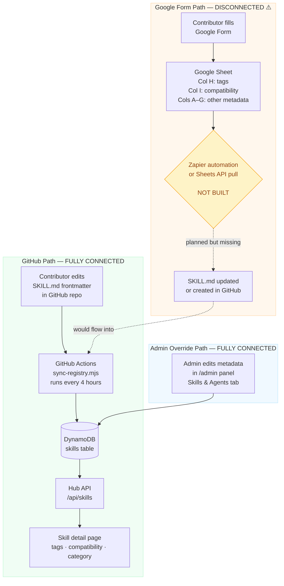
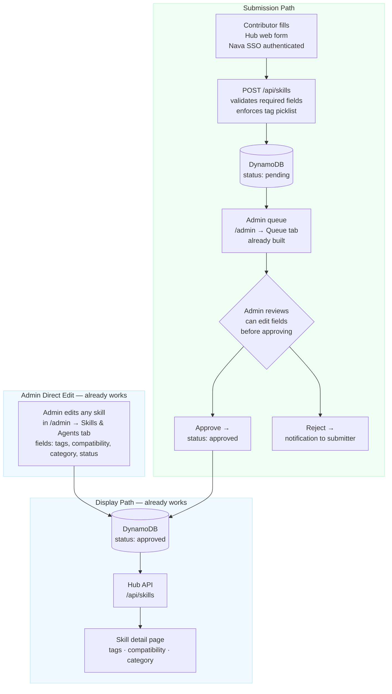

# Form Integration Options — Data Flow & Decision Guide

**Status:** For review by Cory + Diana before any implementation
**Date:** 2026-06-03

---

## Current State

Two parallel paths exist today. Only the GitHub path is fully connected to the Hub.
The Google Form path was planned but the Zapier → GitHub bridge was never built.

**What this means today:**
- Tags and compatibility on Hub skill pages come from SKILL.md files — not the Google Sheet
- Form submissions land in the sheet and stop there; ops has to manually create/update GitHub files
- Admins can directly edit metadata fields via the admin panel (already built)

---

## Potential State — Hub Web Form

Remove Google Form and Zapier from the path entirely. Use the submission + admin review
infrastructure that's already built into the Hub.

**What's already built vs. what's new:**
| Piece | Status |
|---|---|
| POST /api/skills submission endpoint | Built |
| Admin queue review + approve/reject | Built |
| Admin field editing (tags, compatibility) | Built |
| Audit log for changes | Built |
| Hub web form UI (the form itself) | **Not yet built** |
| Tag/compatibility picklist enforcement | **Not yet built** |
| Email notification on reject | **Not yet built** |

Estimated build: 1–2 days for the submission form UI + picklist enforcement.

---

## Open Questions: Hub Web Form vs. Zapier/Google Form

These are the decisions that should be resolved before choosing a path.

### IT Handoff & Maintenance

| Question | Why it matters |
|---|---|
| Does IT currently have Zapier licenses, and who manages them? | Zapier has ongoing subscription costs and requires a designated owner. If no one owns it, automations break silently. |
| Can IT staff configure and debug Zapier workflows without developer support? | Zapier is no-code but non-trivial — someone has to own it when field mappings break or the Google Sheet schema changes. |
| Is the Google Form/Sheet being used for anything beyond Hub population (reporting, audit trails, stakeholder comms)? | If the Sheet is already embedded in other ops workflows, removing it creates side effects beyond the Hub. |
| Who "owns" the Google Form long-term — IT, ops, or dev? | If it's IT, the Zapier path may be easier for them to manage. If it's dev, that advantage disappears. |

### Data Integrity & Consistency

| Question | Why it matters |
|---|---|
| Does the Google Form currently enforce controlled vocabularies for tags and compatibility? | Both paths need picklists to prevent inconsistent values from fragmenting Hub filters. This is a gap in the current form. |
| What's the migration plan for skills that are already in the Google Sheet but not yet in the Hub? | Either path needs a one-time import step for existing sheet data. |
| How are metadata edits handled after initial submission? | The Hub web form path has a built-in admin edit UI. The Zapier path requires re-submitting or editing the sheet row — unclear how that triggers an update. |

### Reliability & Transparency

| Question | Why it matters |
|---|---|
| What happens when Zapier goes down or a webhook fails? | Form submissions could be silently lost. The Hub web form path has no external dependency — it either succeeds or shows the user an error. |
| How will ops know when a submission is waiting for review? | Hub web form: built-in queue in admin panel. Zapier: needs a separate notification step configured. |
| Is there an audit trail requirement? | The Hub already logs all admin actions. Google Sheet has row-level history but it lives outside the Hub. |

### Speed & Experience

| Question | Why it matters |
|---|---|
| Does submission need to go live immediately, or is ops review acceptable? | Both paths can support a review queue. Hub web form makes this the default; Zapier path could bypass it if the sheet-to-GitHub write is direct. |
| Do contributors expect to see their submission status? | Hub web form can show this natively. Zapier path would require a separate email or sheet-based status column. |
| Is the Google Form experience important for non-technical contributors? | Google Forms are very familiar. A well-designed Hub form would be equivalent — and already authenticated — but there's a change management consideration. |

---

## Summary Comparison

| | Google Form + Zapier | Hub Web Form |
|---|---|---|
| **External dependencies** | Google Form, Google Sheet, Zapier | None |
| **IT can manage without dev** | Yes (Zapier UI, no code) | Yes (admin panel UI, no code) |
| **Nava SSO auth** | No (open form) | Yes (already built) |
| **Review queue** | Needs Zapier step to notify | Already built |
| **Audit log** | Google Sheet history (outside Hub) | Built into Hub |
| **Failure mode** | Silent (Zapier drop) | Visible error to submitter |
| **Controlled vocabulary** | Only if form has validated picklists | Can enforce at API level |
| **Existing data migration** | N/A (already in Sheet) | One-time import needed |
| **Build effort (remaining)** | Medium — Zapier config + GitHub write | Low — form UI + picklist only |
| **Ongoing maintenance** | Zapier account + 2 Google assets | One system (Hub) |
